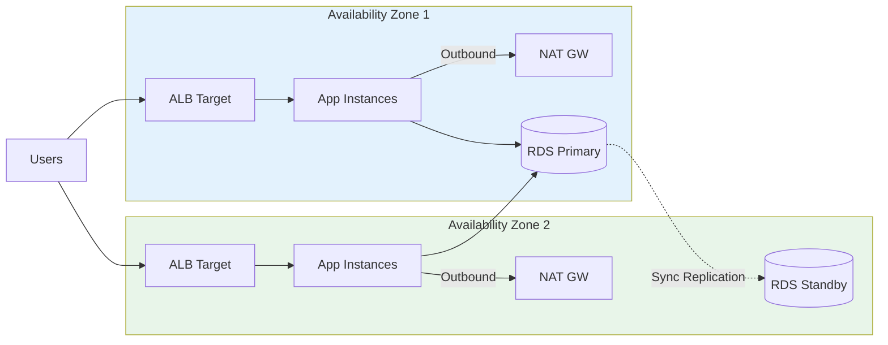
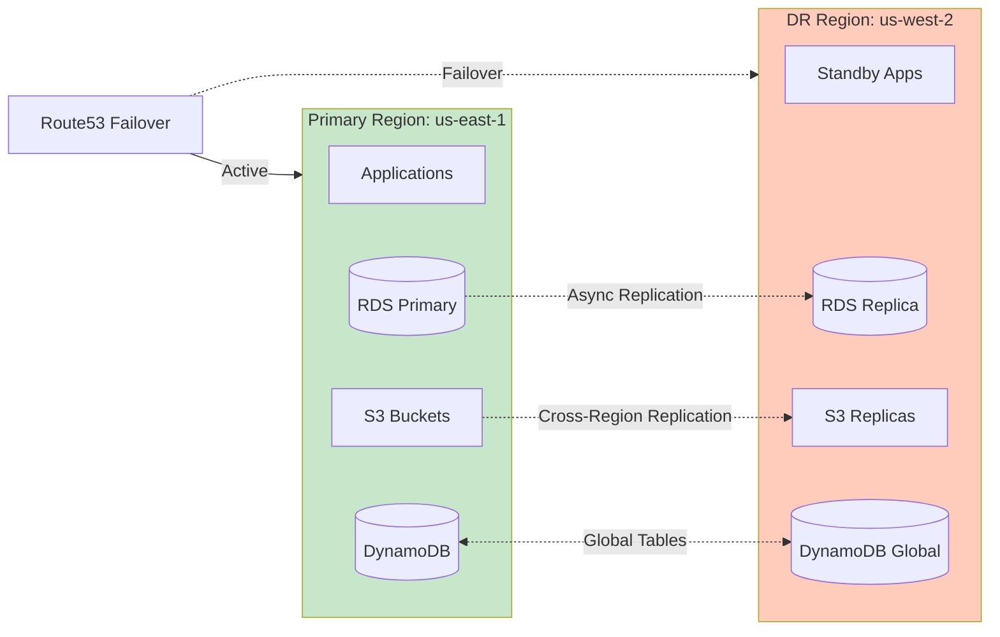

# Enterprise AWS Architecture Diagram

## Overview
This document presents a comprehensive, multi-layered architecture diagram following AWS Well-Architected Framework principles across all five pillars: Operational Excellence, Security, Reliability, Performance Efficiency, and Cost Optimization.

### 📖 How to Read This Document

**For better readability, the architecture has been broken down into multiple focused diagrams:**

1. **Request Flow** - See how user requests flow through the system
2. **Network Architecture** - Understand the VPC layout and Multi-AZ design
3. **Compute Layer** - View all compute services (ECS, EKS, EC2, Lambda)
4. **Data Layer** - See databases and storage services
5. **Security Architecture** - Understand security controls and encryption
6. **Monitoring & Observability** - View logging and alerting setup
7. **Complete Architecture** - Simplified view of all components
8. **Layer Dependencies** - Understand deployment order
9. **High Availability** - See Multi-AZ failover design
10. **Disaster Recovery** - View cross-region replication

💡 **Tip:** Each diagram uses **color coding** and **emojis** for easy identification of component types.

---

## High-Level Architecture Overview

### 1. Request Flow - User to Application

```mermaid
graph LR
    A[👥 Users] -->|HTTPS| B[☁️ CloudFront CDN]
    B -->|"Filter Threats"| C[🛡️ WAF]
    C --> D[🌐 Route53 DNS]
    D -->|"Route Traffic"| E[⚖️ Application Load Balancer]
    E -->|"Distribute"| F[🐳 ECS Tasks/EC2]
    F -->|"Query"| G[(🗄️ RDS Database)]
    F -->|"Store/Retrieve"| H[📦 S3 Buckets]
    
    style A fill:#e1f5ff
    style B fill:#fff4e1
    style C fill:#ffe1e1
    style D fill:#e1ffe1
    style E fill:#f0e1ff
    style F fill:#e1f0ff
    style G fill:#ffe1f0
    style H fill:#f5ffe1
```



---

### 2. Network Architecture - Multi-AZ VPC Layout

```mermaid
graph TB
    subgraph Internet[🌍 Internet]
        IGW[Internet Gateway]
    end
    
    subgraph VPC[VPC: 10.0.0.0/16]
        subgraph AZ1[Availability Zone 1]
            subgraph PubAZ1[Public Subnet<br/>10.0.0.0/24]
                NAT1[NAT Gateway]
                ALB1[ALB]
            end
            subgraph PrivAppAZ1[Private App Subnet<br/>10.0.4.0/24]
                ECS1[ECS Tasks]
                EC2_1[EC2 Instances]
            end
            subgraph PrivDataAZ1[Private Data Subnet<br/>10.0.6.0/24]
                RDS1[(RDS Primary)]
                EFS1[EFS Mount]
            end
        end
        
        subgraph AZ2[Availability Zone 2]
            subgraph PubAZ2[Public Subnet<br/>10.0.1.0/24]
                NAT2[NAT Gateway]
                ALB2[ALB]
            end
            subgraph PrivAppAZ2[Private App Subnet<br/>10.0.5.0/24]
                ECS2[ECS Tasks]
                EC2_2[EC2 Instances]
            end
            subgraph PrivDataAZ2[Private Data Subnet<br/>10.0.7.0/24]
                RDS2[(RDS Standby)]
                EFS2[EFS Mount]
            end
        end
        
        VPCE[VPC Endpoints<br/>S3 • DynamoDB • ECR]
    end
    
    IGW -->|"Public Access"| PubAZ1
    IGW -->|"Public Access"| PubAZ2
    ALB1 & ALB2 -->|"Route Traffic"| ECS1 & ECS2 & EC2_1 & EC2_2
    ECS1 & ECS2 -->|"Outbound via NAT"| NAT1 & NAT2
    EC2_1 & EC2_2 -->|"Database Access"| RDS1
    RDS1 -.->|"Replication"| RDS2
    
    style VPC fill:#e8f4f8
    style AZ1 fill:#fff9e6
    style AZ2 fill:#fff9e6
```



---

### 3. Compute Layer Architecture

```mermaid
graph LR
    subgraph ContainerServices[Container Services]
        ECR[📦 ECR<br/>Container Registry]
        ECS[🐳 ECS Fargate<br/>Serverless Containers]
        EKS[☸️ EKS<br/>Kubernetes]
    end
    
    subgraph TraditionalCompute[Traditional Compute]
        EC2[💻 EC2<br/>Auto Scaling Groups]
        Lambda[⚡ Lambda<br/>Serverless Functions]
    end
    
    subgraph LoadBalancing[Load Balancing]
        ALB[⚖️ ALB<br/>Application Load Balancer]
    end
    
    ECR -->|"Pull Images"| ECS
    ECR -->|"Pull Images"| EKS
    ALB -->|"Route Traffic"| ECS
    ALB -->|"Route Traffic"| EC2
    ALB -->|"Invoke"| Lambda
    
    style ContainerServices fill:#e3f2fd
    style TraditionalCompute fill:#f3e5f5
    style LoadBalancing fill:#e8f5e9
```



---

### 4. Data Layer Architecture

```mermaid
graph TB
    subgraph Databases[Databases]
        RDS[(🗄️ RDS Multi-AZ<br/>PostgreSQL/MySQL)]
        DDB[(⚡ DynamoDB<br/>NoSQL + Global Tables)]
        Aurora[(🌟 Aurora Serverless<br/>Auto-Scaling)]
    end
    
    subgraph Storage[Storage Services]
        S3[📦 S3 Buckets<br/>Standard → IA → Glacier]
        EFS[📁 EFS<br/>Shared File System]
        Backup[💾 AWS Backup<br/>Automated Snapshots]
    end
    
    subgraph Caching[Caching Layer]
        DAX[⚡ DAX<br/>DynamoDB Accelerator]
    end
    
    DDB --> DAX
    RDS -->|"Backup"| Backup
    S3 -->|"Backup"| Backup
    EFS -->|"Backup"| Backup
    
    style Databases fill:#fff3e0
    style Storage fill:#e8f5e9
    style Caching fill:#fce4ec
```



---

### 5. Security Architecture

```mermaid
graph LR
    subgraph Identity[Identity & Access]
        IAM[👤 IAM<br/>Roles & Policies]
        SM[🔐 Secrets Manager<br/>Credential Rotation]
    end
    
    subgraph Encryption[Encryption]
        KMS[🔑 KMS<br/>Encryption Keys]
    end
    
    subgraph ThreatDetection[Threat Detection]
        GD[🛡️ GuardDuty<br/>Threat Detection]
        SH[📊 Security Hub<br/>Compliance Dashboard]
        WAF[🔥 WAF<br/>Web Protection]
    end
    
    subgraph Compliance[Compliance & Audit]
        CT[📝 CloudTrail<br/>API Audit Logs]
        Config[✅ AWS Config<br/>Resource Compliance]
    end
    
    IAM -->|"Authorize"| SM
    KMS -->|"Encrypt"| SM
    GD & WAF -->|"Findings"| SH
    CT -->|"Logs"| SH
    Config -->|"Compliance"| SH
    
    style Identity fill:#e3f2fd
    style Encryption fill:#fff9c4
    style ThreatDetection fill:#ffebee
    style Compliance fill:#f3e5f5
```



---

### 6. Monitoring & Observability

```mermaid
graph TB
    subgraph Sources[Data Sources]
        APP[🐳 Applications<br/>ECS/EC2/Lambda]
        DB[(🗄️ Databases<br/>RDS/DynamoDB)]
        NET[🌐 Network<br/>VPC Flow Logs]
    end
    
    subgraph Monitoring[Monitoring Platform]
        CW[📊 CloudWatch<br/>Logs & Metrics]
        XRay[🔍 X-Ray<br/>Distributed Tracing]
    end
    
    subgraph Alerting[Alerting]
        Alarms[⚠️ CloudWatch Alarms]
        SNS[📧 SNS Topics<br/>Notifications]
    end
    
    subgraph Visualization[Dashboards]
        Dash[📈 CloudWatch Dashboards]
    end
    
    APP & DB & NET -->|"Send Metrics"| CW
    APP -->|"Send Traces"| XRay
    CW -->|"Trigger"| Alarms
    Alarms -->|"Notify"| SNS
    CW & XRay -->|"Display"| Dash
    
    style Sources fill:#e8f5e9
    style Monitoring fill:#e3f2fd
    style Alerting fill:#ffebee
    style Visualization fill:#f3e5f5
```



---

## 📊 Quick Navigation Guide

### Which Diagram Should I Look At?

| Your Question | Diagram to View | Section |
|---------------|----------------|---------|
| How do user requests flow? | Request Flow | Diagram #1 |
| What does the VPC layout look like? | Network Architecture | Diagram #2 |
| What compute services are used? | Compute Layer | Diagram #3 |
| How is data stored? | Data Layer | Diagram #4 |
| How is security implemented? | Security Architecture | Diagram #5 |
| How do we monitor the system? | Monitoring & Observability | Diagram #6 |
| I need a simplified overview | Complete Architecture | Diagram #7 |
| What order do I deploy in? | Layer Dependencies | Diagram #8 |
| How does failover work? | High Availability | Diagram #9 |
| What's the DR strategy? | Disaster Recovery | Diagram #10 |

### Diagram Features

✅ **Color-coded** for easy component identification  
✅ **Emoji icons** for quick visual recognition  
✅ **Left-to-right or top-to-bottom** layouts for readability  
✅ **Focused views** - each diagram shows one aspect clearly  
✅ **Connection labels** explain relationships between components  

---

## Detailed Layer Breakdown

### Layer 1: Networking Architecture

**Components:**
- **VPC Design:** Multi-AZ VPC with CIDR 10.0.0.0/16
  - Public Subnets (10.0.0.0/24, 10.0.1.0/24) - 2 AZs
  - Private App Subnets (10.0.4.0/24, 10.0.5.0/24) - 2 AZs
  - Private Data Subnets (10.0.6.0/24, 10.0.7.0/24) - 2 AZs
  
- **Internet Gateway:** Single IGW for public internet access
- **NAT Gateways:** Redundant NAT Gateways (one per AZ) for high availability
- **Route Tables:** 
  - Public route table with IGW route
  - Private route tables with NAT Gateway routes (one per AZ)
  
- **VPC Endpoints:** 
  - S3 Gateway Endpoint (cost optimization)
  - DynamoDB Gateway Endpoint (cost optimization)
  - Interface Endpoints: ECR, CloudWatch, SSM, Secrets Manager

**Well-Architected Alignment:**
- ✅ **Reliability:** Multi-AZ deployment with redundant NAT Gateways
- ✅ **Security:** Network segmentation with public/private subnets
- ✅ **Cost Optimization:** Gateway endpoints reduce data transfer costs
- ✅ **Performance:** VPC endpoints provide private, low-latency connectivity

**Security Controls:**
- Network ACLs for subnet-level traffic control
- Security Groups for instance-level firewalling
- VPC Flow Logs enabled for network traffic analysis
- Private subnets for sensitive workloads

---

### Layer 2: Security Architecture

**Components:**

**Identity & Access Management:**
- IAM Roles with least privilege principle
- Service-specific IAM roles (ECS Task Role, Lambda Execution Role, EC2 Instance Profile)
- Cross-account roles for multi-account strategy
- MFA enforcement for console access
- IAM Access Analyzer for policy validation

**Encryption:**
- KMS Customer Managed Keys (CMK) for:
  - EBS volumes encryption
  - RDS database encryption at rest
  - S3 bucket encryption (SSE-KMS)
  - EFS encryption
  - Secrets Manager secrets
- KMS key rotation enabled (automatic annual rotation)
- Separate KMS keys per environment

**Secrets Management:**
- AWS Secrets Manager for:
  - Database credentials with automatic rotation
  - API keys and tokens
  - Third-party service credentials
- Parameter Store for non-sensitive configuration

**Threat Detection & Compliance:**
- AWS GuardDuty for threat detection
- AWS Security Hub for centralized security findings
- AWS Config for compliance monitoring
- CloudTrail for API audit logging (all regions)
- AWS WAF with managed rule sets
- AWS Shield Standard (automatic) + Advanced (optional)

**Well-Architected Alignment:**
- ✅ **Security:** Defense in depth with multiple security layers
- ✅ **Operational Excellence:** Automated security monitoring and alerting
- ✅ **Reliability:** Encrypted backups and secure recovery procedures

---

### Layer 3: Compute Architecture

**Components:**

**EC2 Instances:**
- Auto Scaling Groups across multiple AZs
- Launch Templates with latest AMIs (Amazon Linux 2023)
- Instance types: t3.medium (dev), t3.large (qa/uat), m5.xlarge (prod)
- EBS volumes encrypted with KMS
- Systems Manager Session Manager for secure access (no SSH keys)
- CloudWatch agent for detailed monitoring

**ECS (Elastic Container Service):**
- ECS Fargate for serverless containers
- Task definitions with CPU/memory limits
- Service auto-scaling based on CPU/memory metrics
- Application Load Balancer integration
- ECR for private container image registry
- Image scanning enabled for vulnerability detection
- Task IAM roles for granular permissions

**EKS (Elastic Kubernetes Service):**
- Managed Kubernetes control plane (Multi-AZ)
- Self-managed node groups in private subnets
- Fargate profiles for serverless pods
- RBAC integration with IAM
- Pod security policies
- Kubernetes metrics server
- ALB Ingress Controller

**Lambda Functions:**
- VPC-attached for database access
- Reserved concurrency for predictable performance
- X-Ray tracing enabled
- Environment variables encrypted with KMS
- Lambda layers for shared dependencies
- CloudWatch Logs integration

**Load Balancing:**
- Application Load Balancer (ALB) in public subnets
- Target groups for ECS services and EC2 instances
- Health checks with custom endpoints
- SSL/TLS termination with ACM certificates
- Listener rules for path-based routing
- Connection draining enabled

**Well-Architected Alignment:**
- ✅ **Performance Efficiency:** Auto-scaling, right-sizing, Fargate for serverless
- ✅ **Reliability:** Multi-AZ deployment, health checks, auto-recovery
- ✅ **Cost Optimization:** Spot instances, Fargate Spot, Lambda pay-per-use
- ✅ **Operational Excellence:** Automated deployments, infrastructure as code

---

### Layer 4: Storage Architecture

**Components:**

**S3 (Simple Storage Service):**
- **Application Buckets:**
  - Versioning enabled for data protection
  - Server-side encryption (SSE-KMS)
  - Bucket policies with least privilege
  - Public access blocked
  - S3 Access Logs to dedicated logging bucket
  - Object Lock for compliance (WORM)
  
- **Backup Buckets:**
  - Lifecycle policies: Standard → IA (30d) → Glacier (90d) → Deep Archive (365d)
  - Cross-region replication for disaster recovery
  - MFA delete enabled for production
  
- **Static Website Hosting:**
  - CloudFront distribution for global delivery
  - Origin Access Identity (OAI) for security
  - Custom SSL certificates

**EFS (Elastic File System):**
- Multi-AZ deployment for high availability
- Encryption at rest using KMS
- Encryption in transit using TLS
- Mount targets in each AZ
- Lifecycle management: Standard → IA (30 days)
- Throughput modes: Bursting (dev/qa), Provisioned (prod)
- Performance modes: General Purpose (most workloads), Max I/O (high parallelism)

**EBS (Elastic Block Store):**
- gp3 volumes for cost-optimized performance
- io2 volumes for high-performance databases
- Encrypted by default with KMS
- Automated snapshots via AWS Backup
- Snapshot lifecycle policies
- Cross-region snapshot copy for DR

**Well-Architected Alignment:**
- ✅ **Reliability:** Multi-AZ storage, automated backups, versioning
- ✅ **Security:** Encryption at rest and in transit, access logging
- ✅ **Cost Optimization:** Lifecycle policies, right-sized volumes
- ✅ **Performance Efficiency:** Appropriate storage classes and modes

---

### Layer 5: Database Architecture

**Components:**

**RDS (Relational Database Service):**
- **Database Engines:** PostgreSQL 15, MySQL 8.0
- **Multi-AZ Deployment:**
  - Primary instance in AZ1
  - Synchronous standby in AZ2
  - Automatic failover (60-120 seconds)
  
- **Read Replicas:**
  - Up to 5 read replicas per primary
  - Cross-region replicas for disaster recovery
  - Read replica promotion for recovery
  
- **Security:**
  - Database subnet group in private subnets
  - Security groups limiting access to app tier
  - Encryption at rest with KMS
  - SSL/TLS connections required
  - IAM database authentication
  
- **Backup & Recovery:**
  - Automated daily backups (7-35 day retention)
  - Point-in-time recovery (5-minute intervals)
  - Manual snapshots for critical milestones
  - Cross-region snapshot copy
  
- **Monitoring:**
  - Enhanced monitoring (1-60 second intervals)
  - Performance Insights enabled
  - CloudWatch alarms for CPU, memory, storage, connections

**DynamoDB:**
- **Tables:** User profiles, session data, application state
- **Capacity Modes:**
  - On-Demand for unpredictable workloads
  - Provisioned with auto-scaling for predictable patterns
  
- **Features:**
  - Point-in-time recovery enabled
  - Encryption at rest with KMS
  - DynamoDB Streams for change data capture
  - Global Tables for multi-region replication
  - DAX (DynamoDB Accelerator) for microsecond latency
  
- **Access:**
  - VPC Gateway Endpoint (no internet required)
  - Fine-grained access control with IAM
  - Backup to S3 using AWS Backup

**Aurora (Optional Advanced Setup):**
- Aurora PostgreSQL/MySQL compatible
- Aurora Serverless v2 for variable workloads
- Up to 15 read replicas with minimal lag
- Aurora Global Database for cross-region
- Backtrack for point-in-time recovery
- Parallel query for analytical workloads

**Well-Architected Alignment:**
- ✅ **Reliability:** Multi-AZ, automated backups, read replicas
- ✅ **Performance Efficiency:** Read replicas, caching (DAX), right engine selection
- ✅ **Security:** Encryption, network isolation, IAM authentication
- ✅ **Cost Optimization:** Reserved instances, auto-scaling, right-sizing

---

### Layer 6: Monitoring & Observability Architecture

**Components:**

**CloudWatch Logs:**
- **Log Groups:**
  - Application logs from ECS/EC2/Lambda
  - VPC Flow Logs for network analysis
  - CloudTrail logs for API auditing
  - RDS logs (error, slow query, general)
  - ALB access logs
  
- **Features:**
  - Log retention policies (7-365 days)
  - Encryption with KMS
  - Log Insights for query and analysis
  - Subscription filters for real-time processing
  - Cross-account log aggregation

**CloudWatch Metrics:**
- **Standard Metrics:**
  - EC2: CPU, network, disk
  - RDS: connections, IOPS, latency
  - ECS: CPU, memory utilization
  - Lambda: invocations, duration, errors
  - ALB: request count, latency, HTTP codes
  
- **Custom Metrics:**
  - Application-specific KPIs
  - Business metrics
  - Custom dimensions for filtering
  - High-resolution metrics (1-second)

**CloudWatch Alarms:**
- **Critical Alarms (PagerDuty/Opsgenie):**
  - EC2 instance health failures
  - RDS high CPU (>80%)
  - ALB 5xx errors spike
  - Lambda error rate (>5%)
  - ECS service unhealthy targets
  
- **Warning Alarms (Email/Slack):**
  - RDS storage space (<20%)
  - NAT Gateway bandwidth threshold
  - ECS CPU utilization (>70%)
  - S3 bucket size growth anomalies

**CloudWatch Dashboards:**
- **Infrastructure Dashboard:**
  - VPC metrics and health
  - EC2 instance status
  - RDS performance
  - Load balancer metrics
  
- **Application Dashboard:**
  - Request rate and latency
  - Error rates by service
  - Custom business metrics
  - User journey metrics
  
- **Cost Dashboard:**
  - Daily spend by service
  - Budget alerts
  - Reserved Instance utilization

**AWS X-Ray:**
- Distributed tracing for microservices
- Service map visualization
- Trace analysis and filtering
- Integration with Lambda, ECS, EC2
- Sampling rules for cost control
- Annotations and metadata

**SNS (Simple Notification Service):**
- **Alert Topics:**
  - Critical alerts → PagerDuty
  - Warning alerts → Email/Slack
  - Security alerts → Security team
  - Cost alerts → FinOps team
  
- **Features:**
  - Topic encryption with KMS
  - Message filtering
  - Dead-letter queues for reliability
  - Cross-region fan-out

**EventBridge (CloudWatch Events):**
- Schedule-based automation
- Event-driven architectures
- AWS service event capture
- Custom application events
- Cross-account event routing

**Well-Architected Alignment:**
- ✅ **Operational Excellence:** Comprehensive observability, automated responses
- ✅ **Reliability:** Proactive monitoring, automated remediation
- ✅ **Performance Efficiency:** Performance insights, anomaly detection
- ✅ **Security:** Security monitoring, audit logging
- ✅ **Cost Optimization:** Cost monitoring, budget alerts

---

## Additional Architecture Layers

### Disaster Recovery & Business Continuity

**Strategy:** Multi-region active-passive with RPO < 1 hour, RTO < 4 hours

**Components:**

**AWS Backup:**
- Centralized backup management
- Backup plans per resource type:
  - EC2: Daily snapshots, 30-day retention
  - RDS: Automated + manual snapshots
  - EFS: Daily backups, 90-day retention
  - DynamoDB: Continuous backups (PITR)
- Cross-region backup copy for DR
- Backup vault with KMS encryption
- Lifecycle policies for cost optimization

**Cross-Region Replication:**
- S3 buckets replicated to us-west-2
- RDS read replicas in secondary region
- DynamoDB Global Tables
- AMI copies to DR region
- CloudFormation StackSets for infrastructure

**Backup Testing:**
- Quarterly DR drills
- Automated restore validation
- RTO/RPO monitoring
- Runbook automation

---

### CI/CD & DevOps Pipeline

**Components:**

**Source Control:**
- GitHub/GitLab for code repositories
- Branch protection rules
- Pull request reviews required
- Automated security scanning

**Build & Test:**
- AWS CodeBuild for compilation
- Docker image building with caching
- Unit and integration testing
- Security scanning (SAST, DAST)
- Dependency vulnerability scanning

**Artifact Management:**
- ECR for container images
- S3 for build artifacts
- Artifact versioning and tagging
- Image scanning results

**Deployment:**
- AWS CodeDeploy for EC2
- ECS rolling updates
- Blue/Green deployments
- Canary deployments with automatic rollback
- Lambda alias-based deployments

**Infrastructure as Code:**
- Terraform for all infrastructure
- GitOps workflow (pull request → review → apply)
- Terraform state in S3 with DynamoDB locking
- State file encryption
- Module versioning
- Automated plan on PR

**Pipeline Stages:**
1. **Commit** → Trigger build
2. **Build** → Compile, test, scan
3. **Dev** → Auto-deploy to dev environment
4. **QA** → Manual approval + deploy to QA
5. **UAT** → Manual approval + deploy to UAT
6. **Prod** → Change advisory board approval + deploy

---

## AWS Well-Architected Framework Mapping

### 1. Operational Excellence Pillar

**Design Principles:**
- ✅ **Perform operations as code:** Terraform IaC, automated deployments
- ✅ **Make frequent, small, reversible changes:** CI/CD with rollback capability
- ✅ **Refine operations procedures frequently:** Runbook automation, incident reviews
- ✅ **Anticipate failure:** Chaos engineering, DR drills, automated health checks
- ✅ **Learn from operational failures:** Post-mortem analysis, CloudWatch Insights

**Implementation:**
- Infrastructure as Code (Terraform modules)
- Automated deployments via CI/CD
- CloudWatch monitoring and alerting
- Runbook automation with Systems Manager
- Regular DR testing and validation
- Incident management integration

---

### 2. Security Pillar

**Design Principles:**
- ✅ **Implement strong identity foundation:** IAM roles, MFA, least privilege
- ✅ **Enable traceability:** CloudTrail, VPC Flow Logs, audit logging
- ✅ **Apply security at all layers:** Network ACLs, Security Groups, WAF, encryption
- ✅ **Automate security best practices:** AWS Config rules, Security Hub
- ✅ **Protect data in transit and at rest:** TLS, KMS encryption
- ✅ **Keep people away from data:** Systems Manager Session Manager
- ✅ **Prepare for security events:** GuardDuty, automated incident response

**Implementation:**
- Defense in depth across all layers
- Encryption at rest (KMS) and in transit (TLS)
- Network segmentation with private subnets
- IAM roles with least privilege
- Secrets Manager for credential rotation
- GuardDuty for threat detection
- Security Hub for centralized findings
- AWS Config for compliance monitoring
- CloudTrail for API audit logging

---

### 3. Reliability Pillar

**Design Principles:**
- ✅ **Automatically recover from failure:** Auto Scaling, health checks
- ✅ **Test recovery procedures:** Automated DR testing
- ✅ **Scale horizontally:** Auto Scaling Groups, ECS/EKS auto-scaling
- ✅ **Stop guessing capacity:** Auto-scaling based on metrics
- ✅ **Manage change through automation:** Infrastructure as Code

**Implementation:**
- Multi-AZ deployment for all critical components
- RDS Multi-AZ with automated failover
- Auto Scaling Groups for EC2 instances
- ECS/EKS service auto-scaling
- ALB health checks with automatic target removal
- Automated backups with cross-region replication
- DynamoDB with PITR and Global Tables
- Route53 health checks and failover routing

---

### 4. Performance Efficiency Pillar

**Design Principles:**
- ✅ **Democratize advanced technologies:** Managed services (RDS, ECS, Lambda)
- ✅ **Go global in minutes:** CloudFront, Route53, multi-region
- ✅ **Use serverless architectures:** Lambda, Fargate, Aurora Serverless
- ✅ **Experiment more often:** Easy environment provisioning
- ✅ **Consider mechanical sympathy:** Right instance types and storage

**Implementation:**
- CloudFront for global content delivery
- VPC endpoints for AWS service access
- Right-sized EC2 instances per environment
- ECS Fargate for containerized workloads
- Lambda for event-driven processing
- RDS read replicas for read-heavy workloads
- DynamoDB with DAX for caching
- ElastiCache for application caching (optional)
- Auto-scaling based on performance metrics

---

### 5. Cost Optimization Pillar

**Design Principles:**
- ✅ **Implement cloud financial management:** Cost tracking, budgets, alerts
- ✅ **Adopt consumption model:** Pay for what you use
- ✅ **Measure overall efficiency:** Cost per transaction/user
- ✅ **Stop spending on undifferentiated heavy lifting:** Managed services
- ✅ **Analyze and attribute expenditure:** Cost allocation tags

**Implementation:**
- Right-sized instances per environment
- Reserved Instances for predictable workloads
- Spot Instances for fault-tolerant workloads
- S3 lifecycle policies (IA, Glacier)
- Lambda and Fargate pay-per-use model
- VPC Gateway Endpoints (free data transfer)
- CloudWatch cost monitoring
- AWS Budgets with alerts
- Resource tagging for cost allocation
- Automated resource cleanup in non-prod
- EBS gp3 instead of gp2/io1 where appropriate

---

## Network Architecture Details

### CIDR Block Allocation

```
VPC: 10.0.0.0/16 (65,536 IPs)

├── Public Subnets (Internet-facing resources)
│   ├── us-east-1a: 10.0.0.0/24 (256 IPs) - ALB, NAT Gateway
│   └── us-east-1b: 10.0.1.0/24 (256 IPs) - ALB, NAT Gateway
│
├── Private Application Subnets (Application tier)
│   ├── us-east-1a: 10.0.4.0/24 (256 IPs) - ECS, EC2, Lambda
│   └── us-east-1b: 10.0.5.0/24 (256 IPs) - ECS, EC2, Lambda
│
├── Private Data Subnets (Database tier)
│   ├── us-east-1a: 10.0.6.0/24 (256 IPs) - RDS Primary, EFS
│   └── us-east-1b: 10.0.7.0/24 (256 IPs) - RDS Standby, EFS
│
└── Reserved for future expansion
    └── 10.0.8.0/21 through 10.0.255.0/24
```

### Security Group Architecture

**Layered Security Groups:**

1. **ALB Security Group (alb-sg)**
   - Inbound: 443 from 0.0.0.0/0 (HTTPS)
   - Inbound: 80 from 0.0.0.0/0 (HTTP → redirect to HTTPS)
   - Outbound: All to application-sg on ports 8080, 8443

2. **Application Security Group (app-sg)**
   - Inbound: 8080, 8443 from alb-sg
   - Inbound: 443 from vpc-endpoint-sg (AWS services)
   - Outbound: 5432/3306 to database-sg (PostgreSQL/MySQL)
   - Outbound: 443 to 0.0.0.0/0 (API calls via NAT)
   - Outbound: 2049 to efs-sg (NFS)

3. **Database Security Group (db-sg)**
   - Inbound: 5432/3306 from app-sg only
   - Inbound: 5432/3306 from bastion-sg (admin access)
   - Outbound: None (no outbound required)

4. **EFS Security Group (efs-sg)**
   - Inbound: 2049 from app-sg (NFS)
   - Outbound: None

5. **Bastion Security Group (bastion-sg)**
   - Inbound: 443 from Systems Manager (managed)
   - Outbound: 22 to app-sg, 5432/3306 to db-sg

6. **VPC Endpoint Security Group (vpce-sg)**
   - Inbound: 443 from app-sg
   - Outbound: None

### Route Table Configuration

**Public Route Table:**
```
Destination         Target
10.0.0.0/16        local
0.0.0.0/0          igw-xxxxx
```

**Private Route Table AZ1:**
```
Destination         Target
10.0.0.0/16        local
0.0.0.0/0          nat-xxxxx-az1
s3-prefix-list     vpce-s3-xxxxx
ddb-prefix-list    vpce-ddb-xxxxx
```

**Private Route Table AZ2:**
```
Destination         Target
10.0.0.0/16        local
0.0.0.0/0          nat-xxxxx-az2
s3-prefix-list     vpce-s3-xxxxx
ddb-prefix-list    vpce-ddb-xxxxx
```

---

## Data Flow Patterns

### User Request Flow (Web Application)

```
1. User → CloudFront (Edge Location)
   ↓
2. CloudFront → AWS WAF (DDoS protection, rule filtering)
   ↓
3. CloudFront → Route53 (DNS resolution, health checks)
   ↓
4. Route53 → Application Load Balancer (public subnet)
   ↓
5. ALB → Target Group (health check, sticky sessions)
   ↓
6. Target → ECS Task / EC2 Instance (private app subnet)
   ↓
7. Application → RDS Database (private data subnet)
   ↓
8. Application → S3 via VPC Endpoint (no internet gateway)
   ↓
9. Application → DynamoDB via VPC Endpoint
   ↓
10. Response ← Reverse path through ALB → CloudFront → User
```

### Internal Service Communication

```
ECS Service A → ECS Service B
├── Via Service Discovery (Cloud Map)
├── Via Internal ALB
└── Direct IP (with security groups)

Lambda → RDS
├── Lambda in VPC
├── Via ENI in private subnet
└── Security group allows Lambda → DB

EC2 → S3
├── Via S3 Gateway Endpoint (no internet)
├── Uses instance IAM role
└── Traffic stays within AWS network
```

### Outbound Internet Access

```
Private Subnet Resource → NAT Gateway → Internet Gateway → Internet
│
├── For software updates (yum, apt)
├── For third-party API calls
├── For webhook notifications
└── CloudWatch Logs via Interface Endpoint (no NAT needed)
```

### Backup and DR Data Flow

```
Production Resource → AWS Backup
├── Snapshot → S3 (encrypted with KMS)
├── S3 → Cross-Region Replication → DR Region
└── Retention → Lifecycle → Glacier → Deep Archive

RDS Primary (us-east-1a)
├── Synchronous Replication → RDS Standby (us-east-1b)
├── Asynchronous Replication → Read Replica (us-east-1c)
└── Asynchronous Replication → DR Read Replica (us-west-2)
```

---

## Operational Best Practices

### High Availability Design

**Multi-AZ Strategy:**
- All critical components deployed across at least 2 AZs
- Auto Scaling Groups span multiple AZs with balanced distribution
- RDS Multi-AZ for automatic failover (60-120 seconds)
- ECS services with minimum 2 tasks in different AZs
- ALB distributes traffic across healthy targets in all AZs
- NAT Gateways in each AZ to avoid single point of failure

**Health Checks:**
- ALB health checks: HTTP 200 on /health endpoint (30s interval)
- Target deregistration delay: 300 seconds for graceful shutdown
- ECS health checks: Docker HEALTHCHECK instruction
- Route53 health checks for global failover
- Auto Scaling health checks (EC2 + ELB)

**Auto Scaling Configuration:**
```
Target Tracking Policies:
- CPU Utilization: 70% target
- ALB Request Count per Target: 1000 requests
- Custom Metrics: Application-specific KPIs

Step Scaling Policies:
- Scale out: Add 2 instances when CPU > 80% for 5 minutes
- Scale in: Remove 1 instance when CPU < 30% for 15 minutes
- Cooldown periods: 300 seconds (scale out), 600 seconds (scale in)
```

---

### Security Best Practices

**Network Security:**
- Private subnets for all application and data tier resources
- Public subnets only for ALB, NAT Gateways, and Bastion
- Security groups follow least privilege principle
- Network ACLs as second layer of defense
- VPC Flow Logs enabled and monitored
- No direct internet access from private subnets

**Access Control:**
- No SSH keys stored in instances (use Systems Manager Session Manager)
- IAM roles for all AWS service access
- MFA required for console access
- Service Control Policies (SCPs) for account guardrails
- Regular access reviews and least privilege audits

**Data Protection:**
- All data encrypted at rest using KMS CMKs
- All data encrypted in transit using TLS 1.2+
- KMS key rotation enabled annually
- Separate encryption keys per environment
- Database credentials stored in Secrets Manager
- Automatic secret rotation every 30 days

**Monitoring & Detection:**
- GuardDuty for threat detection
- Security Hub for compliance posture
- Config Rules for resource compliance
- CloudTrail for API audit logging
- VPC Flow Logs for network traffic analysis
- Automated remediation for common security findings

---

### Performance Optimization

**Compute Optimization:**
- Right-sized instance types per environment:
  - Dev: t3.medium, t3a.medium (burstable)
  - QA/UAT: t3.large, m5.large (general purpose)
  - Prod: m5.xlarge, c5.xlarge (compute optimized)
- ECS Fargate for variable workloads
- Lambda for event-driven processing
- Spot Instances for non-critical, fault-tolerant workloads

**Database Optimization:**
- RDS Performance Insights for query analysis
- Appropriate instance sizing (db.t3.large → db.r5.large)
- Read replicas for read-heavy workloads
- Connection pooling (RDS Proxy)
- Query result caching (ElastiCache/DAX)
- Proper indexing strategies

**Network Optimization:**
- CloudFront for static content delivery
- VPC endpoints to avoid NAT Gateway data charges
- S3 Transfer Acceleration for large uploads
- EFS with appropriate performance mode
- Placement groups for low-latency requirements

**Storage Optimization:**
- S3 Intelligent-Tiering for unknown access patterns
- EBS gp3 volumes with custom IOPS/throughput
- EFS lifecycle management to IA storage class
- Glacier for long-term archival
- S3 Object Lock for compliance

---

### Cost Management

**Resource Optimization:**
- Auto-scaling to match demand
- Scheduled scaling for predictable patterns
- Instance Scheduler for non-prod environments
- Lambda instead of always-on compute
- Fargate Spot for cost-effective containers

**Commitment Discounts:**
- Reserved Instances for predictable workloads (1-3 year)
- Savings Plans for flexible compute usage
- RDS Reserved Instances for databases
- ElastiCache Reserved Nodes

**Waste Reduction:**
- Automated shutdown of dev/qa environments (off-hours)
- Deletion of unused snapshots and AMIs
- Lifecycle policies for old logs
- Cleanup of unattached EBS volumes
- Regular cost review and optimization

**Monitoring & Alerts:**
- AWS Budgets with threshold alerts
- Cost anomaly detection
- Daily cost reports by service/tag
- Reserved Instance utilization tracking
- Savings Plans coverage monitoring

---

## Deployment Strategy

### Environment Progression

```
Development → QA → UAT → Production

Each environment is isolated:
├── Separate AWS account (recommended) OR
├── Separate VPC in same account
├── Separate Terraform state files
├── Separate KMS keys
└── Separate IAM roles and policies
```

### Infrastructure Deployment Order

**Phase 1: Foundation (Layer 1-2)**
1. Networking Layer
   - VPC, Subnets, Route Tables
   - Internet Gateway, NAT Gateways
   - VPC Endpoints
   
2. Security Layer
   - IAM Roles and Policies
   - KMS Keys
   - Secrets Manager secrets
   - Security Groups
   - AWS Config Rules

**Phase 2: Data Layer (Layer 3-4)**
3. DNS Layer
   - Route53 Hosted Zones
   - Health Checks
   
4. Storage Layer
   - S3 Buckets
   - EFS File Systems
   
5. Database Layer
   - RDS Instances
   - DynamoDB Tables
   - Read Replicas

**Phase 3: Application Layer (Layer 5-6)**
6. Compute Layer
   - ECR Repositories
   - ALB and Target Groups
   - ECS Clusters and Services
   - EC2 Auto Scaling Groups
   - Lambda Functions
   - EKS Cluster (if used)

7. Monitoring Layer
   - CloudWatch Log Groups
   - CloudWatch Alarms
   - SNS Topics
   - CloudWatch Dashboards

**Phase 4: Enhancement**
8. Edge Services
   - CloudFront Distributions
   - WAF Rules
   
9. CI/CD Pipeline
   - CodePipeline
   - CodeBuild Projects
   - CodeDeploy Applications

### Rollback Procedures

**Infrastructure Rollback:**
```bash
# Terraform state rollback
terraform state pull > backup.tfstate
terraform state push previous-good.tfstate
terraform apply

# Or use version control
git revert <commit-hash>
terraform apply
```

**Application Rollback:**
- ECS: Redeploy previous task definition
- Lambda: Revert to previous version or alias
- EC2: Trigger Auto Scaling Group instance refresh with previous AMI
- Blue/Green: Switch traffic back to previous environment

---

## Compliance & Governance

### Compliance Frameworks Supported

**Standards:**
- ✅ SOC 2 Type II
- ✅ HIPAA (with BAA and PHI handling)
- ✅ PCI DSS Level 1
- ✅ ISO 27001
- ✅ GDPR (with data residency controls)
- ✅ FedRAMP (with GovCloud deployment)

**AWS Config Rules:**
- Encryption at rest enabled for all storage
- Encryption in transit required
- MFA enabled for root account
- CloudTrail enabled in all regions
- GuardDuty enabled
- S3 buckets not publicly accessible
- RDS instances encrypted
- EBS volumes encrypted
- IAM password policy compliant

**Audit & Compliance Reporting:**
- AWS Artifact for compliance reports
- AWS Audit Manager for continuous auditing
- CloudTrail logs retained for 7 years
- Regular vulnerability scanning
- Penetration testing annually
- Third-party security audits

---

## Key Metrics & KPIs

### Reliability Metrics
- **Uptime SLA:** 99.9% (43.8 minutes downtime/month allowed)
- **RPO:** < 1 hour (Recovery Point Objective)
- **RTO:** < 4 hours (Recovery Time Objective)
- **MTTR:** < 30 minutes (Mean Time To Recover)
- **MTBF:** > 720 hours (Mean Time Between Failures)

### Performance Metrics
- **API Latency P99:** < 200ms
- **Page Load Time:** < 2 seconds
- **Database Query Time P95:** < 50ms
- **Error Rate:** < 0.1%

### Security Metrics
- **Security Findings:** 0 critical, < 5 high
- **Patch Compliance:** > 95%
- **Vulnerability Scan:** Weekly
- **Incident Response Time:** < 15 minutes

### Cost Metrics
- **Cost per Transaction:** Tracked monthly
- **Reserved Instance Coverage:** > 70%
- **Savings Plans Coverage:** > 80%
- **Budget Variance:** < 5%

---

## Architecture Evolution & Future Enhancements

### Phase 2 Enhancements (3-6 months)

**Advanced Compute:**
- EKS with Karpenter for efficient auto-scaling
- Lambda@Edge for edge computing
- AWS App Runner for simplified deployments

**Advanced Database:**
- Aurora Global Database for multi-region
- DynamoDB Global Tables
- ElastiCache for Redis Cluster mode
- Amazon Neptune for graph data (if needed)

**Advanced Security:**
- AWS Network Firewall for advanced threat protection
- VPC Traffic Mirroring for deep packet inspection
- Amazon Macie for sensitive data discovery

**Advanced Monitoring:**
- Amazon Managed Grafana
- Amazon Managed Prometheus
- AWS Distro for OpenTelemetry
- Synthetic monitoring with CloudWatch Synthetics

**Advanced Networking:**
- AWS Transit Gateway for multi-VPC connectivity
- AWS PrivateLink for SaaS integration
- AWS Direct Connect for hybrid connectivity

### Phase 3 Enhancements (6-12 months)

**Multi-Region Active-Active:**
- Global Accelerator for intelligent routing
- Route53 Application Recovery Controller
- Cross-region load balancing
- Data replication across regions

**Advanced Analytics:**
- Amazon Kinesis for real-time streaming
- Amazon Athena for S3 data lake queries
- Amazon QuickSight for business intelligence
- AWS Glue for ETL pipelines

**AI/ML Integration:**
- Amazon SageMaker for ML model training
- SageMaker Endpoints for inference
- AWS Rekognition for image analysis
- Amazon Comprehend for NLP

---

## Summary

This enterprise AWS architecture provides a robust, scalable, secure, and cost-effective foundation for modern cloud applications. The design adheres to all five pillars of the AWS Well-Architected Framework and incorporates industry best practices for:

✅ **Multi-AZ high availability** with automatic failover
✅ **Defense-in-depth security** with encryption everywhere
✅ **Comprehensive monitoring** and observability
✅ **Infrastructure as Code** with Terraform
✅ **Automated CI/CD** with rollback capabilities
✅ **Disaster recovery** with cross-region replication
✅ **Cost optimization** through right-sizing and automation
✅ **Compliance** with major regulatory frameworks
✅ **Operational excellence** through automation and monitoring

The architecture is designed to:
- Support 10,000+ concurrent users
- Handle 1M+ requests per day
- Maintain 99.9% uptime SLA
- Scale automatically based on demand
- Recover from failures within minutes
- Meet enterprise security and compliance requirements

**Total Estimated Monthly Cost:**
- Development: $500-800
- QA/UAT: $800-1,200
- Production: $3,000-5,000

*Costs vary based on usage, data transfer, and reserved instance commitments*

---

## References

- [AWS Well-Architected Framework](https://aws.amazon.com/architecture/well-architected/)
- [AWS Architecture Center](https://aws.amazon.com/architecture/)
- [AWS Security Best Practices](https://docs.aws.amazon.com/security/latest/userguide/security-best-practices.html)
- [Terraform AWS Provider Documentation](https://registry.terraform.io/providers/hashicorp/aws/latest/docs)
- [AWS Solutions Library](https://aws.amazon.com/solutions/)

---

**Document Version:** 1.0  
**Last Updated:** October 13, 2025  
**Author:** Enterprise Architecture Team  
**Review Cycle:** Quarterly

### 7. Complete Architecture - Simplified View

```mermaid
graph TB
    User[👥 End Users]
    
    subgraph Edge[Edge Services]
        CF[CloudFront CDN]
        R53[Route53]
        WAF[WAF/Shield]
    end
    
    subgraph Compute[Compute Layer]
        ALB[Load Balancer]
        ECS[ECS Fargate]
        EC2[EC2 Auto Scaling]
        Lambda[Lambda Functions]
        EKS[EKS Cluster]
    end
    
    subgraph Data[Data Layer]
        RDS[(RDS Multi-AZ)]
        DDB[(DynamoDB)]
        S3[S3 Storage]
        EFS[EFS Storage]
    end
    
    subgraph Security[Security Layer]
        IAM[IAM]
        KMS[KMS]
        Secrets[Secrets Manager]
        GuardDuty[GuardDuty]
    end
    
    subgraph Monitoring[Monitoring Layer]
        CloudWatch[CloudWatch]
        XRay[X-Ray]
        SNS[SNS Alerts]
    end
    
    User -->|HTTPS| Edge
    Edge -->|Route| Compute
    Compute -->|Read/Write| Data
    Security -.->|Protect| Compute
    Security -.->|Encrypt| Data
    Monitoring -.->|Monitor| Compute
    Monitoring -.->|Monitor| Data
    
    style Edge fill:#ffe0b2
    style Compute fill:#bbdefb
    style Data fill:#c8e6c9
    style Security fill:#ffccbc
    style Monitoring fill:#e1bee7
```



---

### 8. Layer Dependencies - Deployment Order

```mermaid
graph TD
    L1[Layer 1: Foundation<br/>Regions • AZs]
    L2[Layer 2: Networking<br/>VPC • Subnets • Gateways]
    L3[Layer 3: Security<br/>IAM • KMS • Secrets]
    L4[Layer 4: Storage<br/>S3 • EFS]
    L5[Layer 5: Database<br/>RDS • DynamoDB]
    L6[Layer 6: Compute<br/>ECS • EC2 • Lambda • ALB]
    L7[Layer 7: Monitoring<br/>CloudWatch • X-Ray • SNS]
    
    L1 --> L2
    L2 --> L3
    L3 --> L4
    L3 --> L5
    L4 & L5 --> L6
    L6 --> L7
    
    style L1 fill:#f3e5f5
    style L2 fill:#e1f5fe
    style L3 fill:#fff3e0
    style L4 fill:#f1f8e9
    style L5 fill:#fce4ec
    style L6 fill:#e8eaf6
    style L7 fill:#fff9c4
```



---

### 9. High Availability Design



---

### 10. Disaster Recovery Flow



---

## Diagram Legend

### Node Types
- 🐳 **Containers** - ECS, EKS, Docker
- 💻 **Virtual Machines** - EC2 instances
- ⚡ **Serverless** - Lambda, Fargate
- 🗄️ **Databases** - RDS, DynamoDB, Aurora
- 📦 **Storage** - S3, EFS, EBS
- 🔐 **Security** - IAM, KMS, WAF
- 📊 **Monitoring** - CloudWatch, X-Ray
- ⚖️ **Load Balancing** - ALB, NLB
- 🌐 **Networking** - VPC, Route53, CloudFront

### Connection Types
- **Solid arrows (→)** - Active data flow
- **Dashed arrows (-.->)** - Control/management plane
- **Bold text** - Primary services
- **Light colors** - Logical groupings

### Color Coding
- 🔵 **Blue shades** - Compute resources
- 🟢 **Green shades** - Data storage
- 🟡 **Yellow shades** - Security components
- 🟣 **Purple shades** - Monitoring tools
- 🟠 **Orange shades** - Edge services

