# GitHub Actions Workflow Architecture

Visual diagrams showing the CI/CD pipeline architecture, flow, and relationships.

## 📊 Workflow Architecture Overview

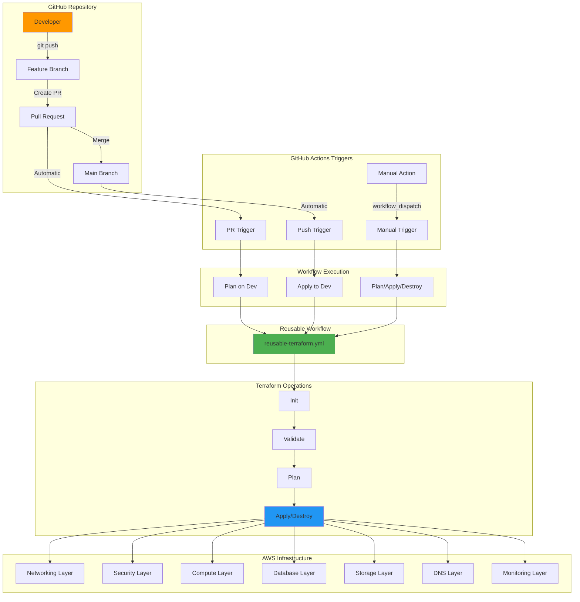

## 🔄 Layer Deployment Flow

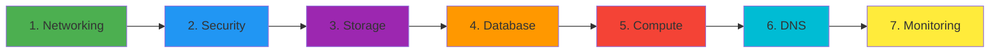

## 🎯 Trigger Types and Behavior

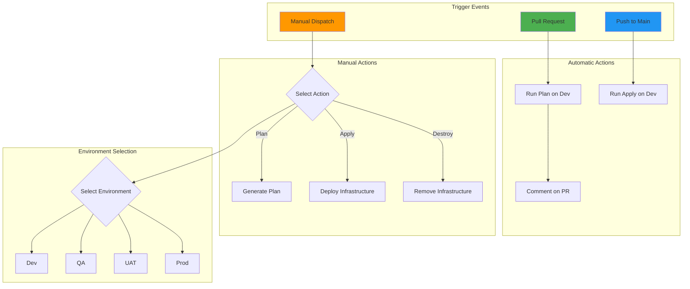

## 🔐 Environment Protection Flow

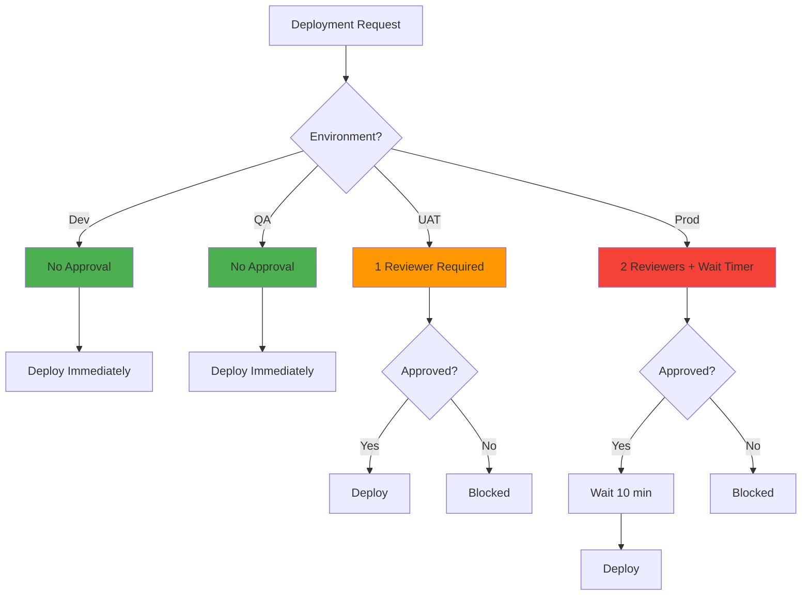

## 📦 Workflow File Structure

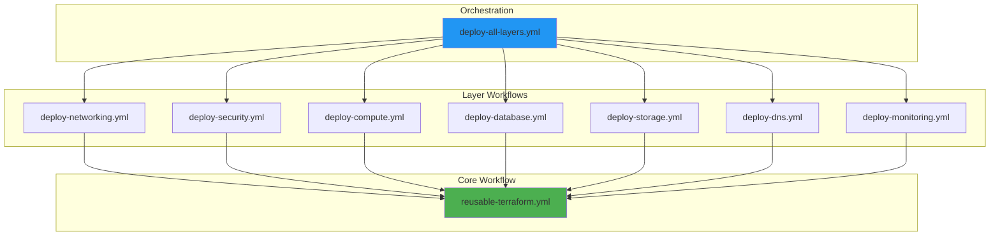

## 🔄 Complete Deployment Workflow

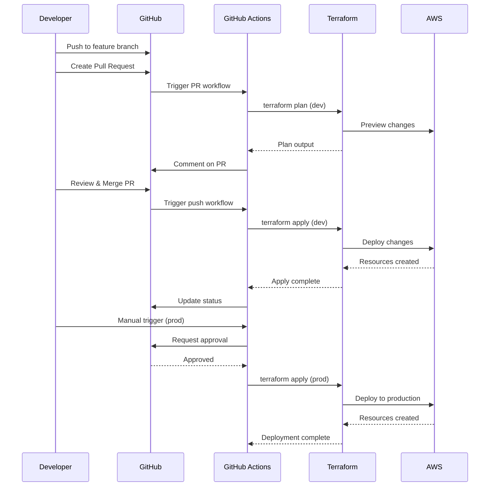

## 🎬 Layer Deployment Sequence

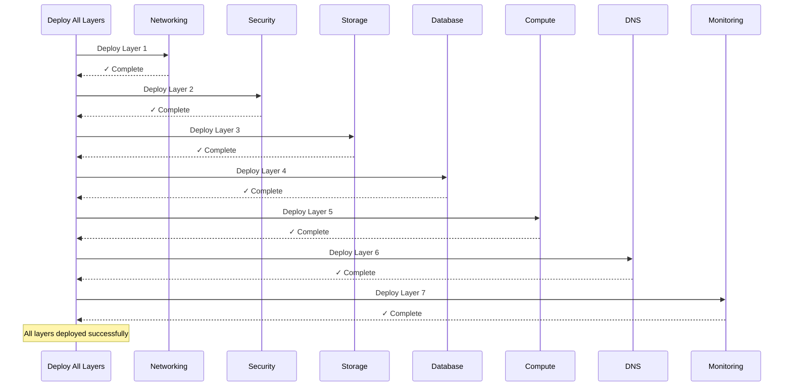

## 🔀 Branching and Deployment Strategy

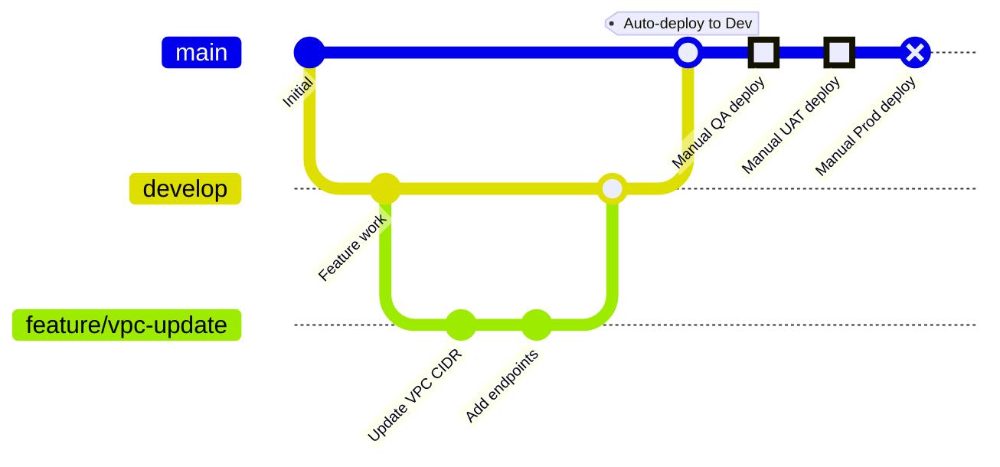

## 🏗️ Infrastructure Layer Dependencies

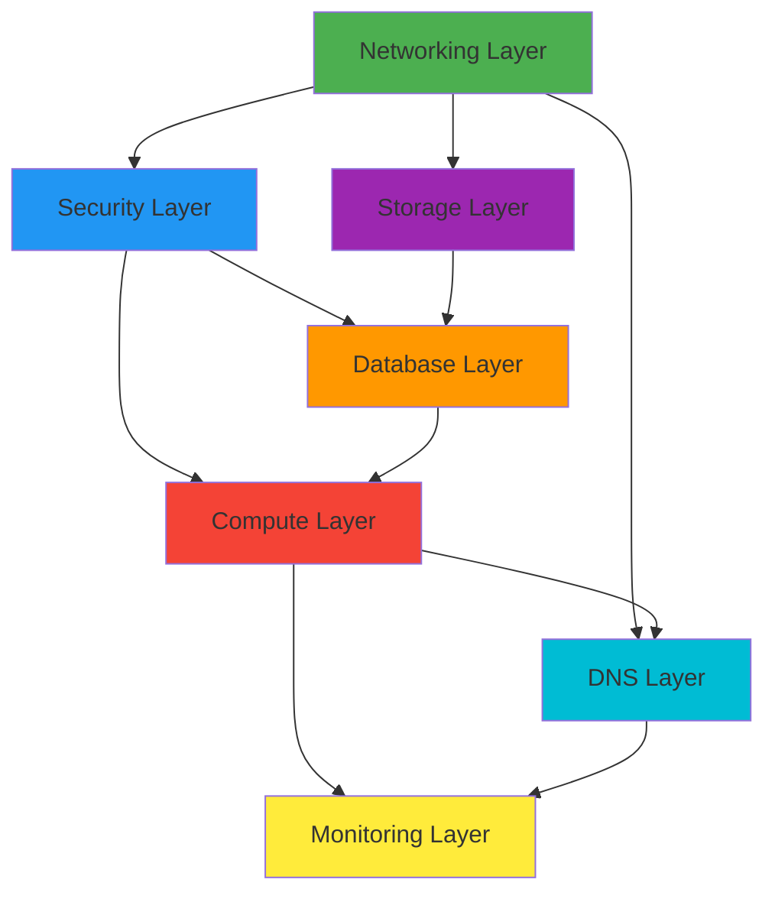

## 📈 Workflow Execution Steps

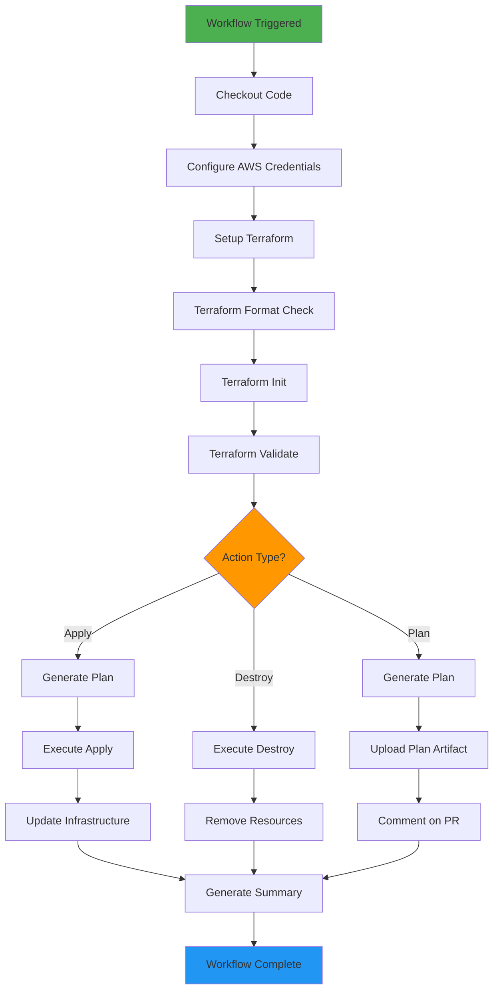

## 🔒 Security and Access Control

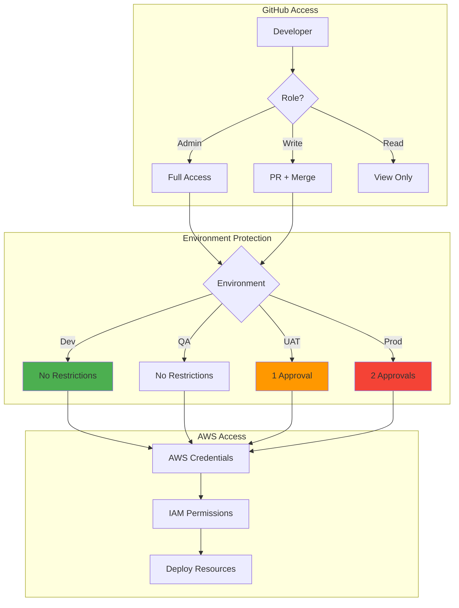

---

## 📝 Diagram Legend

| Symbol | Meaning |
|--------|---------|
| 🟢 Green | Safe/Approved |
| 🔵 Blue | In Progress |
| 🟡 Yellow | Needs Review |
| 🔴 Red | Critical/Prod |
| 🟣 Purple | Storage |
| 🟠 Orange | Warning |

## 🔗 Related Documentation

- [Complete CI/CD Guide](CICD.md)
- [Quick Start Guide](CICD-QUICKSTART.md)
- [Workflow README](../.github/workflows/README.md)

---

**Note**: These diagrams use Mermaid syntax and will render in GitHub, VS Code with Mermaid extension, or any Mermaid-compatible viewer.

**Last Updated**: October 2025  
**Maintained By**: Platform Engineering Team
