# ECR Integration Guide

## 📋 Overview

This guide explains how to use the ECR (Elastic Container Registry) module integrated into the compute layer of your infrastructure.

## 🎯 What is ECR?

Amazon Elastic Container Registry (ECR) is a fully managed container registry that makes it easy to store, manage, share, and deploy container images. It's integrated with:
- **Amazon ECS** (Elastic Container Service)
- **Amazon EKS** (Elastic Kubernetes Service)  
- **AWS Lambda** (for container-based functions)
- **Docker CLI** (standard docker push/pull)

## 🏗️ Architecture

### Integration Points

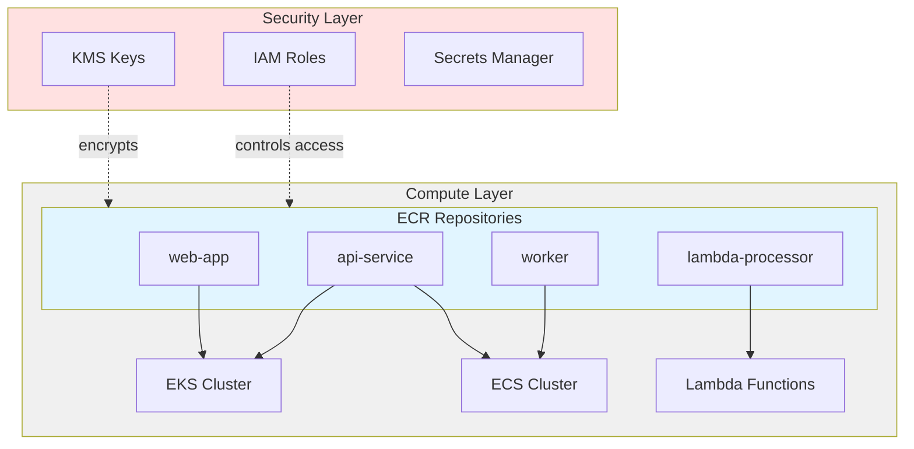
```mermaid
graph TB
    subgraph Compute["Compute Layer"]
        subgraph ECR["ECR Repositories"]
            webapp[web-app]
            api[api-service]
            worker[worker]
            lambda_img[lambda-processor]
        end
        
        EKS[EKS Cluster]
        ECS[ECS Cluster]
        Lambda[Lambda Functions]
        
        webapp --> EKS
        api --> EKS
        api --> ECS
        worker --> ECS
        lambda_img --> Lambda
    end
    
    subgraph Security["Security Layer"]
        KMS[KMS Keys]
        IAM[IAM Roles]
        Secrets[Secrets Manager]
    end
    
    KMS -.encrypts.-> ECR
    IAM -.controls access.-> ECR
    
    style ECR fill:#e1f5ff
    style Security fill:#ffe1e1
    style Compute fill:#f0f0f0
```

### ECR Feature Architecture

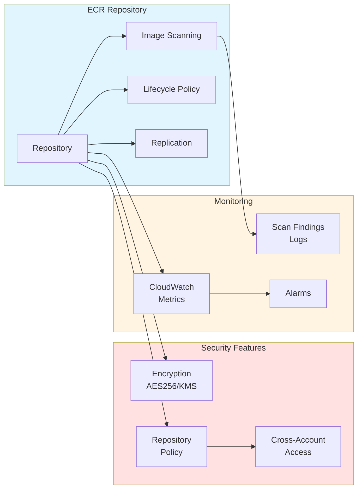
```mermaid
graph LR
    subgraph ECR["ECR Repository"]
        Repo[Repository]
        Scan[Image Scanning]
        Life[Lifecycle Policy]
        Rep[Replication]
    end
    
    subgraph Features["Security Features"]
        Encrypt[Encryption<br/>AES256/KMS]
        Policy[Repository<br/>Policy]
        CrossAcct[Cross-Account<br/>Access]
    end
    
    subgraph Monitoring["Monitoring"]
        CW[CloudWatch<br/>Metrics]
        Logs[Scan Findings<br/>Logs]
        Alarms[Alarms]
    end
    
    Repo --> Scan
    Repo --> Life
    Repo --> Rep
    Repo --> Encrypt
    Repo --> Policy
    Policy --> CrossAcct
    Scan --> Logs
    Repo --> CW
    CW --> Alarms
    
    style ECR fill:#e1f5ff
    style Features fill:#ffe1e1
    style Monitoring fill:#fff4e1
```

### Security Integration

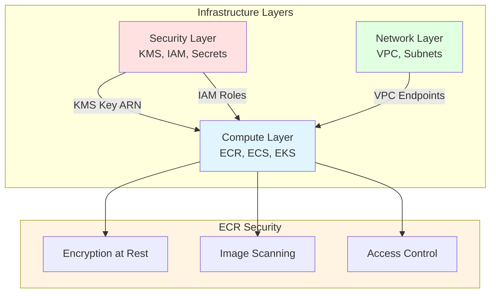
```mermaid
graph TD
    subgraph Layers["Infrastructure Layers"]
        Security[Security Layer<br/>KMS, IAM, Secrets]
        Compute[Compute Layer<br/>ECR, ECS, EKS]
        Network[Network Layer<br/>VPC, Subnets]
    end
    
    Security -->|KMS Key ARN| Compute
    Security -->|IAM Roles| Compute
    Network -->|VPC Endpoints| Compute
    
    subgraph ECR_Security["ECR Security"]
        Encryption[Encryption at Rest]
        Scanning[Image Scanning]
        AccessControl[Access Control]
    end
    
    Compute --> Encryption
    Compute --> Scanning
    Compute --> AccessControl
    
    style Security fill:#ffe1e1
    style Compute fill:#e1f5ff
    style Network fill:#e1ffe1
    style ECR_Security fill:#fff4e1
```

## 🚀 Quick Start

### Step 1: Define Your Repositories

Edit `layers/compute/environments/dev/terraform.tfvars`:

```hcl
ecr_repositories = {
  "web-app" = {
    image_tag_mutability = "MUTABLE"
    scan_on_push         = true
    max_image_count      = 50
  }
  
  "api-service" = {
    image_tag_mutability = "MUTABLE"
    scan_on_push         = true
    max_image_count      = 30
  }
}

ecr_encryption_type = "AES256"
```

### Step 2: Deploy

```bash
# Deploy compute layer with ECR repositories
cd layers/compute/environments/dev
terraform init
terraform plan
terraform apply
```

### Step 3: Get Repository URLs

```bash
# Get all repository URLs
terraform output ecr_repository_urls

# Output example:
# {
#   "api-service" = "123456789012.dkr.ecr.us-east-1.amazonaws.com/myproject-dev-api-service"
#   "web-app" = "123456789012.dkr.ecr.us-east-1.amazonaws.com/myproject-dev-web-app"
# }
```

### Step 4: Push Your First Image

```bash
# Authenticate Docker to ECR
aws ecr get-login-password --region us-east-1 | \
  docker login --username AWS --password-stdin \
  123456789012.dkr.ecr.us-east-1.amazonaws.com

# Build your image
docker build -t web-app:latest .

# Tag for ECR
docker tag web-app:latest \
  123456789012.dkr.ecr.us-east-1.amazonaws.com/myproject-dev-web-app:latest

# Push to ECR
docker push 123456789012.dkr.ecr.us-east-1.amazonaws.com/myproject-dev-web-app:latest
```

## 📊 Configuration Options

### Repository Configuration

Each repository in `ecr_repositories` map supports these options:

| Option | Type | Default | Description |
|--------|------|---------|-------------|
| `image_tag_mutability` | string | `"MUTABLE"` | MUTABLE or IMMUTABLE tags |
| `scan_on_push` | bool | `true` | Scan images when pushed |
| `enable_enhanced_scanning` | bool | `false` | Continuous vulnerability scanning |
| `scan_frequency` | string | `"SCAN_ON_PUSH"` | SCAN_ON_PUSH, CONTINUOUS_SCAN, MANUAL |
| `max_image_count` | number | `100` | Max images to keep |
| `lifecycle_policy` | string | `null` | Custom lifecycle policy JSON |
| `enable_cross_account_access` | bool | `false` | Allow other accounts to pull |
| `allowed_account_ids` | list(string) | `[]` | Account IDs with pull access |
| `enable_lambda_pull` | bool | `false` | Allow Lambda to pull images |
| `enable_replication` | bool | `false` | Enable multi-region replication |
| `replication_destinations` | list(object) | `[]` | Replication target regions |

### Layer-Level Configuration

| Variable | Type | Default | Description |
|----------|------|---------|-------------|
| `ecr_encryption_type` | string | `"AES256"` | AES256 or KMS |
| `ecr_enable_scan_findings_logging` | bool | `false` | Log scan results to CloudWatch |
| `ecr_log_retention_days` | number | `30` | Days to retain scan logs |

## 🌍 Environment-Specific Configurations

### Development Environment

```hcl
ecr_repositories = {
  "web-app" = {
    image_tag_mutability     = "MUTABLE"      # Allow tag updates
    scan_on_push             = true
    enable_enhanced_scanning = false          # Basic scanning
    max_image_count          = 50             # Less retention
    enable_cross_account_access = false       # Isolated
  }
}

ecr_encryption_type = "AES256"                # Standard encryption
ecr_enable_scan_findings_logging = false      # Save costs
```

### Production Environment

```hcl
ecr_repositories = {
  "web-app" = {
    image_tag_mutability     = "IMMUTABLE"    # Prevent tag changes
    scan_on_push             = true
    enable_enhanced_scanning = true           # Continuous scanning
    scan_frequency           = "CONTINUOUS_SCAN"
    max_image_count          = 100            # More retention
    enable_cross_account_access = true        # Share with UAT/QA
    allowed_account_ids      = ["123456789012", "210987654321"]
    enable_replication       = true           # DR strategy
    replication_destinations = [
      {
        region      = "us-west-2"
        registry_id = "YOUR_ACCOUNT_ID"
      }
    ]
  }
}

ecr_encryption_type = "KMS"                   # Enhanced encryption
ecr_enable_scan_findings_logging = true       # Compliance logging
ecr_log_retention_days = 90                   # Longer retention
```

## 🔐 Security Best Practices

### 1. Encryption

**Development:**
```hcl
ecr_encryption_type = "AES256"  # Standard encryption
```

**Production:**
```hcl
ecr_encryption_type = "KMS"     # Customer-managed keys
# Uses KMS key from security layer automatically
```

### 2. Image Tag Mutability

**Development:**
```hcl
image_tag_mutability = "MUTABLE"  # Allow tag updates for testing
```

**Production:**
```hcl
image_tag_mutability = "IMMUTABLE"  # Prevent accidental overwrites
```

### 3. Image Scanning

**Minimum (All Environments):**
```hcl
scan_on_push = true  # Scan every image
```

**Enhanced (Production):**
```hcl
scan_on_push             = true
enable_enhanced_scanning = true
scan_frequency           = "CONTINUOUS_SCAN"  # Continuous monitoring
```

### 4. Cross-Account Access

Only enable when necessary:

```hcl
enable_cross_account_access = true
allowed_account_ids = [
  "123456789012"  # Only specific accounts
]
```

### 5. Lifecycle Policies

Prevent unlimited storage costs:

```hcl
# Simple: Keep last N images
max_image_count = 50

# Or custom policy:
lifecycle_policy = jsonencode({
  rules = [
    {
      rulePriority = 1
      description  = "Keep last 10 production images"
      selection = {
        tagStatus     = "tagged"
        tagPrefixList = ["prod"]
        countType     = "imageCountMoreThan"
        countNumber   = 10
      }
      action = {
        type = "expire"
      }
    }
  ]
})
```

## 🔄 CI/CD Integration

### CI/CD Pipeline Flow

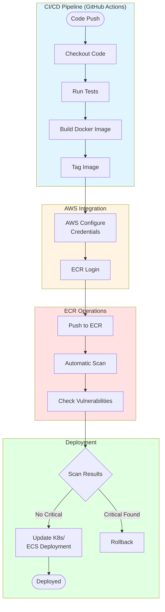
```mermaid
flowchart TB
    subgraph CI["CI/CD Pipeline (GitHub Actions)"]
        Start([Code Push]) --> Checkout[Checkout Code]
        Checkout --> Test[Run Tests]
        Test --> Build[Build Docker Image]
        Build --> Tag[Tag Image]
    end
    
    subgraph AWS["AWS Integration"]
        Auth[AWS Configure<br/>Credentials]
        Login[ECR Login]
    end
    
    subgraph ECR["ECR Operations"]
        Push[Push to ECR]
        Scan[Automatic Scan]
        Check[Check Vulnerabilities]
    end
    
    subgraph Deploy["Deployment"]
        Decision{Scan Results}
        UpdateK8s[Update K8s/<br/>ECS Deployment]
        Rollback[Rollback]
        Success([Deployed])
    end
    
    Tag --> Auth
    Auth --> Login
    Login --> Push
    Push --> Scan
    Scan --> Check
    Check --> Decision
    Decision -->|No Critical| UpdateK8s
    Decision -->|Critical Found| Rollback
    UpdateK8s --> Success
    
    style CI fill:#e1f5ff
    style AWS fill:#fff4e1
    style ECR fill:#ffe1e1
    style Deploy fill:#e1ffe1
```

### GitHub Actions Workflow

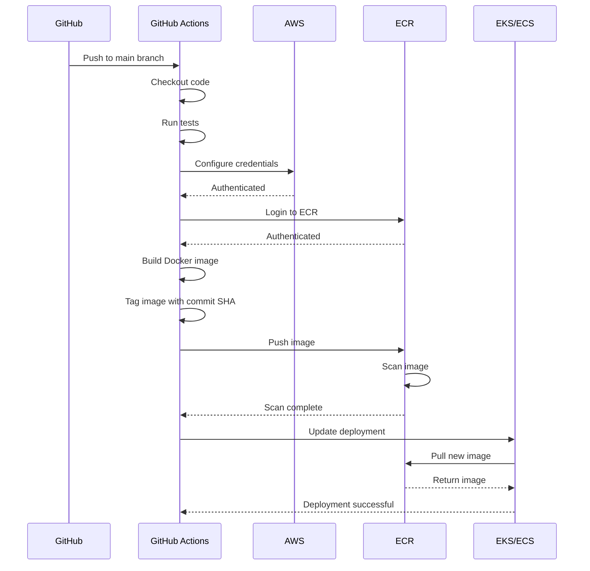
```mermaid
sequenceDiagram
    participant GH as GitHub
    participant GHA as GitHub Actions
    participant AWS as AWS
    participant ECR as ECR
    participant K8s as EKS/ECS
    
    GH->>GHA: Push to main branch
    GHA->>GHA: Checkout code
    GHA->>GHA: Run tests
    GHA->>AWS: Configure credentials
    AWS-->>GHA: Authenticated
    GHA->>ECR: Login to ECR
    ECR-->>GHA: Authenticated
    GHA->>GHA: Build Docker image
    GHA->>GHA: Tag image with commit SHA
    GHA->>ECR: Push image
    ECR->>ECR: Scan image
    ECR-->>GHA: Scan complete
    GHA->>K8s: Update deployment
    K8s->>ECR: Pull new image
    ECR-->>K8s: Return image
    K8s-->>GHA: Deployment successful
```

### GitHub Actions

```yaml
name: Build and Push to ECR

on:
  push:
    branches: [main, dev]

jobs:
  build:
    runs-on: ubuntu-latest
    steps:
      - uses: actions/checkout@v4
      
      - name: Configure AWS credentials
        uses: aws-actions/configure-aws-credentials@v4
        with:
          aws-access-key-id: ${{ secrets.AWS_ACCESS_KEY_ID }}
          aws-secret-access-key: ${{ secrets.AWS_SECRET_ACCESS_KEY }}
          aws-region: us-east-1
      
      - name: Login to ECR
        id: login-ecr
        uses: aws-actions/amazon-ecr-login@v2
      
      - name: Build, tag, and push image
        env:
          ECR_REGISTRY: ${{ steps.login-ecr.outputs.registry }}
          ECR_REPOSITORY: myproject-dev-web-app
          IMAGE_TAG: ${{ github.sha }}
        run: |
          docker build -t $ECR_REGISTRY/$ECR_REPOSITORY:$IMAGE_TAG .
          docker push $ECR_REGISTRY/$ECR_REPOSITORY:$IMAGE_TAG
          docker tag $ECR_REGISTRY/$ECR_REPOSITORY:$IMAGE_TAG \
                     $ECR_REGISTRY/$ECR_REPOSITORY:latest
          docker push $ECR_REGISTRY/$ECR_REPOSITORY:latest
```

### GitLab CI

```yaml
build:
  stage: build
  image: docker:latest
  services:
    - docker:dind
  before_script:
    - apk add --no-cache python3 py3-pip
    - pip3 install awscli
    - aws ecr get-login-password --region us-east-1 | docker login --username AWS --password-stdin $ECR_REGISTRY
  script:
    - docker build -t $ECR_REGISTRY/myproject-dev-web-app:$CI_COMMIT_SHA .
    - docker push $ECR_REGISTRY/myproject-dev-web-app:$CI_COMMIT_SHA
```

## 📱 Using ECR with Container Services

### EKS (Kubernetes)

```yaml
apiVersion: apps/v1
kind: Deployment
metadata:
  name: web-app
spec:
  replicas: 3
  template:
    spec:
      containers:
      - name: web-app
        image: 123456789012.dkr.ecr.us-east-1.amazonaws.com/myproject-prod-web-app:v1.2.3
        ports:
        - containerPort: 8080
```

### ECS (Fargate)

```hcl
resource "aws_ecs_task_definition" "app" {
  family = "web-app"
  container_definitions = jsonencode([
    {
      name  = "web-app"
      image = "${module.ecr_repositories["web-app"].repository_url}:latest"
      portMappings = [
        {
          containerPort = 8080
          protocol      = "tcp"
        }
      ]
    }
  ])
}
```

### Lambda Container

```hcl
resource "aws_lambda_function" "processor" {
  function_name = "image-processor"
  role          = aws_iam_role.lambda.arn
  package_type  = "Image"
  image_uri     = "${module.ecr_repositories["lambda-processor"].repository_url}:latest"
  
  environment {
    variables = {
      ENV = "production"
    }
  }
}
```

## 🔍 Monitoring and Operations

### View Scan Results

```bash
# List images in repository
aws ecr list-images \
  --repository-name myproject-dev-web-app \
  --region us-east-1

# Get scan findings for specific image
aws ecr describe-image-scan-findings \
  --repository-name myproject-dev-web-app \
  --image-id imageTag=latest \
  --region us-east-1
```

### Check Repository Details

```bash
# Describe repository
aws ecr describe-repositories \
  --repository-names myproject-dev-web-app \
  --region us-east-1

# Get lifecycle policy
aws ecr get-lifecycle-policy \
  --repository-name myproject-dev-web-app \
  --region us-east-1
```

### CloudWatch Metrics

ECR automatically provides these metrics:
- `RepositoryPullCount` - Number of pulls
- `RepositoryPushCount` - Number of pushes
- Storage used per repository

```bash
# View metrics via AWS CLI
aws cloudwatch get-metric-statistics \
  --namespace AWS/ECR \
  --metric-name RepositoryPullCount \
  --dimensions Name=RepositoryName,Value=myproject-dev-web-app \
  --start-time 2024-01-01T00:00:00Z \
  --end-time 2024-01-02T00:00:00Z \
  --period 3600 \
  --statistics Sum
```

## 💰 Cost Optimization

### 1. Lifecycle Policies

Remove old images automatically:
```hcl
max_image_count = 50  # Keep only last 50 images
```

### 2. Replication

Only replicate critical repositories:
```hcl
# Don't replicate dev/test repositories
enable_replication = var.environment == "prod"
```

### 3. Enhanced Scanning

Enable selectively:
```hcl
# Only for production and critical services
enable_enhanced_scanning = contains(["prod", "uat"], var.environment)
```

### 4. Image Compression

Use multi-stage builds:
```dockerfile
# Build stage
FROM node:18 AS builder
WORKDIR /app
COPY package*.json ./
RUN npm ci
COPY . .
RUN npm run build

# Production stage
FROM node:18-alpine  # Smaller base image
WORKDIR /app
COPY --from=builder /app/dist ./dist
COPY --from=builder /app/node_modules ./node_modules
CMD ["node", "dist/main.js"]
```

## 🚨 Troubleshooting

### Issue: Cannot authenticate to ECR

**Error:**
```
Error saving credentials: error storing credentials
```

**Solution:**
```bash
# Clear Docker credentials
rm ~/.docker/config.json

# Re-authenticate
aws ecr get-login-password --region us-east-1 | \
  docker login --username AWS --password-stdin \
  123456789012.dkr.ecr.us-east-1.amazonaws.com
```

### Issue: Permission denied when pushing

**Error:**
```
denied: Your authorization token has expired
```

**Solution:**
```bash
# Get fresh authentication token
aws ecr get-login-password --region us-east-1 | \
  docker login --username AWS --password-stdin \
  123456789012.dkr.ecr.us-east-1.amazonaws.com
```

### Issue: Image vulnerabilities found

**Solution:**
1. Review scan findings:
```bash
aws ecr describe-image-scan-findings \
  --repository-name myproject-dev-web-app \
  --image-id imageTag=latest
```

2. Update base image and dependencies
3. Rebuild and push new image
4. Re-scan

### Issue: Lifecycle policy not deleting images

**Check:**
1. Verify policy syntax
2. Check if images match selection criteria
3. Wait 24 hours (policies run daily)

```bash
# Verify policy
aws ecr get-lifecycle-policy \
  --repository-name myproject-dev-web-app
```

## 📚 Additional Resources

### Module Documentation
- [ECR Module README](../modules/ecr/README.md)
- [ECR Module Variables](../modules/ecr/variables.tf)
- [ECR Module Outputs](../modules/ecr/outputs.tf)

### Configuration Examples
- [Development Example](../layers/compute/environments/ecr-examples-dev.tfvars)
- [Production Example](../layers/compute/environments/ecr-examples-prod.tfvars)

### AWS Documentation
- [ECR User Guide](https://docs.aws.amazon.com/ecr/)
- [ECR Best Practices](https://docs.aws.amazon.com/AmazonECR/latest/userguide/best-practices.html)
- [Image Scanning](https://docs.aws.amazon.com/AmazonECR/latest/userguide/image-scanning.html)
- [Lifecycle Policies](https://docs.aws.amazon.com/AmazonECR/latest/userguide/LifecyclePolicies.html)

### Docker Documentation
- [Docker Build](https://docs.docker.com/engine/reference/commandline/build/)
- [Multi-stage Builds](https://docs.docker.com/build/building/multi-stage/)
- [Best Practices](https://docs.docker.com/develop/dev-best-practices/)

## 🤝 Contributing

When adding new ECR repositories:
1. Add to `ecr_repositories` map in tfvars
2. Document the purpose and configuration
3. Set appropriate lifecycle policies
4. Enable scanning
5. Test push/pull operations

## 📞 Support

For ECR-related issues:
- Check this guide first
- Review [module documentation](../modules/ecr/README.md)
- Check [AWS ECR Documentation](https://docs.aws.amazon.com/ecr/)
- Contact Platform Engineering team

---

**Last Updated:** October 2025  
**Maintained By:** Platform Engineering Team


### Image Push Workflow

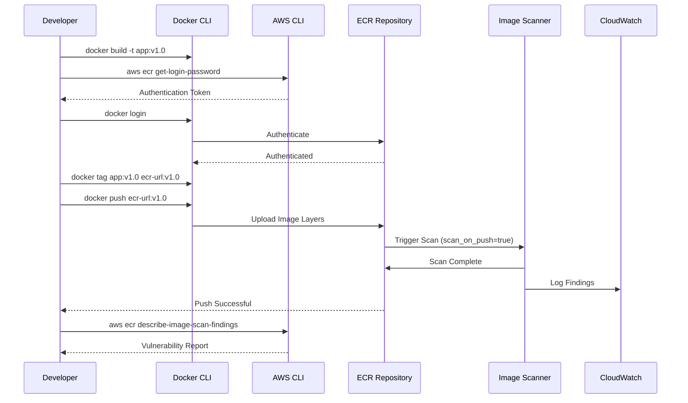
```mermaid
sequenceDiagram
    participant Dev as Developer
    participant Docker as Docker CLI
    participant AWS as AWS CLI
    participant ECR as ECR Repository
    participant Scanner as Image Scanner
    participant CW as CloudWatch
    
    Dev->>Docker: docker build -t app:v1.0
    Dev->>AWS: aws ecr get-login-password
    AWS-->>Dev: Authentication Token
    Dev->>Docker: docker login
    Docker->>ECR: Authenticate
    ECR-->>Docker: Authenticated
    Dev->>Docker: docker tag app:v1.0 ecr-url:v1.0
    Dev->>Docker: docker push ecr-url:v1.0
    Docker->>ECR: Upload Image Layers
    ECR->>Scanner: Trigger Scan (scan_on_push=true)
    Scanner->>ECR: Scan Complete
    Scanner->>CW: Log Findings
    ECR-->>Dev: Push Successful
    Dev->>AWS: aws ecr describe-image-scan-findings
    AWS-->>Dev: Vulnerability Report
```

### Image Pull Workflow (EKS/ECS)

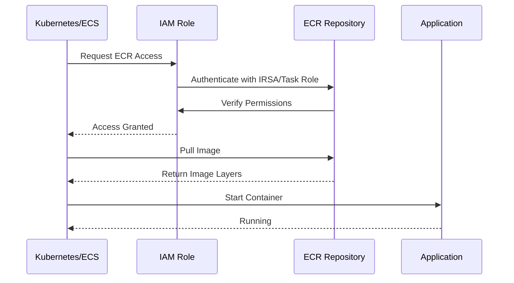
```mermaid
sequenceDiagram
    participant K8s as Kubernetes/ECS
    participant IAM as IAM Role
    participant ECR as ECR Repository
    participant App as Application
    
    K8s->>IAM: Request ECR Access
    IAM->>ECR: Authenticate with IRSA/Task Role
    ECR->>IAM: Verify Permissions
    IAM-->>K8s: Access Granted
    K8s->>ECR: Pull Image
    ECR-->>K8s: Return Image Layers
    K8s->>App: Start Container
    App-->>K8s: Running
```

### Lifecycle Policy Execution

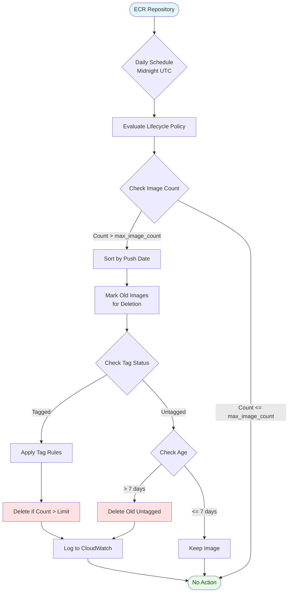
```mermaid
flowchart TD
    Start([ECR Repository]) --> Daily{Daily Schedule<br/>Midnight UTC}
    Daily --> Policy[Evaluate Lifecycle Policy]
    Policy --> Count{Check Image Count}
    
    Count -->|Count > max_image_count| Sort[Sort by Push Date]
    Count -->|Count <= max_image_count| End([No Action])
    
    Sort --> Mark[Mark Old Images<br/>for Deletion]
    Mark --> Tag{Check Tag Status}
    
    Tag -->|Tagged| Rules[Apply Tag Rules]
    Tag -->|Untagged| Age{Check Age}
    
    Rules --> Delete1[Delete if Count > Limit]
    Age -->|> 7 days| Delete2[Delete Old Untagged]
    Age -->|<= 7 days| Keep[Keep Image]
    
    Delete1 --> Log[Log to CloudWatch]
    Delete2 --> Log
    Keep --> End
    Log --> End
    
    style Start fill:#e1f5ff
    style Delete1 fill:#ffe1e1
    style Delete2 fill:#ffe1e1
    style End fill:#e1ffe1
```

### Multi-Region Replication Flow

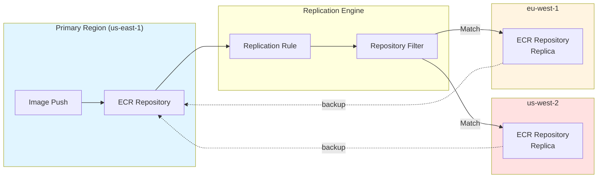
```mermaid
flowchart LR
    subgraph Primary["Primary Region (us-east-1)"]
        ECR1[ECR Repository]
        Push1[Image Push]
    end
    
    subgraph Replication["Replication Engine"]
        Rep[Replication Rule]
        Filter[Repository Filter]
    end
    
    subgraph Secondary1["us-west-2"]
        ECR2[ECR Repository<br/>Replica]
    end
    
    subgraph Secondary2["eu-west-1"]
        ECR3[ECR Repository<br/>Replica]
    end
    
    Push1 --> ECR1
    ECR1 --> Rep
    Rep --> Filter
    Filter -->|Match| ECR2
    Filter -->|Match| ECR3
    
    ECR2 -.backup.-> ECR1
    ECR3 -.backup.-> ECR1
    
    style Primary fill:#e1f5ff
    style Secondary1 fill:#ffe1e1
    style Secondary2 fill:#fff4e1
```

### Cross-Account Access Pattern

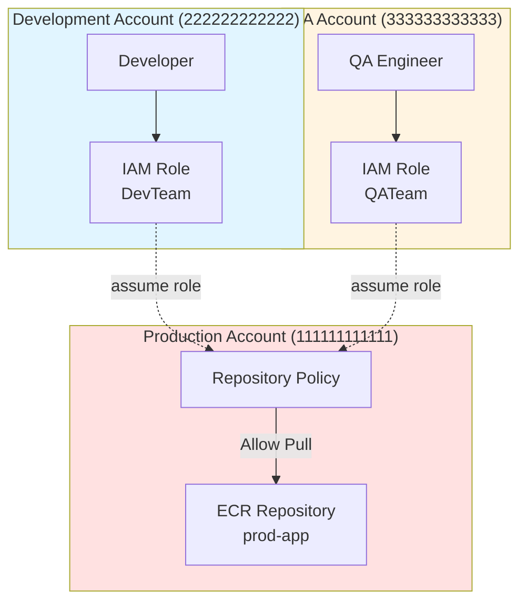
```mermaid
graph TB
    subgraph Prod["Production Account (111111111111)"]
        ECR_Prod[ECR Repository<br/>prod-app]
        Policy_Prod[Repository Policy]
    end
    
    subgraph Dev["Development Account (222222222222)"]
        IAM_Dev[IAM Role<br/>DevTeam]
        User_Dev[Developer]
    end
    
    subgraph QA["QA Account (333333333333)"]
        IAM_QA[IAM Role<br/>QATeam]
        User_QA[QA Engineer]
    end
    
    User_Dev --> IAM_Dev
    User_QA --> IAM_QA
    
    IAM_Dev -.assume role.-> Policy_Prod
    IAM_QA -.assume role.-> Policy_Prod
    
    Policy_Prod -->|Allow Pull| ECR_Prod
    
    style Prod fill:#ffe1e1
    style Dev fill:#e1f5ff
    style QA fill:#fff4e1
```


## 🌍 Environment-Specific Configurations

### Environment Configuration Decision Tree

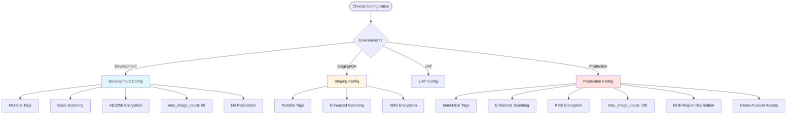
```mermaid
flowchart TD
    Start([Choose Configuration]) --> Env{Environment?}
    
    Env -->|Development| DevConfig[Development Config]
    Env -->|Staging/QA| StageConfig[Staging Config]
    Env -->|UAT| UATConfig[UAT Config]
    Env -->|Production| ProdConfig[Production Config]
    
    DevConfig --> DevTag[Mutable Tags]
    DevConfig --> DevScan[Basic Scanning]
    DevConfig --> DevEnc[AES256 Encryption]
    DevConfig --> DevLife[max_image_count: 50]
    DevConfig --> DevRep[No Replication]
    
    ProdConfig --> ProdTag[Immutable Tags]
    ProdConfig --> ProdScan[Enhanced Scanning]
    ProdConfig --> ProdEnc[KMS Encryption]
    ProdConfig --> ProdLife[max_image_count: 100]
    ProdConfig --> ProdRep[Multi-Region Replication]
    ProdConfig --> ProdCross[Cross-Account Access]
    
    StageConfig --> StageTag[Mutable Tags]
    StageConfig --> StageScan[Enhanced Scanning]
    StageConfig --> StageEnc[KMS Encryption]
    
    style DevConfig fill:#e1f5ff
    style ProdConfig fill:#ffe1e1
    style StageConfig fill:#fff4e1
```

### Feature Selection Matrix

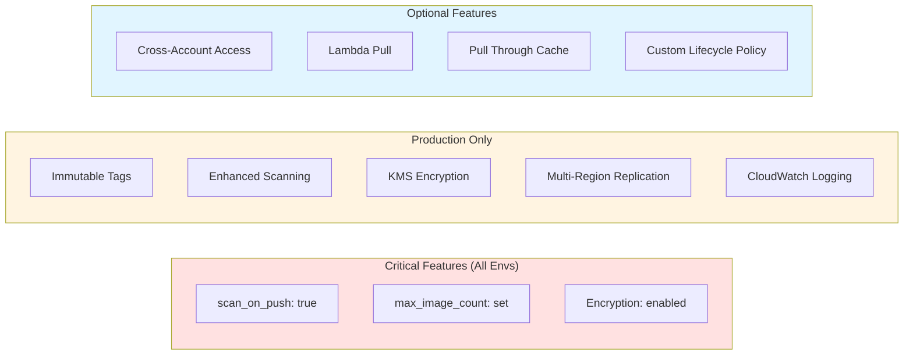
```mermaid
graph LR
    subgraph Critical["Critical Features (All Envs)"]
        F1[scan_on_push: true]
        F2[max_image_count: set]
        F3[Encryption: enabled]
    end
    
    subgraph Prod_Only["Production Only"]
        P1[Immutable Tags]
        P2[Enhanced Scanning]
        P3[KMS Encryption]
        P4[Multi-Region Replication]
        P5[CloudWatch Logging]
    end
    
    subgraph Optional["Optional Features"]
        O1[Cross-Account Access]
        O2[Lambda Pull]
        O3[Pull Through Cache]
        O4[Custom Lifecycle Policy]
    end
    
    style Critical fill:#ffe1e1
    style Prod_Only fill:#fff4e1
    style Optional fill:#e1f5ff
```


## 📊 Monitoring and Operations

### Image Scanning Workflow

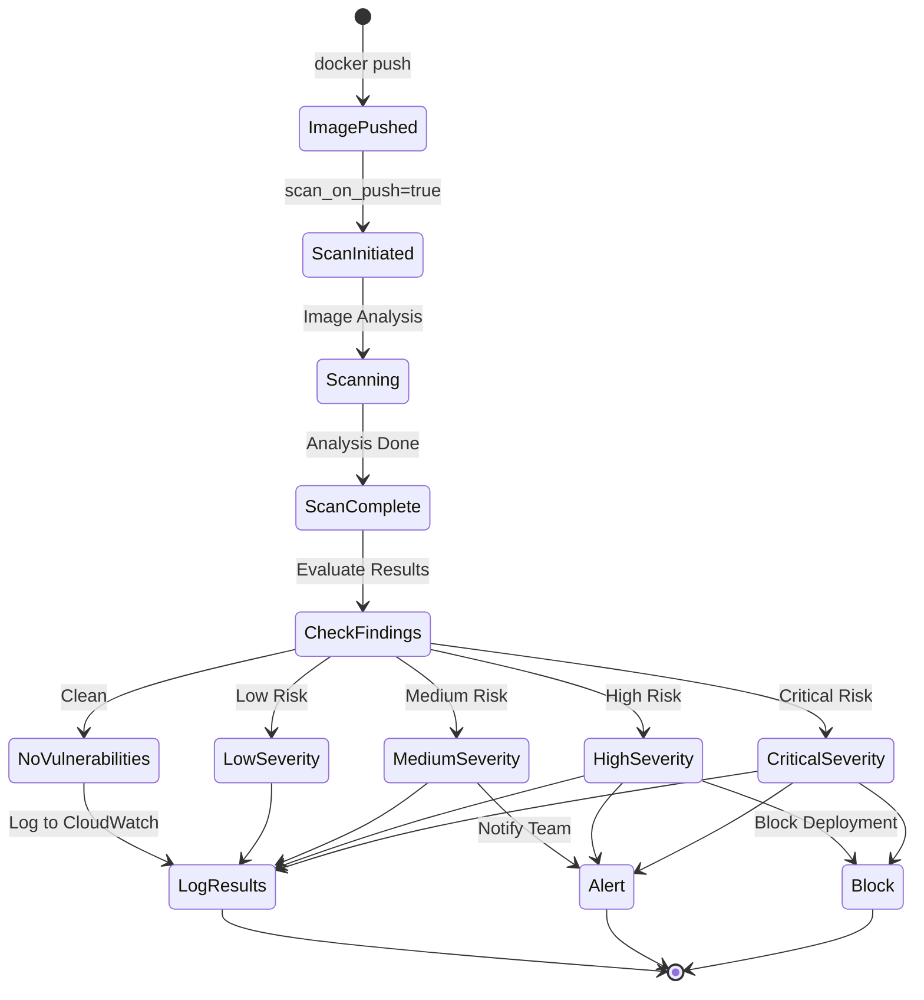
```mermaid
stateDiagram-v2
    [*] --> ImagePushed: docker push
    ImagePushed --> ScanInitiated: scan_on_push=true
    ScanInitiated --> Scanning: Image Analysis
    
    Scanning --> ScanComplete: Analysis Done
    ScanComplete --> CheckFindings: Evaluate Results
    
    CheckFindings --> NoVulnerabilities: Clean
    CheckFindings --> LowSeverity: Low Risk
    CheckFindings --> MediumSeverity: Medium Risk
    CheckFindings --> HighSeverity: High Risk
    CheckFindings --> CriticalSeverity: Critical Risk
    
    NoVulnerabilities --> LogResults: Log to CloudWatch
    LowSeverity --> LogResults
    MediumSeverity --> LogResults
    MediumSeverity --> Alert: Notify Team
    HighSeverity --> LogResults
    HighSeverity --> Alert
    HighSeverity --> Block: Block Deployment
    CriticalSeverity --> LogResults
    CriticalSeverity --> Alert
    CriticalSeverity --> Block
    
    LogResults --> [*]
    Alert --> [*]
    Block --> [*]
```

### Monitoring Dashboard Structure

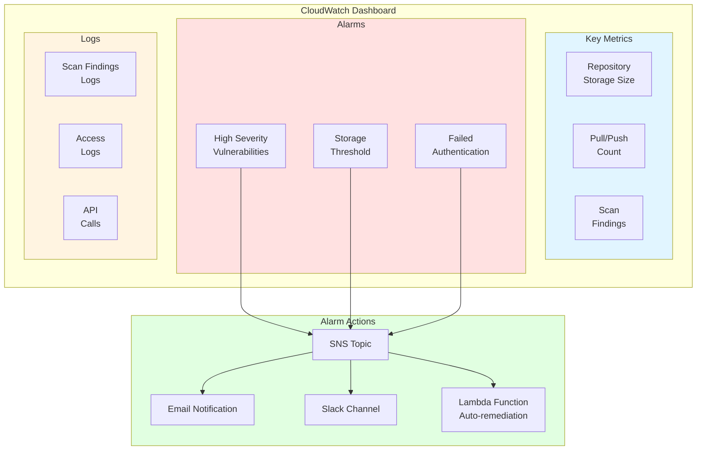
```mermaid
graph TB
    subgraph CloudWatch["CloudWatch Dashboard"]
        subgraph Metrics["Key Metrics"]
            M1[Repository<br/>Storage Size]
            M2[Pull/Push<br/>Count]
            M3[Scan<br/>Findings]
        end
        
        subgraph Alarms["Alarms"]
            A1[High Severity<br/>Vulnerabilities]
            A2[Storage<br/>Threshold]
            A3[Failed<br/>Authentication]
        end
        
        subgraph Logs["Logs"]
            L1[Scan Findings<br/>Logs]
            L2[Access<br/>Logs]
            L3[API<br/>Calls]
        end
    end
    
    subgraph Actions["Alarm Actions"]
        SNS[SNS Topic]
        Email[Email Notification]
        Slack[Slack Channel]
        Lambda[Lambda Function<br/>Auto-remediation]
    end
    
    A1 --> SNS
    A2 --> SNS
    A3 --> SNS
    SNS --> Email
    SNS --> Slack
    SNS --> Lambda
    
    style Metrics fill:#e1f5ff
    style Alarms fill:#ffe1e1
    style Logs fill:#fff4e1
    style Actions fill:#e1ffe1
```

### Security Scanning Levels

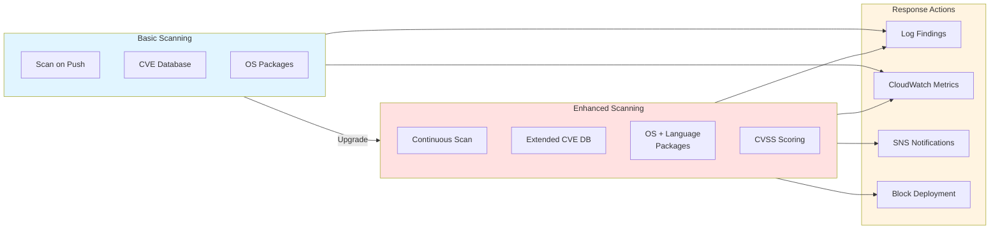
```mermaid
flowchart LR
    subgraph Basic["Basic Scanning"]
        B1[Scan on Push]
        B2[CVE Database]
        B3[OS Packages]
    end
    
    subgraph Enhanced["Enhanced Scanning"]
        E1[Continuous Scan]
        E2[Extended CVE DB]
        E3[OS + Language<br/>Packages]
        E4[CVSS Scoring]
    end
    
    subgraph Actions["Response Actions"]
        R1[Log Findings]
        R2[CloudWatch Metrics]
        R3[SNS Notifications]
        R4[Block Deployment]
    end
    
    Basic -->|Upgrade| Enhanced
    Basic --> R1
    Basic --> R2
    Enhanced --> R1
    Enhanced --> R2
    Enhanced --> R3
    Enhanced --> R4
    
    style Basic fill:#e1f5ff
    style Enhanced fill:#ffe1e1
    style Actions fill:#fff4e1
```


## 📱 Using ECR with Container Services

### EKS Integration Architecture

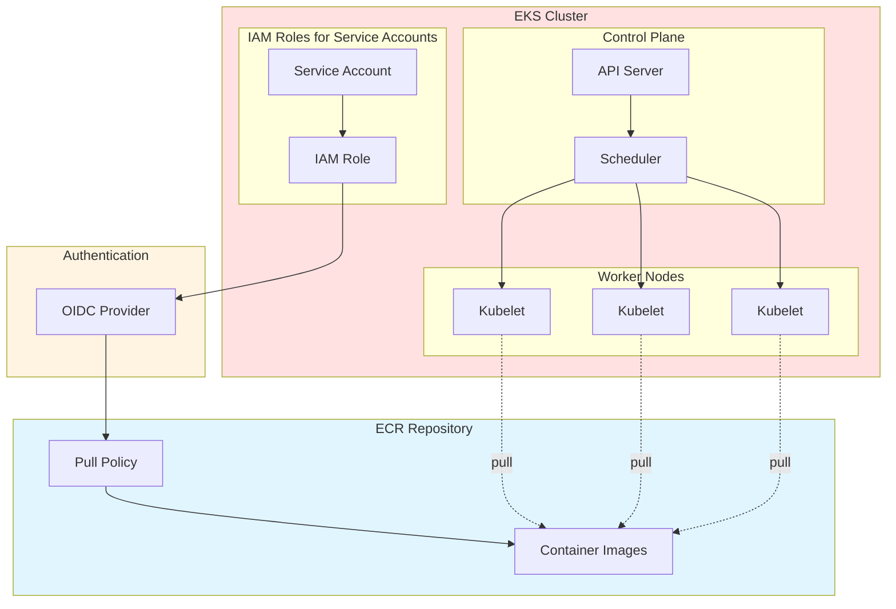
```mermaid
graph TB
    subgraph ECR["ECR Repository"]
        Images[Container Images]
        Policy[Pull Policy]
    end
    
    subgraph EKS["EKS Cluster"]
        subgraph ControlPlane["Control Plane"]
            API[API Server]
            Scheduler[Scheduler]
        end
        
        subgraph DataPlane["Worker Nodes"]
            Kubelet1[Kubelet]
            Kubelet2[Kubelet]
            Kubelet3[Kubelet]
        end
        
        subgraph IRSA["IAM Roles for Service Accounts"]
            SA[Service Account]
            IAMRole[IAM Role]
        end
    end
    
    subgraph Auth["Authentication"]
        OIDC[OIDC Provider]
    end
    
    API --> Scheduler
    Scheduler --> Kubelet1
    Scheduler --> Kubelet2
    Scheduler --> Kubelet3
    
    SA --> IAMRole
    IAMRole --> OIDC
    OIDC --> Policy
    Policy --> Images
    
    Kubelet1 -.pull.-> Images
    Kubelet2 -.pull.-> Images
    Kubelet3 -.pull.-> Images
    
    style ECR fill:#e1f5ff
    style EKS fill:#ffe1e1
    style Auth fill:#fff4e1
```

### ECS Integration Architecture

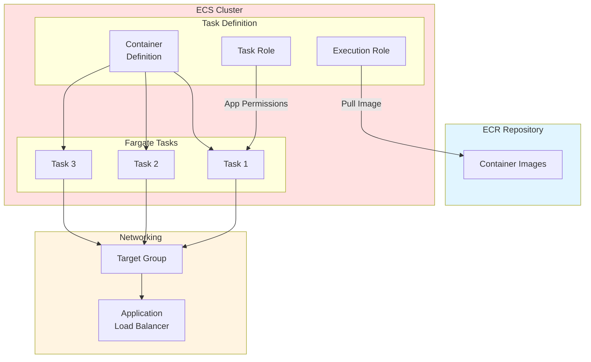
```mermaid
graph TB
    subgraph ECR["ECR Repository"]
        Images[Container Images]
    end
    
    subgraph ECS["ECS Cluster"]
        subgraph Tasks["Fargate Tasks"]
            Task1[Task 1]
            Task2[Task 2]
            Task3[Task 3]
        end
        
        subgraph TaskDef["Task Definition"]
            TD[Container<br/>Definition]
            TaskRole[Task Role]
            ExecRole[Execution Role]
        end
    end
    
    subgraph Network["Networking"]
        ALB[Application<br/>Load Balancer]
        TG[Target Group]
    end
    
    TD --> Task1
    TD --> Task2
    TD --> Task3
    
    ExecRole -->|Pull Image| Images
    TaskRole -->|App Permissions| Task1
    
    Task1 --> TG
    Task2 --> TG
    Task3 --> TG
    TG --> ALB
    
    style ECR fill:#e1f5ff
    style ECS fill:#ffe1e1
    style Network fill:#fff4e1
```

### Lambda Container Integration

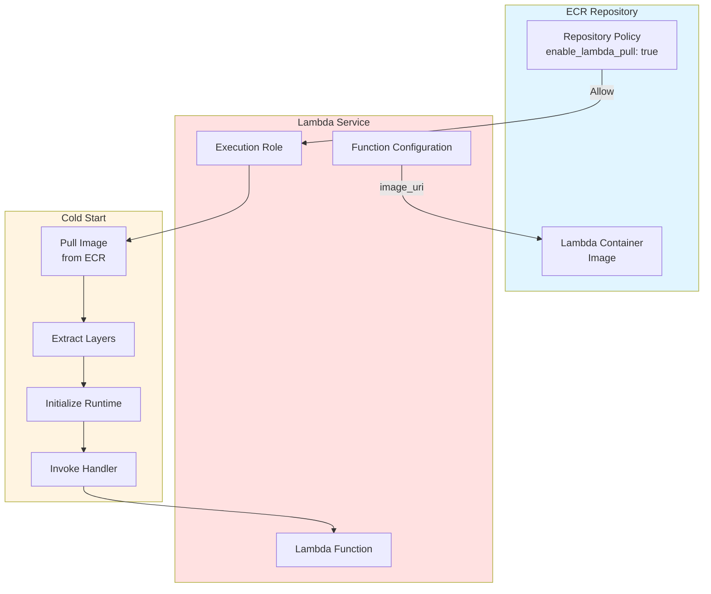
```mermaid
flowchart TD
    subgraph ECR["ECR Repository"]
        Image[Lambda Container<br/>Image]
        Policy[Repository Policy<br/>enable_lambda_pull: true]
    end
    
    subgraph Lambda["Lambda Service"]
        Function[Lambda Function]
        ExecRole[Execution Role]
        Config[Function Configuration]
    end
    
    subgraph Execution["Cold Start"]
        Pull[Pull Image<br/>from ECR]
        Extract[Extract Layers]
        Init[Initialize Runtime]
        Handler[Invoke Handler]
    end
    
    Config -->|image_uri| Image
    Policy -->|Allow| ExecRole
    ExecRole --> Pull
    Pull --> Extract
    Extract --> Init
    Init --> Handler
    Handler --> Function
    
    style ECR fill:#e1f5ff
    style Lambda fill:#ffe1e1
    style Execution fill:#fff4e1
```

### Deployment Strategies Comparison

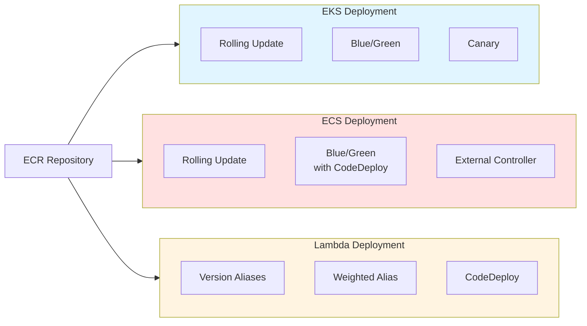
```mermaid
graph LR
    subgraph EKS["EKS Deployment"]
        K1[Rolling Update]
        K2[Blue/Green]
        K3[Canary]
    end
    
    subgraph ECS["ECS Deployment"]
        E1[Rolling Update]
        E2[Blue/Green<br/>with CodeDeploy]
        E3[External Controller]
    end
    
    subgraph Lambda["Lambda Deployment"]
        L1[Version Aliases]
        L2[Weighted Alias]
        L3[CodeDeploy]
    end
    
    ECR[ECR Repository] --> EKS
    ECR --> ECS
    ECR --> Lambda
    
    style EKS fill:#e1f5ff
    style ECS fill:#ffe1e1
    style Lambda fill:#fff4e1
```


## 💰 Cost Optimization

### Cost Components Breakdown

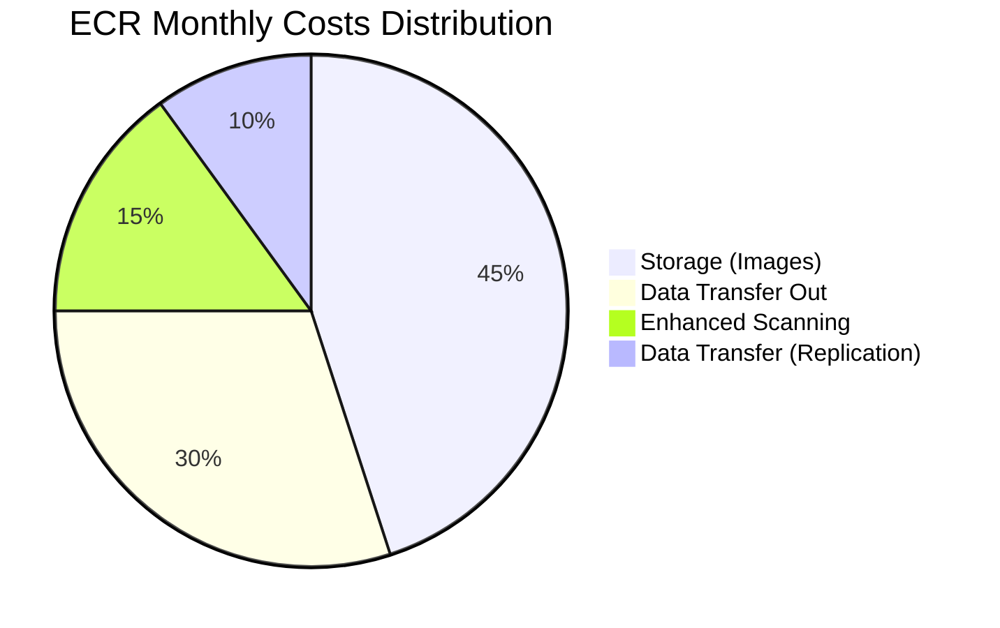
```mermaid
pie title ECR Monthly Costs Distribution
    "Storage (Images)" : 45
    "Data Transfer Out" : 30
    "Enhanced Scanning" : 15
    "Data Transfer (Replication)" : 10
```

### Cost Optimization Strategy

```mermaid
flowchart TD
    Start([ECR Repository]) --> Storage{Storage Costs<br/>High?}
    
    Storage -->|Yes| Lifecycle[Implement<br/>Lifecycle Policy]
    Storage -->|No| Transfer{Data Transfer<br/>Costs High?}
    
    Lifecycle --> MaxCount[Set max_image_count]
    Lifecycle --> TagRules[Age-based Cleanup]
    MaxCount --> Monitor1[Monitor Monthly]
    TagRules --> Monitor1
    
    Transfer -->|Yes| CacheStrategy{Can Use<br/>Cache?}
    Transfer -->|No| Scanning{Scanning Costs<br/>High?}
    
    CacheStrategy -->|Yes| PullThrough[Enable Pull<br/>Through Cache]
    CacheStrategy -->|No| Replication{Need<br/>Replication?}
    
    Replication -->|Yes| Selective[Selective<br/>Replication]
    Replication -->|No| Monitor2[Monitor Monthly]
    
    Scanning -->|Yes| BasicScan[Use Basic Scanning<br/>for Non-Prod]
    Scanning -->|No| Optimized([Optimized])
    
    PullThrough --> Monitor2
    Selective --> Monitor2
    BasicScan --> Monitor2
    Monitor1 --> Optimized
    Monitor2 --> Optimized
    
    style Start fill:#e1f5ff
    style Optimized fill:#e1ffe1
    style Lifecycle fill:#ffe1e1
    style CacheStrategy fill:#fff4e1
```

### Lifecycle Policy Impact

```mermaid
gantt
    title Image Retention Over Time
    dateFormat YYYY-MM-DD
    section Without Policy
    Images Accumulate  :a1, 2024-01-01, 365d
    section With Policy (max 50)
    Controlled Growth  :a2, 2024-01-01, 60d
    Steady State       :a3, after a2, 305d
```


## 🚨 Troubleshooting

### Authentication Troubleshooting Flow

```mermaid
flowchart TD
    Start([Authentication Failed]) --> Check{Error Type?}
    
    Check -->|Token Expired| Refresh[Get Fresh Token]
    Check -->|No Credentials| Setup[Configure AWS CLI]
    Check -->|Permission Denied| IAM[Check IAM Permissions]
    Check -->|Invalid Registry| Registry[Verify Registry URL]
    
    Refresh --> Login[Run ECR Login]
    Setup --> Configure[aws configure]
    Configure --> Login
    
    IAM --> Permissions{Has Required<br/>Permissions?}
    Permissions -->|No| AddPerms[Add ECR Permissions]
    Permissions -->|Yes| CheckPolicy[Check Repository Policy]
    
    Registry --> VerifyURL[Verify Format:<br/>account.dkr.ecr.region.amazonaws.com]
    
    AddPerms --> Retry[Retry Authentication]
    CheckPolicy --> Retry
    Login --> Retry
    VerifyURL --> Retry
    
    Retry --> Success([Authenticated])
    
    style Start fill:#ffe1e1
    style Success fill:#e1ffe1
```

### Image Push Troubleshooting

```mermaid
flowchart TD
    Start([Push Failed]) --> Error{Error Type?}
    
    Error -->|Denied| Auth[Check Authentication]
    Error -->|Not Found| Repo[Check Repository Exists]
    Error -->|Layer Exists| Tag[Check Tag/Digest]
    Error -->|Timeout| Network[Check Network]
    Error -->|Too Large| Size[Check Image Size]
    
    Auth --> Login[Re-authenticate]
    Repo --> Create[Create Repository]
    Tag --> Retag[Retag Image]
    Network --> VPN{Using VPN?}
    Size --> Optimize[Optimize Image<br/>Multi-stage Build]
    
    VPN -->|Yes| DisableVPN[Try Without VPN]
    VPN -->|No| CheckSG[Check Security Groups]
    
    Login --> Retry[Retry Push]
    Create --> Retry
    Retag --> Retry
    DisableVPN --> Retry
    CheckSG --> Retry
    Optimize --> Retry
    
    Retry --> Success([Push Successful])
    
    style Start fill:#ffe1e1
    style Success fill:#e1ffe1
```

### Scan Findings Troubleshooting

```mermaid
flowchart TD
    Start([High Vulnerabilities Found]) --> Analyze[Review Scan Report]
    
    Analyze --> Type{Vulnerability<br/>Type?}
    
    Type -->|OS Package| OS[Update Base Image]
    Type -->|App Dependency| Dep[Update Dependencies]
    Type -->|Config Issue| Config[Fix Configuration]
    
    OS --> BaseImage{Can Update<br/>Base Image?}
    BaseImage -->|Yes| Update1[Update to Latest]
    BaseImage -->|No| Mitigate1[Document & Mitigate]
    
    Dep --> UpdateDeps[Update package.json/<br/>requirements.txt]
    Config --> FixConfig[Update Dockerfile/<br/>App Config]
    
    Update1 --> Rebuild[Rebuild Image]
    UpdateDeps --> Rebuild
    FixConfig --> Rebuild
    
    Rebuild --> Push[Push New Image]
    Push --> Rescan[Wait for Scan]
    Rescan --> Check{Vulnerabilities<br/>Resolved?}
    
    Check -->|Yes| Success([Deployment Ready])
    Check -->|No| Review[Review Remaining Issues]
    Review --> Mitigate1
    Mitigate1 --> Document[Document Known Issues]
    Document --> Deploy{Safe to<br/>Deploy?}
    
    Deploy -->|Yes| Success
    Deploy -->|No| Block([Block Deployment])
    
    style Start fill:#ffe1e1
    style Success fill:#e1ffe1
    style Block fill:#ff9999
```
