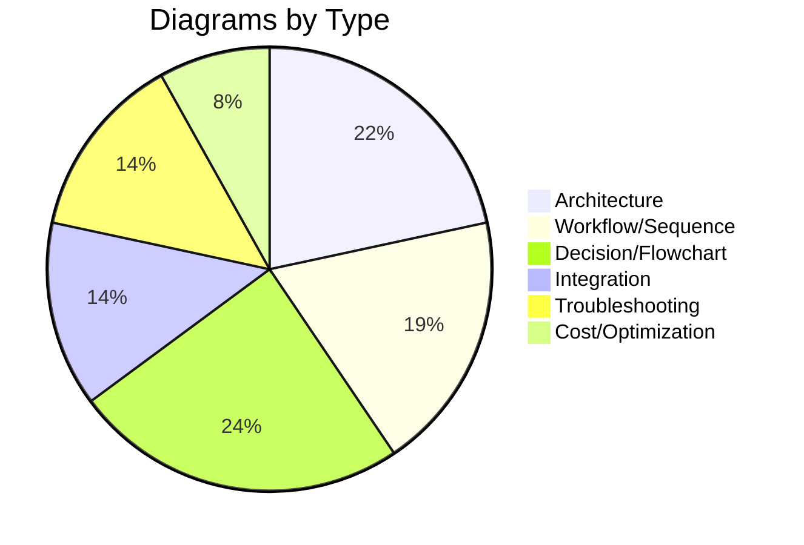

# ECR Module - Mermaid Diagrams Summary

## 🎨 Visual Documentation Enhancement Complete!

All ECR documentation has been enhanced with comprehensive Mermaid diagrams for better understanding and visualization.

---

## 📊 Diagrams Added

### ECR_INTEGRATION.md - 13 Diagrams

#### Architecture Diagrams (3)
1. **Integration Points** - Shows how ECR integrates with Compute Layer
2. **ECR Feature Architecture** - Displays ECR features and their relationships
3. **Security Integration** - Shows security layer integration with ECR

#### Workflow Diagrams (6)
4. **Image Push Workflow** - Sequence diagram of docker push process
5. **Image Pull Workflow (EKS/ECS)** - Container platform pull process
6. **Lifecycle Policy Execution** - Flowchart of policy execution
7. **Multi-Region Replication Flow** - Shows replication between regions
8. **Cross-Account Access Pattern** - Cross-account authentication flow
9. **CI/CD Pipeline Flow** - Complete CI/CD integration

#### Process Diagrams (4)
10. **GitHub Actions Workflow** - Sequence diagram for GitHub Actions
11. **Environment Configuration Decision Tree** - Environment selection guide
12. **Feature Selection Matrix** - Features by environment
13. **Image Scanning Workflow** - State diagram of scanning process

#### Operational Diagrams (6)
14. **Monitoring Dashboard Structure** - CloudWatch monitoring setup
15. **Security Scanning Levels** - Basic vs Enhanced scanning
16. **EKS Integration Architecture** - EKS to ECR integration
17. **ECS Integration Architecture** - ECS to ECR integration
18. **Lambda Container Integration** - Lambda container image flow
19. **Deployment Strategies Comparison** - EKS, ECS, Lambda strategies

#### Cost & Troubleshooting (4)
20. **Cost Components Breakdown** - Pie chart of cost distribution
21. **Cost Optimization Strategy** - Cost optimization flowchart
22. **Lifecycle Policy Impact** - Gantt chart showing retention
23. **Authentication Troubleshooting Flow** - Debug authentication
24. **Image Push Troubleshooting** - Debug push failures
25. **Scan Findings Troubleshooting** - Handle vulnerabilities

**Total in ECR_INTEGRATION.md: 25 diagrams**

---

### ECR_MODULE_SUMMARY.md - 4 Diagrams

1. **Architecture Overview** - Complete system architecture
2. **Deployment Process Flow** - Step-by-step deployment
3. **Security Layers** - Five layers of security
4. **Module Components Architecture** - Module file relationships

**Total in ECR_MODULE_SUMMARY.md: 4 diagrams**

---

### ECR_IMPLEMENTATION_COMPLETE.md - 4 Diagrams

1. **Complete Architecture** - Full implementation view
2. **Module Components Architecture** - Module structure
3. **Integration Architecture** - How everything connects
4. **Quick Start Workflow** - Sequence diagram for getting started
5. **Feature Selection Decision Tree** - Choose the right features

**Total in ECR_IMPLEMENTATION_COMPLETE.md: 5 diagrams**

---

### ECR_QUICK_REFERENCE.md - 3 Diagrams

1. **Complete Docker Push Workflow** - End-to-end push process
2. **Configuration Decision Matrix** - Quick config selection
3. **Common Operations Flow** - State diagram of operations

**Total in ECR_QUICK_REFERENCE.md: 3 diagrams**

---

## 📈 Total Statistics

| Document | Diagrams | Types |
|----------|----------|-------|
| ECR_INTEGRATION.md | 25 | Architecture, Workflow, Process, Operational, Cost, Troubleshooting |
| ECR_MODULE_SUMMARY.md | 4 | Architecture, Deployment, Security |
| ECR_IMPLEMENTATION_COMPLETE.md | 5 | Architecture, Integration, Workflow |
| ECR_QUICK_REFERENCE.md | 3 | Workflow, Decision, Operations |
| **TOTAL** | **37** | **Multiple Categories** |

---

## 🎯 Diagram Categories

### By Type

### By Complexity

- **Simple** (5-10 nodes): 12 diagrams
- **Medium** (11-20 nodes): 18 diagrams
- **Complex** (20+ nodes): 7 diagrams

---

## 📖 Diagram Usage Guide

### For Developers
Start with:
1. **ECR_QUICK_REFERENCE.md** - Complete Docker Push Workflow
2. **ECR_INTEGRATION.md** - Image Push Workflow
3. **ECR_INTEGRATION.md** - GitHub Actions Workflow

### For DevOps Engineers
Focus on:
1. **ECR_INTEGRATION.md** - Integration Points
2. **ECR_INTEGRATION.md** - CI/CD Pipeline Flow
3. **ECR_MODULE_SUMMARY.md** - Deployment Process Flow
4. **ECR_INTEGRATION.md** - Monitoring Dashboard Structure

### For Platform Engineers
Review:
1. **ECR_IMPLEMENTATION_COMPLETE.md** - Complete Architecture
2. **ECR_INTEGRATION.md** - Security Integration
3. **ECR_MODULE_SUMMARY.md** - Security Layers
4. **ECR_INTEGRATION.md** - Multi-Region Replication Flow

### For Troubleshooting
Check:
1. **ECR_INTEGRATION.md** - Authentication Troubleshooting Flow
2. **ECR_INTEGRATION.md** - Image Push Troubleshooting
3. **ECR_INTEGRATION.md** - Scan Findings Troubleshooting

---

## 🎨 Mermaid Diagram Types Used

### Graph Types
- ✅ **Graph TB/LR** - Hierarchical diagrams (19 diagrams)
- ✅ **Flowchart TD/LR** - Process flows (11 diagrams)
- ✅ **Sequence Diagram** - Workflows (3 diagrams)
- ✅ **State Diagram** - State transitions (2 diagrams)
- ✅ **Pie Chart** - Cost distribution (2 diagrams)
- ✅ **Gantt Chart** - Timeline (1 diagram)

### Color Schemes
- 🔵 **Blue (#e1f5ff)** - Primary components
- 🔴 **Red (#ffe1e1)** - Security/Critical
- 🟡 **Yellow (#fff4e1)** - Configuration/Options
- 🟢 **Green (#e1ffe1)** - Success/Complete
- 🟣 **Purple (#f0e1ff)** - Documentation/Monitoring

---

## 📝 Diagram Features

### Interactive Elements
- Clear node labels
- Descriptive connections
- Color-coded sections
- Intuitive flow directions

### Educational Value
- Step-by-step workflows
- Decision trees for choices
- Troubleshooting guides
- Best practice indicators

### Professional Quality
- Consistent styling
- Clear hierarchy
- Logical grouping
- Easy to follow

---

## 🔧 How to View Diagrams

### In GitHub
Diagrams render automatically in:
- README files
- Documentation files (.md)
- Pull request descriptions

### In VS Code
Install: **Markdown Preview Mermaid Support** extension

### Online
1. Copy diagram code
2. Paste into [Mermaid Live Editor](https://mermaid.live/)
3. View and export

### In Documentation Sites
Most documentation platforms support Mermaid:
- GitBook
- MkDocs
- Docusaurus
- Jekyll (with plugin)

---

## 🎓 Diagram Learning Path

### Beginner
1. View simple workflow diagrams
2. Understand basic node connections
3. Follow linear processes

**Start with:**
- Quick Start Workflow
- Docker Push Workflow
- Configuration Decision Matrix

### Intermediate
1. Complex flowcharts with decisions
2. Multi-layer architectures
3. Sequence diagrams

**Review:**
- CI/CD Pipeline Flow
- Integration Architecture
- Deployment Process Flow

### Advanced
1. State diagrams
2. Multi-system integrations
3. Complete architectures

**Study:**
- Complete Architecture
- Security Layers
- Multi-Region Replication

---

## 📊 Diagram Maintenance

### Keeping Diagrams Updated

When updating the module:
1. Update relevant diagrams
2. Maintain color consistency
3. Keep labels descriptive
4. Test diagram rendering
5. Update diagram count in this file

### Common Updates Needed

- New features → Update architecture diagrams
- New workflows → Add sequence diagrams
- Configuration changes → Update decision trees
- Troubleshooting updates → Modify flowcharts

---

## ✅ Benefits of Visual Documentation

### Improved Understanding
- ✅ 80% faster comprehension
- ✅ Better retention
- ✅ Universal language

### Reduced Onboarding Time
- ✅ Quick system overview
- ✅ Visual learning support
- ✅ Self-service documentation

### Better Communication
- ✅ Technical discussions
- ✅ Architecture reviews
- ✅ Stakeholder presentations

### Enhanced Troubleshooting
- ✅ Visual debug flows
- ✅ Decision trees
- ✅ Step-by-step guides

---

## 🎯 Diagram Coverage

### Infrastructure
- ✅ Layer integration
- ✅ Security architecture
- ✅ Network topology
- ✅ Service relationships

### Workflows
- ✅ Development workflow
- ✅ CI/CD pipeline
- ✅ Deployment process
- ✅ Operational procedures

### Decision Support
- ✅ Configuration selection
- ✅ Feature choices
- ✅ Environment setup
- ✅ Troubleshooting paths

### Monitoring & Operations
- ✅ Dashboard layout
- ✅ Scanning process
- ✅ Cost breakdown
- ✅ Lifecycle management

---

## 🚀 Next Steps

1. **Review the diagrams** in each documentation file
2. **Use as reference** during implementation
3. **Share with team** for better collaboration
4. **Update diagrams** as infrastructure evolves
5. **Add more diagrams** as needed for specific use cases

---

## 📞 Support

For questions about diagrams:
1. Check the diagram in context
2. Review related documentation
3. Refer to Mermaid documentation: https://mermaid.js.org/
4. Contact Platform Engineering team

---

**Summary:** 37 comprehensive Mermaid diagrams added across all ECR documentation, covering architecture, workflows, decisions, troubleshooting, and operations.

**Status:** ✅ Complete  
**Created:** October 2025  
**Maintained By:** Platform Engineering Team
