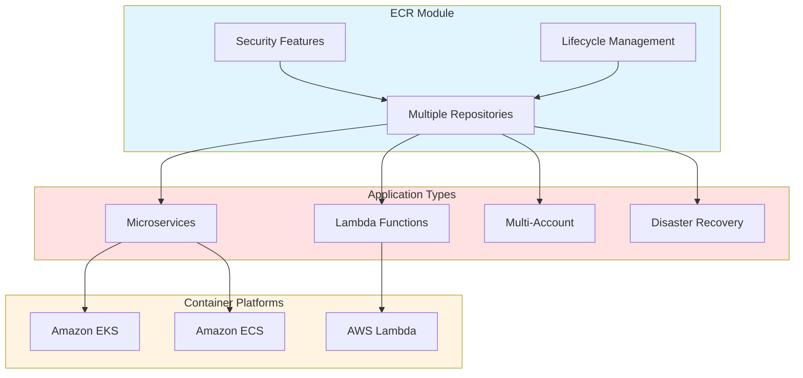
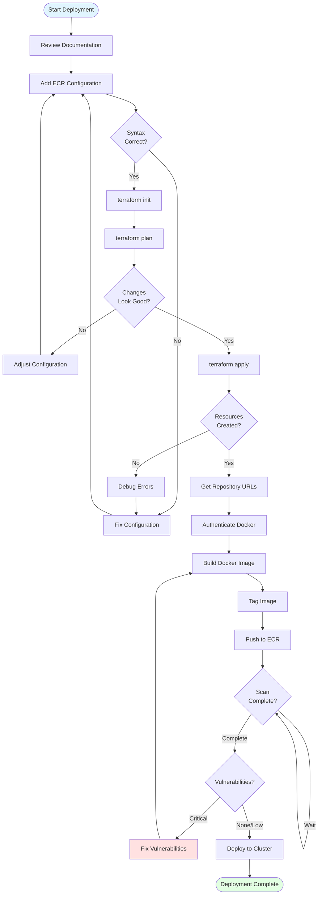
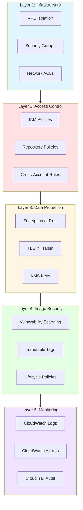

# ECR Module Implementation Summary

## ✅ What Was Created

### 1. ECR Module (`/modules/ecr/`)

A complete, production-ready ECR module with the following files:

#### `main.tf` (149 lines)
- ECR repository creation
- Lifecycle policies for automatic image cleanup
- Repository policies for access control
- Replication configuration for multi-region
- Registry scanning configuration
- Pull through cache support
- CloudWatch log groups for scan findings

#### `variables.tf` (168 lines)
- Repository configuration variables
- Encryption settings (AES256/KMS)
- Image scanning options (basic/enhanced)
- Lifecycle policy configuration
- Cross-account access controls
- Replication settings
- Pull through cache configuration
- Comprehensive validation rules

#### `outputs.tf` (109 lines)
- Repository ARN, URL, name, and ID
- Scanning configuration status
- Encryption details
- Policy enablement status
- Replication information
- Tag mutability settings

#### `versions.tf` (15 lines)
- Terraform >= 1.5.0 requirement
- AWS provider >= 5.0 requirement

#### `README.md` (498 lines)
- Comprehensive module documentation
- Multiple usage examples
- All inputs and outputs documented
- Docker command references
- Security best practices
- Cost optimization tips
- Monitoring and troubleshooting guides

### 2. Compute Layer Integration

#### Updated `layers/compute/main.tf`
Added ECR repository creation using the module with:
- Dynamic repository creation using `for_each`
- Integration with security layer for KMS encryption
- Support for multiple repositories per environment
- Comprehensive configuration options

#### Updated `layers/compute/variables.tf`
Added ECR-specific variables:
- `ecr_repositories` map for defining multiple repositories
- `ecr_encryption_type` for AES256 or KMS encryption
- `ecr_enable_scan_findings_logging` for CloudWatch integration
- `ecr_log_retention_days` for log retention configuration

#### Updated `layers/compute/outputs.tf`
Added ECR outputs:
- `ecr_repository_urls` - Map of repository URLs for docker push/pull
- `ecr_repository_arns` - Map of repository ARNs
- `ecr_repository_names` - Map of repository names
- `ecr_registry_ids` - Map of registry IDs

### 3. Configuration Examples

#### `layers/compute/environments/ecr-examples-dev.tfvars` (55 lines)
Development environment configuration example with:
- Multiple repository examples (web-app, api-service, worker, lambda-processor)
- Mutable tags for development flexibility
- Basic scanning configuration
- Cost-optimized settings
- Commented explanations

#### `layers/compute/environments/ecr-examples-prod.tfvars` (100 lines)
Production environment configuration example with:
- Immutable tags for stability
- Enhanced scanning with continuous monitoring
- Cross-account access for UAT/QA
- Multi-region replication for disaster recovery
- KMS encryption
- Compliance logging
- Extended retention policies

### 4. Documentation

#### `docs/ECR_INTEGRATION.md` (596 lines)
Comprehensive integration guide including:
- Architecture diagrams
- Quick start guide
- Configuration options reference
- Environment-specific configurations
- Security best practices
- CI/CD integration examples (GitHub Actions, GitLab CI)
- Container service integration (EKS, ECS, Lambda)
- Monitoring and operations
- Cost optimization strategies
- Troubleshooting guide
- Additional resources and links

## 📊 Module Features

### 🔐 Security Features
- ✅ **Encryption at rest** (AES256 or KMS)
- ✅ **Image scanning** (basic and enhanced)
- ✅ **Repository policies** with IAM integration
- ✅ **Cross-account access** controls
- ✅ **Immutable/mutable tags** configuration
- ✅ **Lambda integration** support

### 🔄 Lifecycle Management
- ✅ **Automatic image cleanup** based on count
- ✅ **Custom lifecycle policies** with JSON
- ✅ **Tag-based retention rules**
- ✅ **Configurable image limits**

### 📊 Scanning & Monitoring
- ✅ **Scan on push** for immediate detection
- ✅ **Enhanced scanning** with continuous monitoring
- ✅ **CloudWatch integration** for findings
- ✅ **Configurable scan frequency**
- ✅ **Log retention management**

### 🌍 High Availability
- ✅ **Multi-region replication** for DR
- ✅ **Cross-account replication** support
- ✅ **Selective replication** with filters

### 🚀 Performance
- ✅ **Pull through cache** for public registries
- ✅ **Docker Hub integration**
- ✅ **ECR Public integration**
- ✅ **Optimized image layers**

## 🎯 Use Cases

### Architecture Overview



### 1. Microservices Architecture
```hcl
ecr_repositories = {
  "frontend"        = { max_image_count = 50 }
  "backend-api"     = { max_image_count = 50 }
  "auth-service"    = { max_image_count = 30 }
  "payment-service" = { max_image_count = 30 }
  "worker"          = { max_image_count = 20 }
}
```

### 2. Lambda Container Functions
```hcl
ecr_repositories = {
  "image-processor"   = { enable_lambda_pull = true }
  "data-transformer"  = { enable_lambda_pull = true }
  "report-generator"  = { enable_lambda_pull = true }
}
```

### 3. Multi-Account Setup
```hcl
ecr_repositories = {
  "shared-base-images" = {
    enable_cross_account_access = true
    allowed_account_ids = ["123456789012", "210987654321"]
  }
}
```

### 4. Disaster Recovery
```hcl
ecr_repositories = {
  "critical-app" = {
    enable_replication = true
    replication_destinations = [
      { region = "us-west-2", registry_id = "ACCOUNT_ID" },
      { region = "eu-west-1", registry_id = "ACCOUNT_ID" }
    ]
  }
}
```

## 🚀 Getting Started

### Step 1: Review Module Documentation
```bash
cat modules/ecr/README.md
```

### Step 2: Review Integration Guide
```bash
cat docs/ECR_INTEGRATION.md
```

### Step 3: Review Example Configurations
```bash
# Development example
cat layers/compute/environments/ecr-examples-dev.tfvars

# Production example
cat layers/compute/environments/ecr-examples-prod.tfvars
```

### Step 4: Add Repositories to Your Environment

Edit your environment's tfvars file:
```bash
# For dev environment
vim layers/compute/environments/dev/terraform.tfvars
```

Add ECR configuration:
```hcl
ecr_repositories = {
  "web-app" = {
    image_tag_mutability = "MUTABLE"
    scan_on_push         = true
    max_image_count      = 50
  }
}

ecr_encryption_type = "AES256"
```

### Step 5: Deploy
```bash
cd layers/compute/environments/dev
terraform init
terraform plan
terraform apply
```

### Step 6: Get Repository URL
```bash
terraform output ecr_repository_urls
```

### Step 7: Push Your First Image
```bash
# Authenticate
aws ecr get-login-password --region us-east-1 | \
  docker login --username AWS --password-stdin \
  $(terraform output -raw ecr_repository_urls | jq -r '.["web-app"]' | cut -d'/' -f1)

# Build and push
docker build -t web-app:latest .
docker tag web-app:latest $(terraform output -raw ecr_repository_urls | jq -r '.["web-app"]'):latest
docker push $(terraform output -raw ecr_repository_urls | jq -r '.["web-app"]'):latest
```

## 📁 File Structure

```
terraform-aws-enterprise/
├── modules/
│   └── ecr/                                    # New ECR module
│       ├── main.tf                             # Module implementation (149 lines)
│       ├── variables.tf                        # Input variables (168 lines)
│       ├── outputs.tf                          # Output values (109 lines)
│       ├── versions.tf                         # Version requirements (15 lines)
│       └── README.md                           # Module documentation (498 lines)
│
├── layers/
│   └── compute/
│       ├── main.tf                             # Updated with ECR integration
│       ├── variables.tf                        # Updated with ECR variables
│       ├── outputs.tf                          # Updated with ECR outputs
│       └── environments/
│           ├── ecr-examples-dev.tfvars         # Dev configuration example (55 lines)
│           └── ecr-examples-prod.tfvars        # Prod configuration example (100 lines)
│
└── docs/
    ├── ECR_INTEGRATION.md                      # Integration guide (596 lines)
    └── ECR_MODULE_SUMMARY.md                   # This file
```

**Total Lines of Code:** ~1,695 lines
**Total Files Created:** 8 files (1 module + 2 examples + 1 summary + updates to 4 existing files)

## 🔧 Configuration Quick Reference

### Minimal Configuration (Development)
```hcl
ecr_repositories = {
  "app-name" = {}  # Uses all defaults
}
```

### Standard Configuration (Development)
```hcl
ecr_repositories = {
  "app-name" = {
    image_tag_mutability = "MUTABLE"
    scan_on_push         = true
    max_image_count      = 50
  }
}
ecr_encryption_type = "AES256"
```

### Full Configuration (Production)
```hcl
ecr_repositories = {
  "app-name" = {
    image_tag_mutability     = "IMMUTABLE"
    scan_on_push             = true
    enable_enhanced_scanning = true
    scan_frequency           = "CONTINUOUS_SCAN"
    max_image_count          = 100
    enable_cross_account_access = true
    allowed_account_ids      = ["123456789012"]
    enable_replication       = true
    replication_destinations = [
      { region = "us-west-2", registry_id = "YOUR_ACCOUNT_ID" }
    ]
  }
}
ecr_encryption_type = "KMS"
ecr_enable_scan_findings_logging = true
ecr_log_retention_days = 90
```

## 🔐 Security Checklist

### Development Environment
- ✅ Enable basic image scanning (`scan_on_push = true`)
- ✅ Use standard encryption (`ecr_encryption_type = "AES256"`)
- ✅ Set reasonable image limits (`max_image_count = 50`)
- ✅ Use mutable tags for flexibility

### Production Environment
- ✅ Enable enhanced scanning (`enable_enhanced_scanning = true`)
- ✅ Use KMS encryption (`ecr_encryption_type = "KMS"`)
- ✅ Use immutable tags (`image_tag_mutability = "IMMUTABLE"`)
- ✅ Enable scan findings logging
- ✅ Configure lifecycle policies
- ✅ Enable multi-region replication for critical apps
- ✅ Use cross-account access instead of public repositories
- ✅ Set up CloudWatch alarms for vulnerabilities

## 💰 Cost Considerations

### Storage Costs
- **Images**: $0.10 per GB/month
- **Optimize**: Use lifecycle policies to delete old images
- **Example**: 50 images × 500 MB = ~$2.50/month

### Data Transfer Costs
- **Within region**: Free
- **Between regions**: Standard data transfer rates
- **To internet**: Standard data transfer rates
- **Optimize**: Use replication selectively

### Scanning Costs
- **Basic scanning**: Free
- **Enhanced scanning**: $0.09 per image scan (continuous scanning)
- **Optimize**: Enable enhanced scanning only for production

### Pull Through Cache
- Reduces Docker Hub rate limits
- Caches images locally in your ECR
- No additional cost for cached images

## 📊 Monitoring

### Key Metrics to Watch
1. **Storage Usage**: Monitor repository size
2. **Pull/Push Count**: Track usage patterns
3. **Scan Findings**: Monitor vulnerabilities
4. **Failed Authentications**: Security monitoring

### CloudWatch Alarms (Recommended)
```hcl
resource "aws_cloudwatch_metric_alarm" "high_severity_findings" {
  alarm_name          = "ecr-high-severity-vulnerabilities"
  comparison_operator = "GreaterThanThreshold"
  evaluation_periods  = "1"
  metric_name         = "HighSeverityFindings"
  namespace           = "AWS/ECR"
  period              = "300"
  statistic           = "Sum"
  threshold           = "0"
  alarm_description   = "Alert on high severity vulnerabilities"
}
```

## 🐛 Common Issues & Solutions

### 1. Authentication Failures
**Issue**: `no basic auth credentials`
**Solution**: Run ECR login command before docker operations
```bash
aws ecr get-login-password --region us-east-1 | \
  docker login --username AWS --password-stdin ACCOUNT.dkr.ecr.REGION.amazonaws.com
```

### 2. Permission Denied
**Issue**: `AccessDeniedException`
**Solution**: Verify IAM permissions include:
- `ecr:GetAuthorizationToken`
- `ecr:BatchCheckLayerAvailability`
- `ecr:GetDownloadUrlForLayer`
- `ecr:BatchGetImage`
- `ecr:PutImage`

### 3. Lifecycle Policy Not Working
**Issue**: Old images not being deleted
**Solution**: 
- Policies run daily, wait 24 hours
- Verify policy syntax
- Check CloudWatch logs

### 4. Scan Findings Not Appearing
**Issue**: No scan results
**Solution**:
- Verify `scan_on_push = true`
- Check image was successfully pushed
- Wait a few minutes for scan to complete
- Check CloudWatch logs if logging enabled

## 🚀 Next Steps

1. **Deploy ECR repositories** to your development environment
2. **Push test images** and verify scanning works
3. **Set up CI/CD pipelines** to automate image builds
4. **Configure lifecycle policies** to manage costs
5. **Enable enhanced scanning** for production repositories
6. **Set up CloudWatch alarms** for vulnerabilities
7. **Document your repositories** in your team wiki
8. **Train team members** on ECR usage

## 📚 Additional Documentation

### Internal Documentation
- [ECR Module README](../modules/ecr/README.md)
- [ECR Integration Guide](../docs/ECR_INTEGRATION.md)
- [Compute Layer Documentation](../layers/compute/README.md)

### AWS Documentation
- [ECR User Guide](https://docs.aws.amazon.com/ecr/)
- [ECR Best Practices](https://docs.aws.amazon.com/AmazonECR/latest/userguide/best-practices.html)
- [Image Scanning](https://docs.aws.amazon.com/AmazonECR/latest/userguide/image-scanning.html)

### Docker Documentation
- [Docker Documentation](https://docs.docker.com/)
- [Multi-stage Builds](https://docs.docker.com/build/building/multi-stage/)
- [Best Practices](https://docs.docker.com/develop/dev-best-practices/)

## 🤝 Support

For issues or questions:
1. Review this summary and the integration guide
2. Check the module README for detailed documentation
3. Review AWS ECR documentation
4. Contact Platform Engineering team
5. Create an issue in the repository

## ✅ Implementation Checklist

- [x] ECR module created with full features
- [x] Compute layer integrated with ECR
- [x] Variables and outputs added
- [x] Development configuration example created
- [x] Production configuration example created
- [x] Comprehensive module documentation written
- [x] Integration guide created
- [x] Summary document created
- [ ] Deploy to development environment
- [ ] Test image push/pull
- [ ] Verify scanning works
- [ ] Set up CI/CD integration
- [ ] Deploy to production

---

**Created:** October 2025  
**Version:** 1.0  
**Maintained By:** Platform Engineering Team  
**Status:** ✅ Ready for Use


### Deployment Process Flow



### Security Layers


