# ECR Quick Reference Card

## 🚀 Quick Commands

### Authentication
```bash
# Login to ECR
aws ecr get-login-password --region us-east-1 | \
  docker login --username AWS --password-stdin \
  123456789012.dkr.ecr.us-east-1.amazonaws.com
```

### Build & Push
```bash
# Build image
docker build -t my-app:latest .

# Tag for ECR
docker tag my-app:latest \
  123456789012.dkr.ecr.us-east-1.amazonaws.com/myproject-dev-my-app:latest

# Push to ECR
docker push \
  123456789012.dkr.ecr.us-east-1.amazonaws.com/myproject-dev-my-app:latest
```

### Pull Image
```bash
# Pull from ECR
docker pull \
  123456789012.dkr.ecr.us-east-1.amazonaws.com/myproject-dev-my-app:latest
```

## 📋 Configuration Snippets

### Minimal (Dev)
```hcl
ecr_repositories = {
  "my-app" = {
    scan_on_push    = true
    max_image_count = 50
  }
}
```

### Standard (Prod)
```hcl
ecr_repositories = {
  "my-app" = {
    image_tag_mutability     = "IMMUTABLE"
    scan_on_push             = true
    enable_enhanced_scanning = true
    max_image_count          = 100
  }
}
ecr_encryption_type = "KMS"
```

## 🔍 Useful AWS CLI Commands

```bash
# List repositories
aws ecr describe-repositories

# List images in repository
aws ecr list-images --repository-name myproject-dev-my-app

# Get scan findings
aws ecr describe-image-scan-findings \
  --repository-name myproject-dev-my-app \
  --image-id imageTag=latest

# Delete image
aws ecr batch-delete-image \
  --repository-name myproject-dev-my-app \
  --image-ids imageTag=old-tag
```

## 🎯 Common Patterns

### Multi-stage Docker Build
```dockerfile
FROM node:18 AS builder
WORKDIR /app
COPY package*.json ./
RUN npm ci
COPY . .
RUN npm run build

FROM node:18-alpine
WORKDIR /app
COPY --from=builder /app/dist ./dist
CMD ["node", "dist/main.js"]
```

### GitHub Actions
```yaml
- name: Login to ECR
  uses: aws-actions/amazon-ecr-login@v2

- name: Build and push
  env:
    ECR_REGISTRY: ${{ steps.login-ecr.outputs.registry }}
  run: |
    docker build -t $ECR_REGISTRY/my-app:${{ github.sha }} .
    docker push $ECR_REGISTRY/my-app:${{ github.sha }}
```

### EKS Deployment
```yaml
apiVersion: apps/v1
kind: Deployment
spec:
  template:
    spec:
      containers:
      - name: app
        image: 123456789012.dkr.ecr.us-east-1.amazonaws.com/myproject-prod-app:v1.0
```

## 🔐 IAM Permissions Needed

```json
{
  "Version": "2012-10-17",
  "Statement": [
    {
      "Effect": "Allow",
      "Action": [
        "ecr:GetAuthorizationToken",
        "ecr:BatchCheckLayerAvailability",
        "ecr:GetDownloadUrlForLayer",
        "ecr:BatchGetImage",
        "ecr:PutImage"
      ],
      "Resource": "*"
    }
  ]
}
```

## 💡 Best Practices

### ✅ DO
- Use immutable tags in production
- Enable image scanning
- Set lifecycle policies
- Use multi-stage builds
- Tag images with version/commit SHA
- Use KMS encryption for production

### ❌ DON'T
- Push `latest` tag to production
- Store secrets in images
- Use overly large base images
- Keep unlimited old images
- Disable scanning
- Use public repositories for sensitive code

## 📊 Terraform Outputs

```bash
# Get repository URL
terraform output ecr_repository_urls

# Example output:
# {
#   "my-app" = "123456789012.dkr.ecr.us-east-1.amazonaws.com/myproject-dev-my-app"
# }

# Use in scripts
REPO_URL=$(terraform output -json ecr_repository_urls | jq -r '.["my-app"]')
docker push $REPO_URL:latest
```

## 🐛 Quick Troubleshooting

| Issue | Solution |
|-------|----------|
| Auth token expired | Run `aws ecr get-login-password` again |
| Permission denied | Check IAM permissions |
| Image not found | Verify repository name and tag |
| Scan not working | Wait a few minutes, verify scan_on_push=true |
| Can't delete repository | Set force_delete=true or delete images first |

## 📚 Documentation Links

- [Module README](../modules/ecr/README.md) - Complete module documentation
- [Integration Guide](./ECR_INTEGRATION.md) - Detailed integration guide
- [Summary](./ECR_MODULE_SUMMARY.md) - Implementation summary
- [AWS ECR Docs](https://docs.aws.amazon.com/ecr/) - Official AWS documentation

## 🎓 Learning Resources

### Tutorials
1. Deploy ECR → Push image → Scan for vulnerabilities
2. Set up CI/CD with GitHub Actions
3. Configure lifecycle policies
4. Enable cross-account access
5. Set up multi-region replication

### Example Workflows
```bash
# Complete workflow
1. Add repository to tfvars
2. Deploy: terraform apply
3. Get URL: terraform output
4. Login: aws ecr get-login-password
5. Build: docker build
6. Tag: docker tag
7. Push: docker push
8. Verify: aws ecr list-images
```

---

**🔖 Save this card for quick reference!**

Print or bookmark: `/docs/ECR_QUICK_REFERENCE.md`


## 📊 Visual Workflows

### Complete Docker Push Workflow

```mermaid
flowchart LR
    subgraph Local["Local Development"]
        Code[Write Code]
        Build[docker build]
        Test[Test Locally]
    end
    
    subgraph Auth["Authentication"]
        GetToken[aws ecr<br/>get-login-password]
        Login[docker login]
    end
    
    subgraph ECR["ECR Repository"]
        Tag[docker tag]
        Push[docker push]
        Scan[Image Scan]
    end
    
    subgraph Result["Results"]
        Success[✓ Image Pushed]
        Report[Scan Report]
    end
    
    Code --> Build
    Build --> Test
    Test --> GetToken
    GetToken --> Login
    Login --> Tag
    Tag --> Push
    Push --> Scan
    Scan --> Success
    Scan --> Report
    
    style Local fill:#e1f5ff
    style Auth fill:#fff4e1
    style ECR fill:#ffe1e1
    style Result fill:#e1ffe1
```



### Configuration Decision Matrix

```mermaid
graph TD
    Start([Need ECR?]) --> Purpose{Purpose?}
    
    Purpose -->|Development| Dev[Development Config]
    Purpose -->|Testing/QA| Test[Testing Config]
    Purpose -->|Production| Prod[Production Config]
    
    Dev --> DevSet[• Mutable tags<br/>• Basic scanning<br/>• AES256<br/>• 30-50 images]
    Test --> TestSet[• Mutable tags<br/>• Enhanced scanning<br/>• KMS optional<br/>• 50 images]
    Prod --> ProdSet[• Immutable tags<br/>• Enhanced scanning<br/>• KMS encryption<br/>• 100+ images<br/>• Replication<br/>• Logging]
    
    DevSet --> Deploy[Deploy with Terraform]
    TestSet --> Deploy
    ProdSet --> Deploy
    
    style Dev fill:#e1f5ff
    style Test fill:#fff4e1
    style Prod fill:#ffe1e1
    style Deploy fill:#e1ffe1
```



### Common Operations Flow


