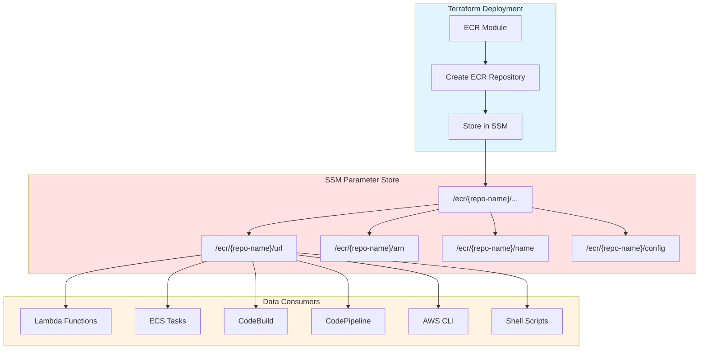
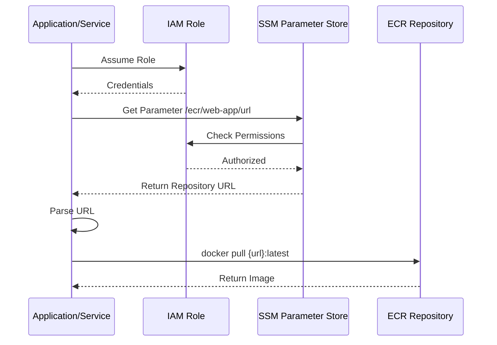

# ECR SSM Parameter Store Integration Guide

## 📋 Overview

This guide explains how ECR repository information is automatically stored in AWS Systems Manager (SSM) Parameter Store for easy access by other services, CI/CD pipelines, and applications.

## 🎯 Why SSM Parameter Store?

### Benefits

1. **Centralized Configuration** - Single source of truth for ECR information
2. **Service Integration** - Easy access from Lambda, ECS, CodePipeline, etc.
3. **Access Control** - Fine-grained IAM permissions
4. **Encryption** - Secure storage of sensitive data
5. **Versioning** - Parameter history tracking
6. **No Terraform Required** - Access data without Terraform state

## 🏗️ Architecture

### Data Storage Flow



### Access Pattern



## 📊 Parameter Structure

### Parameter Naming Convention

All ECR parameters follow this structure:
```
/ecr/{repository-name}/{parameter-type}
```

### Parameters Stored

For each ECR repository, the following parameters are automatically created:

| Parameter Path | Description | Example Value |
|---------------|-------------|---------------|
| `/ecr/{repo}/url` | Repository URL for docker push/pull | `123456789012.dkr.ecr.us-east-1.amazonaws.com/myproject-dev-web-app` |
| `/ecr/{repo}/arn` | Repository ARN for IAM policies | `arn:aws:ecr:us-east-1:123456789012:repository/myproject-dev-web-app` |
| `/ecr/{repo}/name` | Repository name | `myproject-dev-web-app` |
| `/ecr/{repo}/registry-id` | Registry ID (AWS Account ID) | `123456789012` |
| `/ecr/{repo}/scan-on-push` | Scan on push enabled | `true` or `false` |
| `/ecr/{repo}/encryption-type` | Encryption type | `AES256` or `KMS` |
| `/ecr/{repo}/tag-mutability` | Tag mutability setting | `MUTABLE` or `IMMUTABLE` |

### Example Parameter Structure

```
/ecr/
├── web-app/
│   ├── url
│   ├── arn
│   ├── name
│   ├── registry-id
│   ├── scan-on-push
│   ├── encryption-type
│   └── tag-mutability
├── api-service/
│   ├── url
│   ├── arn
│   ├── name
│   └── ...
└── worker/
    ├── url
    ├── arn
    ├── name
    └── ...
```

## 🔧 Usage Examples

### AWS CLI

#### Get Repository URL
```bash
# Get single parameter
aws ssm get-parameter \
  --name "/ecr/web-app/url" \
  --query "Parameter.Value" \
  --output text

# Output: 123456789012.dkr.ecr.us-east-1.amazonaws.com/myproject-dev-web-app
```

#### Get Multiple Parameters
```bash
# Get all parameters for a repository
aws ssm get-parameters-by-path \
  --path "/ecr/web-app" \
  --query "Parameters[*].[Name,Value]" \
  --output table

# Output:
# ----------------------------------------------------------------
# |                       GetParametersByPath                    |
# +-------------------------------+------------------------------+
# |  /ecr/web-app/arn            |  arn:aws:ecr:...            |
# |  /ecr/web-app/url            |  123456789012.dkr.ecr...    |
# |  /ecr/web-app/name           |  myproject-dev-web-app      |
# +-------------------------------+------------------------------+
```

#### Get All ECR Repositories
```bash
# List all ECR parameters
aws ssm get-parameters-by-path \
  --path "/ecr" \
  --recursive \
  --query "Parameters[?contains(Name, '/url')].[Name,Value]" \
  --output table
```

### Shell Scripts

#### Deployment Script
```bash
#!/bin/bash
# deploy.sh - Deploy Docker image to ECR

set -e

REPO_NAME="web-app"

# Get repository URL from SSM
REPO_URL=$(aws ssm get-parameter \
  --name "/ecr/${REPO_NAME}/url" \
  --query "Parameter.Value" \
  --output text)

echo "Repository URL: ${REPO_URL}"

# Get registry ID
REGISTRY_ID=$(aws ssm get-parameter \
  --name "/ecr/${REPO_NAME}/registry-id" \
  --query "Parameter.Value" \
  --output text)

# Authenticate Docker
aws ecr get-login-password --region us-east-1 | \
  docker login --username AWS --password-stdin "${REGISTRY_ID}.dkr.ecr.us-east-1.amazonaws.com"

# Build and push
docker build -t ${REPO_NAME}:latest .
docker tag ${REPO_NAME}:latest ${REPO_URL}:latest
docker push ${REPO_URL}:latest

echo "✅ Deployed successfully to ${REPO_URL}:latest"
```

#### Multi-Repository Script
```bash
#!/bin/bash
# list-all-repos.sh - List all ECR repositories from SSM

echo "ECR Repositories:"
echo "================="

# Get all repository URLs
aws ssm get-parameters-by-path \
  --path "/ecr" \
  --recursive \
  --query "Parameters[?ends_with(Name, '/url')].{Repository:Name,URL:Value}" \
  --output table
```

### Python (Boto3)

#### Simple Retrieval
```python
import boto3

ssm = boto3.client('ssm', region_name='us-east-1')

# Get repository URL
response = ssm.get_parameter(Name='/ecr/web-app/url')
repo_url = response['Parameter']['Value']

print(f"Repository URL: {repo_url}")
```

#### Get All Repository Information
```python
import boto3
from typing import Dict

def get_ecr_info(repository_name: str) -> Dict[str, str]:
    """
    Get all ECR information for a repository from SSM Parameter Store
    
    Args:
        repository_name: Name of the ECR repository
        
    Returns:
        Dictionary with all repository information
    """
    ssm = boto3.client('ssm')
    
    # Get all parameters for this repository
    response = ssm.get_parameters_by_path(
        Path=f'/ecr/{repository_name}',
        Recursive=False
    )
    
    # Parse parameters into dictionary
    ecr_info = {}
    for param in response['Parameters']:
        # Extract parameter type from path
        param_type = param['Name'].split('/')[-1]
        ecr_info[param_type] = param['Value']
    
    return ecr_info

# Usage
info = get_ecr_info('web-app')
print(f"URL: {info['url']}")
print(f"ARN: {info['arn']}")
print(f"Scan on Push: {info['scan-on-push']}")
```

#### List All Repositories
```python
import boto3

def list_all_ecr_repositories():
    """List all ECR repositories from SSM Parameter Store"""
    ssm = boto3.client('ssm')
    
    # Get all ECR URLs
    response = ssm.get_parameters_by_path(
        Path='/ecr',
        Recursive=True
    )
    
    # Filter for URLs only
    repos = {}
    for param in response['Parameters']:
        if param['Name'].endswith('/url'):
            repo_name = param['Name'].split('/')[2]
            repos[repo_name] = param['Value']
    
    return repos

# Usage
repositories = list_all_ecr_repositories()
for name, url in repositories.items():
    print(f"{name}: {url}")
```

### Lambda Function

```python
import boto3
import os

ssm = boto3.client('ssm')
ecr = boto3.client('ecr')

def lambda_handler(event, context):
    """
    Lambda function to get latest image digest from ECR
    """
    # Get repository name from environment or event
    repo_name = os.environ.get('REPO_NAME', event.get('repository'))
    
    # Get repository URL from SSM
    param_name = f'/ecr/{repo_name}/url'
    response = ssm.get_parameter(Name=param_name)
    repo_url = response['Parameter']['Value']
    
    # Extract repository name from URL
    repo_parts = repo_url.split('/')
    repository_name = repo_parts[-1]
    
    # Get latest image
    images = ecr.list_images(
        repositoryName=repository_name,
        filter={'tagStatus': 'TAGGED'}
    )
    
    return {
        'statusCode': 200,
        'body': {
            'repository': repo_name,
            'url': repo_url,
            'image_count': len(images['imageIds'])
        }
    }
```

### Node.js (AWS SDK v3)

```javascript
import { SSMClient, GetParameterCommand, GetParametersByPathCommand } from '@aws-sdk/client-ssm';

const ssm = new SSMClient({ region: 'us-east-1' });

// Get single parameter
async function getRepoUrl(repoName) {
  const command = new GetParameterCommand({
    Name: `/ecr/${repoName}/url`
  });
  
  const response = await ssm.send(command);
  return response.Parameter.Value;
}

// Get all repository info
async function getRepoInfo(repoName) {
  const command = new GetParametersByPathCommand({
    Path: `/ecr/${repoName}`,
    Recursive: false
  });
  
  const response = await ssm.send(command);
  
  const info = {};
  response.Parameters.forEach(param => {
    const key = param.Name.split('/').pop();
    info[key] = param.Value;
  });
  
  return info;
}

// Usage
const url = await getRepoUrl('web-app');
console.log(`Repository URL: ${url}`);

const info = await getRepoInfo('web-app');
console.log('Repository Info:', info);
```

### GitHub Actions

```yaml
name: Deploy to ECR

on:
  push:
    branches: [main]

jobs:
  deploy:
    runs-on: ubuntu-latest
    steps:
      - uses: actions/checkout@v4
      
      - name: Configure AWS credentials
        uses: aws-actions/configure-aws-credentials@v4
        with:
          aws-access-key-id: ${{ secrets.AWS_ACCESS_KEY_ID }}
          aws-secret-access-key: ${{ secrets.AWS_SECRET_ACCESS_KEY }}
          aws-region: us-east-1
      
      - name: Get ECR Repository URL from SSM
        id: ecr-url
        run: |
          REPO_URL=$(aws ssm get-parameter \
            --name "/ecr/web-app/url" \
            --query "Parameter.Value" \
            --output text)
          echo "url=$REPO_URL" >> $GITHUB_OUTPUT
      
      - name: Login to Amazon ECR
        uses: aws-actions/amazon-ecr-login@v2
      
      - name: Build and push
        env:
          ECR_URL: ${{ steps.ecr-url.outputs.url }}
        run: |
          docker build -t web-app:latest .
          docker tag web-app:latest $ECR_URL:${{ github.sha }}
          docker tag web-app:latest $ECR_URL:latest
          docker push $ECR_URL:${{ github.sha }}
          docker push $ECR_URL:latest
```

### GitLab CI

```yaml
deploy:
  stage: deploy
  image: docker:latest
  services:
    - docker:dind
  before_script:
    - apk add --no-cache aws-cli python3 py3-pip
    # Get repository URL from SSM
    - export REPO_URL=$(aws ssm get-parameter --name "/ecr/web-app/url" --query "Parameter.Value" --output text)
    - echo "Repository URL: $REPO_URL"
    - aws ecr get-login-password --region us-east-1 | docker login --username AWS --password-stdin $REPO_URL
  script:
    - docker build -t web-app:$CI_COMMIT_SHA .
    - docker tag web-app:$CI_COMMIT_SHA $REPO_URL:$CI_COMMIT_SHA
    - docker tag web-app:$CI_COMMIT_SHA $REPO_URL:latest
    - docker push $REPO_URL:$CI_COMMIT_SHA
    - docker push $REPO_URL:latest
```

### Terraform Data Source

You can also read SSM parameters in other Terraform configurations:

```hcl
# Read ECR URL from SSM in another Terraform config
data "aws_ssm_parameter" "ecr_web_app_url" {
  name = "/ecr/web-app/url"
}

# Use in ECS task definition
resource "aws_ecs_task_definition" "app" {
  family = "web-app"
  
  container_definitions = jsonencode([
    {
      name  = "web-app"
      image = "${data.aws_ssm_parameter.ecr_web_app_url.value}:latest"
      # ... other configuration
    }
  ])
}
```

### ECS Task Definition

```json
{
  "family": "web-app",
  "containerDefinitions": [
    {
      "name": "web-app",
      "image": "{{resolve:ssm:/ecr/web-app/url}}:latest",
      "essential": true,
      "portMappings": [
        {
          "containerPort": 8080,
          "protocol": "tcp"
        }
      ]
    }
  ]
}
```

### CloudFormation

```yaml
Resources:
  ECSTaskDefinition:
    Type: AWS::ECS::TaskDefinition
    Properties:
      Family: web-app
      ContainerDefinitions:
        - Name: web-app
          Image: !Sub '{{resolve:ssm:/ecr/web-app/url}}:latest'
          Essential: true
          PortMappings:
            - ContainerPort: 8080
              Protocol: tcp
```

## 🔐 IAM Permissions

### Required Permissions for Reading

```json
{
  "Version": "2012-10-17",
  "Statement": [
    {
      "Effect": "Allow",
      "Action": [
        "ssm:GetParameter",
        "ssm:GetParameters",
        "ssm:GetParametersByPath"
      ],
      "Resource": [
        "arn:aws:ssm:*:*:parameter/ecr/*"
      ]
    }
  ]
}
```

### Read-Only Policy for Specific Repository

```json
{
  "Version": "2012-10-17",
  "Statement": [
    {
      "Effect": "Allow",
      "Action": [
        "ssm:GetParameter"
      ],
      "Resource": [
        "arn:aws:ssm:us-east-1:123456789012:parameter/ecr/web-app/*"
      ]
    }
  ]
}
```

### Terraform Managed Policy

```hcl
# Create IAM policy for SSM parameter access
resource "aws_iam_policy" "ecr_ssm_read" {
  name        = "ECRSSMParameterRead"
  description = "Allow reading ECR information from SSM Parameter Store"
  
  policy = jsonencode({
    Version = "2012-10-17"
    Statement = [
      {
        Effect = "Allow"
        Action = [
          "ssm:GetParameter",
          "ssm:GetParameters",
          "ssm:GetParametersByPath"
        ]
        Resource = [
          "arn:aws:ssm:${var.aws_region}:${data.aws_caller_identity.current.account_id}:parameter/ecr/*"
        ]
      }
    ]
  })
}

# Attach to role
resource "aws_iam_role_policy_attachment" "lambda_ecr_ssm" {
  role       = aws_iam_role.lambda.name
  policy_arn = aws_iam_policy.ecr_ssm_read.arn
}
```

## 📊 Monitoring and Logging

### CloudWatch Metrics

Monitor SSM parameter access:

```bash
# Get parameter access count
aws cloudwatch get-metric-statistics \
  --namespace AWS/SSM \
  --metric-name GetParameterCount \
  --dimensions Name=ParameterName,Value=/ecr/web-app/url \
  --start-time 2024-01-01T00:00:00Z \
  --end-time 2024-01-02T00:00:00Z \
  --period 3600 \
  --statistics Sum
```

### CloudTrail Events

Track parameter access in CloudTrail:

```bash
# Query CloudTrail for SSM parameter access
aws cloudtrail lookup-events \
  --lookup-attributes AttributeKey=ResourceName,AttributeValue=/ecr/web-app/url \
  --max-results 10
```

## 🎯 Best Practices

### 1. Use Parameter Paths Consistently
```bash
# Good - hierarchical structure
/ecr/{repo-name}/url
/ecr/{repo-name}/arn

# Bad - flat structure
/ecr-web-app-url
/ecr_web_app_arn
```

### 2. Cache Parameters When Possible
```python
# Cache parameters to reduce API calls
from functools import lru_cache

@lru_cache(maxsize=128)
def get_repo_url(repo_name: str) -> str:
    ssm = boto3.client('ssm')
    response = ssm.get_parameter(Name=f'/ecr/{repo_name}/url')
    return response['Parameter']['Value']
```

### 3. Handle Errors Gracefully
```python
import boto3
from botocore.exceptions import ClientError

def get_parameter_safe(name: str, default=None):
    ssm = boto3.client('ssm')
    try:
        response = ssm.get_parameter(Name=name)
        return response['Parameter']['Value']
    except ClientError as e:
        if e.response['Error']['Code'] == 'ParameterNotFound':
            print(f"Parameter {name} not found, using default")
            return default
        raise
```

### 4. Use Batch Operations
```python
# Good - get multiple parameters in one call
response = ssm.get_parameters(
    Names=[
        '/ecr/web-app/url',
        '/ecr/api-service/url',
        '/ecr/worker/url'
    ]
)

# Bad - multiple individual calls
url1 = ssm.get_parameter(Name='/ecr/web-app/url')
url2 = ssm.get_parameter(Name='/ecr/api-service/url')
url3 = ssm.get_parameter(Name='/ecr/worker/url')
```

### 5. Document Parameter Usage
```bash
# Add descriptions when creating parameters
aws ssm put-parameter \
  --name "/ecr/web-app/url" \
  --value "123456789012.dkr.ecr.us-east-1.amazonaws.com/web-app" \
  --type "String" \
  --description "ECR repository URL for web application - managed by Terraform"
```

## 🔄 Comparison with Remote State

### When to Use SSM vs Remote State

| Scenario | SSM Parameter Store | terraform_remote_state |
|----------|-------------------|----------------------|
| CI/CD Pipelines | ✅ Recommended | ❌ Complex |
| Lambda Functions | ✅ Recommended | ❌ Not Available |
| ECS Task Definitions | ✅ Native Support | ❌ Not Supported |
| Cross-Account Access | ✅ Easy with IAM | ⚠️ Complex |
| Terraform Configurations | ✅ Can Use Both | ✅ Primary Method |
| Runtime Applications | ✅ Recommended | ❌ Not Suitable |
| Shell Scripts | ✅ Easy with AWS CLI | ⚠️ Requires jq/parsing |

### Using Both Together

```hcl
# In one Terraform config
data "terraform_remote_state" "compute" {
  backend = "s3"
  config = {
    bucket = "terraform-state-dev-123456789012"
    key    = "layers/compute/dev/terraform.tfstate"
    region = "us-east-1"
  }
}

# Also read from SSM for runtime access
data "aws_ssm_parameter" "ecr_url" {
  name = "/ecr/web-app/url"
}

# Use remote state for Terraform orchestration
output "from_remote_state" {
  value = data.terraform_remote_state.compute.outputs.ecr_repository_urls
}

# Use SSM for runtime configurations
output "from_ssm" {
  value = data.aws_ssm_parameter.ecr_url.value
}
```

## 🚨 Troubleshooting

### Issue: Parameter Not Found

```bash
# Check if parameter exists
aws ssm describe-parameters \
  --parameter-filters "Key=Name,Values=/ecr/web-app/url"

# List all ECR parameters
aws ssm get-parameters-by-path \
  --path "/ecr" \
  --recursive
```

### Issue: Access Denied

```bash
# Check IAM permissions
aws iam simulate-principal-policy \
  --policy-source-arn arn:aws:iam::123456789012:role/MyRole \
  --action-names ssm:GetParameter \
  --resource-arns arn:aws:ssm:us-east-1:123456789012:parameter/ecr/web-app/url
```

### Issue: Stale Data

```bash
# Force parameter update (if manually managed)
# Note: Terraform-managed parameters are automatically updated
terraform apply -replace="module.ecr_repositories[\"web-app\"].aws_ssm_parameter.repository_url"
```

## 📚 Additional Resources

- [AWS SSM Parameter Store Documentation](https://docs.aws.amazon.com/systems-manager/latest/userguide/systems-manager-parameter-store.html)
- [ECR Integration Guide](./ECR_INTEGRATION.md)
- [ECR Module README](../modules/ecr/README.md)

## 🎓 Learning Path

1. **Beginner**: Use AWS CLI to retrieve repository URL
2. **Intermediate**: Integrate SSM in CI/CD pipeline
3. **Advanced**: Build Lambda functions that dynamically read from SSM

---

**Summary**: ECR repository information is automatically stored in SSM Parameter Store at `/ecr/{repo-name}/*` for easy access by AWS services, CI/CD pipelines, and applications without requiring Terraform state access.

**Status:** ✅ Production Ready  
**Created:** October 2025  
**Maintained By:** Platform Engineering Team
