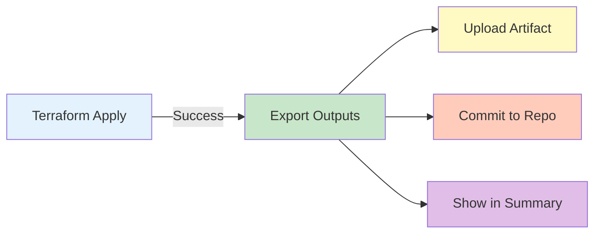

# 📤 Terraform Outputs Export - Implementation Guide

## 🎯 Overview

This document describes the implementation of automated Terraform outputs export functionality added to the CI/CD pipeline.

---

## 📋 Decision: Add New Step to Reusable Workflow

### Why This Approach?

After analyzing the repository structure, I decided to **add new steps to the existing reusable workflow** (`reusable-terraform.yml`) rather than creating a separate pipeline.

### ✅ Benefits of This Approach

| Benefit | Description |
|---------|-------------|
| **DRY Principle** | Single change affects all 7+ layer workflows automatically |
| **Maintainability** | Update in one place, not multiple files |
| **Consistency** | All layers export outputs identically |
| **Follows Pattern** | Aligns with existing reusable workflow architecture |
| **No Duplication** | Avoids repeating code across multiple workflow files |
| **Automatic** | Runs automatically after every successful `apply` |

### ❌ Why Not a Separate Pipeline?

| Reason | Impact |
|--------|--------|
| More complexity | Would need to trigger after each layer deployment |
| Timing issues | Could run before apply completes |
| Duplication | Would repeat environment/layer logic |
| Maintenance burden | Two places to update for changes |

---

## 🏗️ Implementation Details

### Files Modified

1. **`.github/workflows/reusable-terraform.yml`**
   - Added 4 new steps after the apply step
   - Steps run only when `action == 'apply'` and apply succeeds

### New Steps Added

#### Step 13: Export Terraform Outputs
```yaml
- name: 📤 Export Terraform Outputs
  id: export_outputs
  if: inputs.action == 'apply' && steps.apply.outcome == 'success'
  run: |
    mkdir -p "${{ github.workspace }}/outputs"
    OUTPUT_FILE="${{ github.workspace }}/outputs/${{ inputs.environment }}-${{ inputs.layer }}-outputs.json"
    terraform output -json > "$OUTPUT_FILE" 2>/dev/null || echo "{}" > "$OUTPUT_FILE"
```

**Purpose:** Extracts Terraform outputs and saves to JSON file

**When it runs:** After successful `terraform apply`

**Output format:** `{environment}-{layer}-outputs.json`

---

#### Step 14: Upload Outputs as Artifact
```yaml
- name: 📦 Upload Outputs Artifact
  if: steps.export_outputs.outcome == 'success'
  uses: actions/upload-artifact@v4
  with:
    name: terraform-outputs-${{ inputs.layer }}-${{ inputs.environment }}
    path: outputs/${{ inputs.environment }}-${{ inputs.layer }}-outputs.json
    retention-days: 90
```

**Purpose:** Upload outputs as GitHub Actions artifact

**Retention:** 90 days

**Benefits:**
- ✅ Downloadable from GitHub Actions UI
- ✅ Accessible to downstream jobs
- ✅ Historical record of deployments

---

#### Step 15: Commit Outputs to Repository
```yaml
- name: 💾 Commit Outputs to Repository
  if: steps.export_outputs.outcome == 'success' && github.event_name != 'pull_request'
  run: |
    git config --local user.email "github-actions[bot]@users.noreply.github.com"
    git config --local user.name "github-actions[bot]"
    git add outputs/${{ inputs.environment }}-${{ inputs.layer }}-outputs.json
    git commit -m "chore: update ${{ inputs.environment }}-${{ inputs.layer }} outputs [skip ci]"
    git push origin HEAD:${{ github.ref_name }}
```

**Purpose:** Commit outputs back to repository

**When:** Only on push events (not PRs)

**Commit message:** `chore: update {env}-{layer} outputs [skip ci]`

**Note:** `[skip ci]` prevents infinite pipeline loops

---

#### Step 16: Add Outputs to Job Summary
```yaml
- name: 📊 Add Outputs to Summary
  if: steps.export_outputs.outcome == 'success'
  run: |
    echo "## 📤 Terraform Outputs" >> $GITHUB_STEP_SUMMARY
    jq '.' "$OUTPUT_FILE" >> $GITHUB_STEP_SUMMARY
```

**Purpose:** Display outputs in GitHub Actions job summary

**Benefits:**
- ✅ Quick visibility in Actions UI
- ✅ No need to download artifacts
- ✅ Easy to copy values

---

### Step 12 Update: Enhanced Summary
```yaml
- name: 📊 Generate Summary
  run: |
    echo "- 📤 Export Outputs: \`${{ steps.export_outputs.outcome }}\`" >> $GITHUB_STEP_SUMMARY
```

**Purpose:** Include export status in workflow summary

---

## 📁 Output File Structure

### Naming Convention
```
{environment}-{layer}-outputs.json
```

### Examples
- `dev-networking-outputs.json`
- `prod-database-outputs.json`
- `qa-compute-outputs.json`

### File Format
```json
{
  "vpc_id": {
    "value": "vpc-0123456789abcdef0",
    "type": "string"
  },
  "private_subnet_ids": {
    "value": [
      "subnet-0abc123",
      "subnet-0def456"
    ],
    "type": ["list", "string"]
  }
}
```

---

## 🚀 How It Works

### Automatic Export (CI/CD)



**Flow:**
1. Developer triggers deployment (manual or push)
2. Workflow runs terraform apply
3. If apply succeeds, exports outputs automatically
4. Uploads as artifact (90 day retention)
5. Commits to repository (except on PRs)
6. Displays in job summary

---

### Manual Export (Script)

A helper script is also provided for local use:

```bash
# Export all layers for dev environment
./scripts/export-outputs.sh dev

# Export specific layer for prod
./scripts/export-outputs.sh prod networking

# Export all environments and layers
./scripts/export-outputs.sh all
```

---

## 💻 Usage Examples

### 1. View Outputs in GitHub Actions

**After deployment:**
1. Go to Actions tab
2. Click on the workflow run
3. Scroll to "📤 Terraform Outputs" section
4. View JSON output directly

### 2. Download Artifact

**From GitHub UI:**
1. Go to Actions → Select workflow run
2. Scroll to "Artifacts" section
3. Download `terraform-outputs-{layer}-{env}-{run}`

### 3. Access in Repository

**After commit (non-PR deployments):**
```bash
# Clone/pull latest
git pull

# View outputs
cat outputs/dev-networking-outputs.json

# Get specific value (requires jq)
jq -r '.vpc_id.value' outputs/dev-networking-outputs.json
```

### 4. Use in Scripts

```bash
#!/bin/bash

# Get VPC ID from outputs
VPC_ID=$(jq -r '.vpc_id.value' outputs/dev-networking-outputs.json)

# Get ALB DNS name
ALB_DNS=$(jq -r '.alb_dns_name.value' outputs/dev-compute-outputs.json)

# Use values in automation
echo "Deploying to VPC: $VPC_ID"
echo "Application URL: https://$ALB_DNS"
```

### 5. Manual Export

```bash
# Export outputs locally
cd /Users/diego/terraform-aws-enterprise

# Export all layers for dev
./scripts/export-outputs.sh dev

# Export specific layer
./scripts/export-outputs.sh prod database

# Export everything
./scripts/export-outputs.sh all
```

---

## 🔐 Security Considerations

### Sensitive Data Handling

⚠️ **Important:** Outputs may contain sensitive information

**Best Practices:**

1. **Mark sensitive outputs in Terraform:**
   ```hcl
   output "database_password" {
     value     = aws_db_instance.main.password
     sensitive = true
   }
   ```

2. **Add to .gitignore if needed:**
   ```bash
   # If outputs contain secrets
   echo "outputs/*-prod-*.json" >> .gitignore
   ```

3. **Use GitHub Secrets for sensitive data:**
   - Store in GitHub Secrets or AWS Secrets Manager
   - Don't export as Terraform outputs

4. **Restrict artifact access:**
   - Set appropriate retention days
   - Control who can access workflow runs

---

## 📊 What Gets Exported

### By Layer

#### Networking
- VPC ID
- Subnet IDs (public, private, data)
- NAT Gateway IDs
- Internet Gateway ID
- Route Table IDs
- Security Group IDs
- VPC Endpoint IDs

#### Security
- IAM Role ARNs
- KMS Key IDs
- Secrets Manager ARN
- Security Group IDs

#### Database
- RDS Endpoint
- RDS Port
- DynamoDB Table Names
- Database Subnet Group

#### Compute
- ALB DNS Name
- ALB ARN
- ECS Cluster Name
- ECR Repository URLs
- Lambda Function ARNs

#### Storage
- S3 Bucket Names
- S3 Bucket ARNs
- EFS File System ID
- EFS Mount Target IDs

#### Monitoring
- CloudWatch Log Group Names
- SNS Topic ARNs
- CloudWatch Dashboard URLs

---

## 🔄 Workflow Behavior

### When Outputs Are Exported

| Event | Action | Export? | Commit? | Artifact? |
|-------|--------|---------|---------|-----------|
| Pull Request | Plan | ❌ No | ❌ No | ❌ No |
| Pull Request | Apply | ✅ Yes | ❌ No | ✅ Yes |
| Push to main | Apply | ✅ Yes | ✅ Yes | ✅ Yes |
| Manual dispatch | Plan | ❌ No | ❌ No | ❌ No |
| Manual dispatch | Apply | ✅ Yes | ✅ Yes | ✅ Yes |
| Manual dispatch | Destroy | ❌ No | ❌ No | ❌ No |

### Error Handling

All export steps use `continue-on-error: true`:
- ✅ Pipeline won't fail if export fails
- ⚠️ Export failure is logged and visible
- ✅ Deployment success not affected

---

## 🧪 Testing

### Test the Implementation

1. **Trigger a deployment:**
   ```bash
   # Via GitHub Actions UI
   Actions → Deploy Networking Layer → Run workflow
   Select: environment=dev, action=apply
   ```

2. **Verify artifact:**
   - Check workflow run
   - Confirm artifact is created
   - Download and inspect

3. **Verify commit:**
   ```bash
   git pull
   ls -la outputs/
   cat outputs/dev-networking-outputs.json
   ```

4. **Test manual script:**
   ```bash
   ./scripts/export-outputs.sh dev networking
   cat outputs/dev-networking-outputs.json
   ```

---

## 📈 Monitoring

### Check Export Status

**In GitHub Actions:**
1. Go to workflow run
2. Check step "📤 Export Terraform Outputs"
3. View logs for any errors

**In Repository:**
```bash
# Check latest outputs
ls -lt outputs/*.json | head -5

# Check file sizes
du -h outputs/*.json

# Count outputs per file
for f in outputs/*.json; do
  echo "$f: $(jq 'length' $f) outputs"
done
```

---

## 🐛 Troubleshooting

### Common Issues

#### 1. No outputs file created

**Symptoms:** Output file doesn't appear after deployment

**Causes:**
- Layer has no outputs defined
- Terraform apply failed
- Export step was skipped

**Solution:**
```bash
# Check if layer has outputs.tf
ls layers/networking/outputs.tf

# Check workflow logs
# View GitHub Actions logs for export step

# Manually export
cd layers/networking/environments/dev
terraform output -json
```

---

#### 2. Empty JSON file

**Symptoms:** File exists but contains `{}`

**Cause:** Layer has no output values defined

**Solution:**
Add outputs to layer's `outputs.tf`:
```hcl
output "vpc_id" {
  description = "VPC ID"
  value       = module.vpc.vpc_id
}
```

---

#### 3. Commit failed

**Symptoms:** "Failed to push" in logs

**Causes:**
- Branch protection rules
- Insufficient permissions
- Concurrent pushes

**Solution:**
- Check branch protection settings
- Verify GITHUB_TOKEN permissions
- Export still saved as artifact

---

#### 4. Permission denied on script

**Symptoms:** `./scripts/export-outputs.sh: Permission denied`

**Solution:**
```bash
chmod +x scripts/export-outputs.sh
```

---

## 📚 Related Documentation

- **Outputs folder README:** `/outputs/README.md`
- **Deployment guide:** `DEPLOYMENT_RUNBOOK.md`
- **Workflow documentation:** `.github/workflows/README.md`
- **Makefile:** `Makefile` (outputs and output commands)

---

## 🎯 Next Steps

### Recommended Actions

1. **✅ Deploy a test layer** to verify outputs export
   ```bash
   # Via GitHub Actions
   Actions → Deploy Networking → Run workflow → Apply
   ```

2. **✅ Verify outputs** in repository and artifacts
   ```bash
   git pull
   cat outputs/dev-networking-outputs.json
   ```

3. **✅ Test manual script** for local exports
   ```bash
   ./scripts/export-outputs.sh dev
   ```

4. **✅ Update team documentation** about outputs availability

5. **✅ Consider automation** using exported outputs

---

## 💡 Pro Tips

### 1. Use jq for JSON processing
```bash
# Install jq
brew install jq  # macOS
apt-get install jq  # Linux

# Query outputs
jq -r '.vpc_id.value' outputs/dev-networking-outputs.json

# List all output keys
jq 'keys' outputs/dev-networking-outputs.json

# Get multiple values
jq -r '.vpc_id.value, .private_subnet_ids.value[]' outputs/dev-networking-outputs.json
```

### 2. Create helper aliases
```bash
# Add to ~/.bashrc or ~/.zshrc
alias tf-outputs='jq "." outputs/*.json'
alias tf-vpc-id='jq -r ".vpc_id.value" outputs/dev-networking-outputs.json'
```

### 3. Use in Makefile
```makefile
# Get VPC ID
get-vpc-id:
	@jq -r '.vpc_id.value' outputs/$(ENV)-networking-outputs.json

# Show all outputs nicely
show-outputs:
	@for f in outputs/$(ENV)-*.json; do \
		echo "=== $$f ===" ; \
		jq '.' $$f ; \
		echo "" ; \
	done
```

---

## 📞 Support

**Questions about outputs export?**
1. Check this documentation
2. Review workflow logs in GitHub Actions
3. Run manual export script with `-v` flag
4. Check layer's `outputs.tf` file

---

## ✨ Summary

### What Was Implemented

✅ **4 new steps** added to reusable workflow  
✅ **Automatic export** after successful apply  
✅ **Artifact upload** for 90-day retention  
✅ **Repository commit** for permanent storage  
✅ **Job summary** display for quick viewing  
✅ **Manual script** for local exports  
✅ **Comprehensive documentation**  

### Key Benefits

🎯 **Automatic** - No manual intervention needed  
🎯 **Consistent** - Same format across all layers  
🎯 **Accessible** - Multiple access methods  
🎯 **Maintainable** - Single point of update  
🎯 **Reliable** - Error handling included  

---

**Implementation Date:** October 14, 2025  
**Status:** ✅ Complete and Ready to Use  
**Applies to:** All layer deployments (networking, security, compute, database, storage, dns, monitoring)
