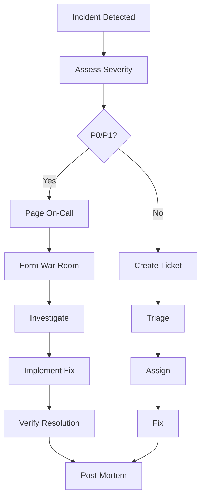

# Operational Runbook

## Overview

This runbook provides standard operating procedures for managing the AWS infrastructure. Use this guide for day-to-day operations, incident response, and routine maintenance.

## Table of Contents

1. [Daily Operations](#daily-operations)
2. [Weekly Tasks](#weekly-tasks)
3. [Monthly Tasks](#monthly-tasks)
4. [Incident Response](#incident-response)
5. [Deployment Procedures](#deployment-procedures)
6. [Backup and Recovery](#backup-and-recovery)
7. [Scaling Operations](#scaling-operations)
8. [Monitoring and Alerting](#monitoring-and-alerting)

## Daily Operations

### Morning Checklist

```bash
#!/bin/bash
# daily-health-check.sh

echo "=== Daily Infrastructure Health Check ==="
echo "Date: $(date)"
echo ""

# 1. Check AWS Service Health
echo "1. AWS Service Health Dashboard"
echo "   Visit: https://status.aws.amazon.com/"
echo ""

# 2. Check critical services
echo "2. Checking critical services..."

# VPCs
echo "   VPCs:"
aws ec2 describe-vpcs --query 'Vpcs[*].[VpcId,State,Tags[?Key==`Environment`].Value|[0]]' --output table

# RDS Instances
echo "   RDS Instances:"
aws rds describe-db-instances --query 'DBInstances[*].[DBInstanceIdentifier,DBInstanceStatus,MultiAZ]' --output table

# ECS Clusters
echo "   ECS Clusters:"
aws ecs list-clusters --query 'clusterArns' --output table

# Load Balancers
echo "   Load Balancers:"
aws elbv2 describe-load-balancers --query 'LoadBalancers[*].[LoadBalancerName,State.Code]' --output table

# 3. Check recent alarms
echo "3. Recent CloudWatch Alarms:"
aws cloudwatch describe-alarms \
  --state-value ALARM \
  --query 'MetricAlarms[*].[AlarmName,StateValue,StateUpdatedTimestamp]' \
  --output table

# 4. Check failed deployments
echo "4. Recent Failed Deployments:"
aws ecs list-services --cluster production-cluster | \
  jq -r '.serviceArns[]' | \
  xargs -I {} aws ecs describe-services --cluster production-cluster --services {} | \
  jq -r '.services[] | select(.runningCount < .desiredCount) | .serviceName'

# 5. Cost check
echo "5. Yesterday's Costs:"
aws ce get-cost-and-usage \
  --time-period Start=$(date -d "yesterday" +%Y-%m-%d),End=$(date +%Y-%m-%d) \
  --granularity DAILY \
  --metrics BlendedCost \
  --group-by Type=DIMENSION,Key=SERVICE \
  --query 'ResultsByTime[0].Groups[?Metrics.BlendedCost.Amount>`10`].[Keys[0],Metrics.BlendedCost.Amount]' \
  --output table

echo ""
echo "=== Health Check Complete ==="
```

### Log Review

```bash
# Check application logs for errors
aws logs filter-log-events \
  --log-group-name /aws/application/enterprise-prod \
  --filter-pattern "ERROR" \
  --start-time $(date -d "1 hour ago" +%s)000

# Check for 5xx errors in ALB
aws logs filter-log-events \
  --log-group-name /aws/elasticloadbalancing/app/production-alb \
  --filter-pattern "[..., status_code=5*, ...]" \
  --start-time $(date -d "1 hour ago" +%s)000
```

### Capacity Monitoring

```bash
# Check RDS storage
aws rds describe-db-instances \
  --query 'DBInstances[*].[DBInstanceIdentifier,AllocatedStorage,MaxAllocatedStorage]' \
  --output table

# Check ECS task capacity
aws ecs list-services --cluster production-cluster | \
  jq -r '.serviceArns[]' | \
  xargs -I {} aws ecs describe-services --cluster production-cluster --services {} | \
  jq '.services[] | {name: .serviceName, running: .runningCount, desired: .desiredCount}'
```

## Weekly Tasks

### Monday: Infrastructure Review

```bash
# Generate weekly infrastructure report
cat > weekly-report.md << 'EOF'
# Weekly Infrastructure Report - $(date +%Y-%m-%d)

## Resource Inventory
### Compute
- EC2 Instances: $(aws ec2 describe-instances --query 'Reservations[*].Instances[*].[InstanceId,State.Name]' | jq 'length')
- ECS Tasks: $(aws ecs list-tasks --cluster production-cluster | jq '.taskArns | length')

### Database
- RDS Instances: $(aws rds describe-db-instances | jq '.DBInstances | length')
- DynamoDB Tables: $(aws dynamodb list-tables | jq '.TableNames | length')

### Storage
- S3 Buckets: $(aws s3 ls | wc -l)
- Total S3 Storage: $(aws s3 ls --recursive s3://all-buckets --summarize | grep "Total Size" | awk '{print $3/1024/1024/1024 " GB"}')

## Cost Analysis
### Last 7 Days Trend
$(aws ce get-cost-and-usage \
  --time-period Start=$(date -d "7 days ago" +%Y-%m-%d),End=$(date +%Y-%m-%d) \
  --granularity DAILY \
  --metrics BlendedCost \
  --output table)

## Action Items
- [ ] Review and optimize unused resources
- [ ] Update documentation
- [ ] Check for available updates
EOF
```

### Wednesday: Security Review

```bash
# Security audit script
#!/bin/bash

echo "=== Weekly Security Audit ==="

# 1. Check for publicly accessible resources
echo "1. Checking for public resources..."

# Public S3 buckets
aws s3api list-buckets --query 'Buckets[*].Name' --output text | \
  xargs -I {} sh -c 'aws s3api get-bucket-acl --bucket {} | grep -q "AllUsers" && echo "Public bucket: {}"'

# Public RDS instances
aws rds describe-db-instances \
  --query 'DBInstances[?PubliclyAccessible==`true`].[DBInstanceIdentifier]' \
  --output table

# 2. Check security groups for 0.0.0.0/0
echo "2. Checking security groups..."
aws ec2 describe-security-groups \
  --query 'SecurityGroups[?IpPermissions[?IpRanges[?CidrIp==`0.0.0.0/0`]]].{GroupId:GroupId,GroupName:GroupName}' \
  --output table

# 3. Check IAM users without MFA
echo "3. Checking IAM users without MFA..."
aws iam list-users --query 'Users[*].UserName' --output text | \
  xargs -I {} sh -c 'aws iam list-mfa-devices --user-name {} | grep -q "MFADevices" || echo "No MFA: {}"'

# 4. Check for old access keys (>90 days)
echo "4. Checking for old access keys..."
aws iam list-users --query 'Users[*].UserName' --output text | \
  xargs -I {} aws iam list-access-keys --user-name {} \
  --query 'AccessKeyMetadata[?CreateDate<=`'$(date -d "90 days ago" -I)'`].[UserName,AccessKeyId,CreateDate]' \
  --output table

# 5. Check CloudTrail status
echo "5. Checking CloudTrail..."
aws cloudtrail describe-trails --query 'trailList[*].[Name,IsLogging]' --output table

echo "=== Security Audit Complete ==="
```

### Friday: Backup Verification

```bash
# Verify backups
#!/bin/bash

echo "=== Backup Verification ==="

# 1. RDS Snapshots
echo "1. Recent RDS Snapshots:"
aws rds describe-db-snapshots \
  --snapshot-type automated \
  --query 'DBSnapshots[?SnapshotCreateTime>=`'$(date -d "7 days ago" -I)'`].[DBSnapshotIdentifier,SnapshotCreateTime,Status]' \
  --output table

# 2. EBS Snapshots
echo "2. Recent EBS Snapshots:"
aws ec2 describe-snapshots \
  --owner-ids self \
  --query 'Snapshots[?StartTime>=`'$(date -d "7 days ago" -I)'`].[SnapshotId,StartTime,State]' \
  --output table

# 3. S3 Versioning Status
echo "3. S3 Versioning Status:"
aws s3api list-buckets --query 'Buckets[*].Name' --output text | \
  xargs -I {} sh -c 'echo -n "{}: "; aws s3api get-bucket-versioning --bucket {} --query Status --output text'

echo "=== Backup Verification Complete ==="
```

## Monthly Tasks

### First Monday: Capacity Planning

```bash
# Generate capacity planning report
#!/bin/bash

echo "=== Monthly Capacity Planning Report ==="
echo "Report Date: $(date)"
echo ""

# RDS Capacity
echo "## RDS Database Capacity"
aws cloudwatch get-metric-statistics \
  --namespace AWS/RDS \
  --metric-name DatabaseConnections \
  --dimensions Name=DBInstanceIdentifier,Value=production-db \
  --start-time $(date -d "30 days ago" -I) \
  --end-time $(date -I) \
  --period 86400 \
  --statistics Maximum,Average \
  --query 'Datapoints[*].[Timestamp,Maximum,Average]' \
  --output table

# ECS Service Scaling
echo "## ECS Task Count Trends"
aws cloudwatch get-metric-statistics \
  --namespace ECS/ContainerInsights \
  --metric-name RunningTaskCount \
  --dimensions Name=ServiceName,Value=production-service Name=ClusterName,Value=production-cluster \
  --start-time $(date -d "30 days ago" -I) \
  --end-time $(date -I) \
  --period 86400 \
  --statistics Maximum,Average \
  --output table

# Recommendations
echo ""
echo "## Recommendations"
echo "- Review metrics above for scaling decisions"
echo "- Check for consistently high/low utilization"
echo "- Plan for upcoming traffic patterns"
```

### Third Monday: Cost Optimization

```bash
# Monthly cost optimization review
#!/bin/bash

echo "=== Monthly Cost Optimization Review ==="

# 1. Idle resources
echo "1. Idle Resources (potential savings):"

# Unused Elastic IPs
echo "   Unused Elastic IPs:"
aws ec2 describe-addresses \
  --query 'Addresses[?AssociationId==`null`].[PublicIp,AllocationId]' \
  --output table

# Unattached EBS Volumes
echo "   Unattached EBS Volumes:"
aws ec2 describe-volumes \
  --filters Name=status,Values=available \
  --query 'Volumes[*].[VolumeId,Size,VolumeType,CreateTime]' \
  --output table

# Old Snapshots
echo "   Snapshots older than 90 days:"
aws ec2 describe-snapshots \
  --owner-ids self \
  --query 'Snapshots[?StartTime<=`'$(date -d "90 days ago" -I)'`].[SnapshotId,StartTime,VolumeSize]' \
  --output table

# 2. Right-sizing opportunities
echo "2. Right-sizing Opportunities:"

# RDS instances with low CPU
echo "   RDS instances with low average CPU (<20%):"
aws rds describe-db-instances --query 'DBInstances[*].DBInstanceIdentifier' --output text | \
  xargs -I {} sh -c 'CPU=$(aws cloudwatch get-metric-statistics --namespace AWS/RDS --metric-name CPUUtilization --dimensions Name=DBInstanceIdentifier,Value={} --start-time $(date -d "7 days ago" -I) --end-time $(date -I) --period 86400 --statistics Average --query "Datapoints[*].Average" --output text | awk "{sum+=\$1; count++} END {print sum/count}"); echo "{}: ${CPU}%"'

# 3. Reserved Instance recommendations
echo "3. Reserved Instance Recommendations:"
aws ce get-reservation-purchase-recommendation \
  --service EC2 \
  --lookback-period-in-days SIXTY_DAYS \
  --term-in-years ONE_YEAR \
  --payment-option NO_UPFRONT

echo "=== Cost Optimization Review Complete ==="
```

## Incident Response

### Severity Levels

**P0 - Critical (Production Down)**
- Response Time: Immediate
- Resolution Time: 1 hour
- Examples: Complete outage, data loss

**P1 - High (Major Feature Down)**
- Response Time: 15 minutes
- Resolution Time: 4 hours
- Examples: Payment processing down, auth issues

**P2 - Medium (Performance Degradation)**
- Response Time: 1 hour
- Resolution Time: 24 hours
- Examples: Slow response times, intermittent errors

**P3 - Low (Minor Issues)**
- Response Time: Next business day
- Resolution Time: 1 week
- Examples: UI bugs, non-critical features

### Incident Response Workflow



### P0 Incident Playbook

```bash
#!/bin/bash
# p0-incident-response.sh

echo "=== P0 INCIDENT RESPONSE ==="
echo "Incident ID: $1"
echo "Start Time: $(date)"
echo ""

# 1. Initial Assessment
echo "## Step 1: Initial Assessment"
echo "- [ ] Verify incident scope"
echo "- [ ] Determine affected services"
echo "- [ ] Notify stakeholders"
echo ""

# 2. Gather Information
echo "## Step 2: Gather Information"

# Check CloudWatch Alarms
echo "### Active Alarms:"
aws cloudwatch describe-alarms --state-value ALARM

# Check ECS Services
echo "### ECS Service Status:"
aws ecs list-services --cluster production-cluster | \
  jq -r '.serviceArns[]' | \
  xargs -I {} aws ecs describe-services --cluster production-cluster --services {} | \
  jq '.services[] | {name: .serviceName, running: .runningCount, desired: .desiredCount, status: .status}'

# Check RDS Status
echo "### RDS Status:"
aws rds describe-db-instances \
  --query 'DBInstances[*].[DBInstanceIdentifier,DBInstanceStatus]' \
  --output table

# Check Load Balancer Health
echo "### Load Balancer Target Health:"
aws elbv2 describe-target-groups --query 'TargetGroups[*].TargetGroupArn' --output text | \
  xargs -I {} aws elbv2 describe-target-health --target-group-arn {}

# 3. Recent Changes
echo "### Recent CloudTrail Events:"
aws cloudtrail lookup-events \
  --start-time $(date -d "1 hour ago" -I) \
  --max-results 20 \
  --query 'Events[*].[EventTime,EventName,Username]' \
  --output table

# 4. Create incident channel
echo ""
echo "## Step 3: Communication"
echo "Create Slack channel: #incident-$1"
echo "Start incident timeline document"

# 5. Rollback if needed
echo ""
echo "## Step 4: Mitigation Options"
echo "- [ ] Rollback recent deployment"
echo "- [ ] Scale up resources"
echo "- [ ] Failover to DR region"
echo "- [ ] Enable maintenance mode"

echo ""
echo "=== Waiting for incident resolution ==="
```

### Rollback Procedures

```bash
# Rollback ECS service to previous task definition
aws ecs update-service \
  --cluster production-cluster \
  --service web-service \
  --task-definition web-service:$(( $(aws ecs describe-services --cluster production-cluster --services web-service --query 'services[0].taskDefinition' --output text | cut -d: -f7) - 1 ))

# Rollback RDS to snapshot
aws rds restore-db-instance-from-db-snapshot \
  --db-instance-identifier production-db-restored \
  --db-snapshot-identifier manual-backup-20250101

# Rollback Lambda function
aws lambda update-function-code \
  --function-name my-function \
  --s3-bucket my-deployment-bucket \
  --s3-key my-function-previous-version.zip
```

## Deployment Procedures

### Pre-Deployment Checklist

```bash
#!/bin/bash
# pre-deployment-checklist.sh

ENVIRONMENT=$1

echo "=== Pre-Deployment Checklist for $ENVIRONMENT ==="
echo ""

# 1. Verify Terraform state is clean
echo "[ ] 1. Terraform State Health"
cd layers/networking/environments/$ENVIRONMENT
terraform state list > /dev/null 2>&1 && echo "✓ State accessible" || echo "✗ State issue"

# 2. Check for drift
echo "[ ] 2. Configuration Drift Check"
terraform plan -detailed-exitcode > /dev/null 2>&1
case $? in
  0) echo "✓ No drift detected" ;;
  1) echo "✗ Terraform error" ;;
  2) echo "⚠ Drift detected - review plan" ;;
esac

# 3. Verify backups
echo "[ ] 3. Recent Backups"
aws rds describe-db-snapshots \
  --snapshot-type automated \
  --query 'DBSnapshots[?SnapshotCreateTime>=`'$(date -d "24 hours ago" -I)'`].[DBSnapshotIdentifier]' \
  --output text && echo "✓ Recent RDS backup found" || echo "✗ No recent backup"

# 4. Check service health
echo "[ ] 4. Current Service Health"
aws ecs describe-services --cluster $ENVIRONMENT-cluster --services web-service \
  --query 'services[0].runningCount==services[0].desiredCount' \
  --output text | grep -q "True" && echo "✓ Services healthy" || echo "✗ Services unhealthy"

# 5. Review change window
echo "[ ] 5. Deployment Window"
HOUR=$(date +%H)
if [ $HOUR -ge 2 ] && [ $HOUR -le 5 ]; then
  echo "✓ In maintenance window (02:00-05:00)"
else
  echo "⚠ Outside maintenance window"
fi

# 6. Notify stakeholders
echo "[ ] 6. Stakeholder Notification"
echo "   Send notification to #deployments channel"

echo ""
echo "=== Checklist Complete ==="
echo "Proceed with deployment? (yes/no)"
```

### Blue-Green Deployment

```bash
#!/bin/bash
# blue-green-deployment.sh

SERVICE_NAME="web-service"
CLUSTER="production-cluster"
NEW_TASK_DEF="web-service:42"  # New version

echo "=== Blue-Green Deployment ==="

# 1. Create new target group (Green)
GREEN_TG=$(aws elbv2 create-target-group \
  --name ${SERVICE_NAME}-green \
  --protocol HTTP \
  --port 80 \
  --vpc-id vpc-xxx \
  --health-check-path /health \
  --query 'TargetGroups[0].TargetGroupArn' \
  --output text)

# 2. Deploy new version to green
aws ecs create-service \
  --cluster $CLUSTER \
  --service-name ${SERVICE_NAME}-green \
  --task-definition $NEW_TASK_DEF \
  --desired-count 2 \
  --load-balancers targetGroupArn=$GREEN_TG,containerName=web,containerPort=80

# 3. Wait for healthy targets
echo "Waiting for green deployment to be healthy..."
while true; do
  HEALTHY=$(aws elbv2 describe-target-health --target-group-arn $GREEN_TG \
    --query 'length(TargetHealthDescriptions[?TargetHealth.State==`healthy`])' \
    --output text)
  if [ "$HEALTHY" -ge 2 ]; then
    echo "Green deployment healthy!"
    break
  fi
  sleep 10
done

# 4. Switch traffic (modify ALB listener rule)
echo "Switching traffic to green..."
aws elbv2 modify-rule \
  --rule-arn arn:aws:elasticloadbalancing:... \
  --actions Type=forward,TargetGroupArn=$GREEN_TG

# 5. Monitor for 15 minutes
echo "Monitoring new deployment for 15 minutes..."
sleep 900

# 6. If successful, delete blue
echo "Deployment successful. Cleaning up blue environment..."
aws ecs update-service \
  --cluster $CLUSTER \
  --service ${SERVICE_NAME}-blue \
  --desired-count 0

echo "=== Deployment Complete ==="
```

## Backup and Recovery

### Database Backup

```bash
# Create manual RDS snapshot
aws rds create-db-snapshot \
  --db-instance-identifier production-db \
  --db-snapshot-identifier prod-manual-$(date +%Y%m%d-%H%M%S) \
  --tags Key=Type,Value=Manual Key=CreatedBy,Value=$(whoami)

# Export to S3
aws rds start-export-task \
  --export-task-identifier prod-export-$(date +%Y%m%d) \
  --source-arn arn:aws:rds:us-east-1:123456789:snapshot:prod-manual-xxx \
  --s3-bucket-name production-db-exports \
  --iam-role-arn arn:aws:iam::123456789:role/rds-export-role \
  --kms-key-id arn:aws:kms:us-east-1:123456789:key/xxx
```

### Disaster Recovery Test

```bash
#!/bin/bash
# dr-test.sh

echo "=== Disaster Recovery Test ==="
echo "Test Date: $(date)"
echo ""

# 1. Create test VPC
echo "1. Creating test VPC..."
terraform -chdir=layers/networking/environments/dr-test apply -auto-approve

# 2. Restore RDS from snapshot
echo "2. Restoring database..."
LATEST_SNAPSHOT=$(aws rds describe-db-snapshots \
  --db-instance-identifier production-db \
  --snapshot-type automated \
  --query 'DBSnapshots | sort_by(@, &SnapshotCreateTime) | [-1].DBSnapshotIdentifier' \
  --output text)

aws rds restore-db-instance-from-db-snapshot \
  --db-instance-identifier dr-test-db \
  --db-snapshot-identifier $LATEST_SNAPSHOT

# 3. Deploy application
echo "3. Deploying application..."
terraform -chdir=layers/compute/environments/dr-test apply -auto-approve

# 4. Verify functionality
echo "4. Running verification tests..."
# Add your verification tests here

# 5. Cleanup
echo "5. Cleaning up test environment..."
terraform -chdir=layers/compute/environments/dr-test destroy -auto-approve
terraform -chdir=layers/networking/environments/dr-test destroy -auto-approve

echo "=== DR Test Complete ==="
```

## Scaling Operations

### Manual Scaling

```bash
# Scale ECS service
aws ecs update-service \
  --cluster production-cluster \
  --service web-service \
  --desired-count 10

# Scale RDS (requires downtime)
aws rds modify-db-instance \
  --db-instance-identifier production-db \
  --db-instance-class db.r5.xlarge \
  --apply-immediately

# Scale EC2 Auto Scaling Group
aws autoscaling set-desired-capacity \
  --auto-scaling-group-name production-asg \
  --desired-capacity 5
```

### Auto-Scaling Configuration

```terraform
# ECS Service Auto Scaling
resource "aws_appautoscaling_target" "ecs" {
  max_capacity       = 10
  min_capacity       = 2
  resource_id        = "service/production-cluster/web-service"
  scalable_dimension = "ecs:service:DesiredCount"
  service_namespace  = "ecs"
}

resource "aws_appautoscaling_policy" "ecs_cpu" {
  name               = "cpu-autoscaling"
  policy_type        = "TargetTrackingScaling"
  resource_id        = aws_appautoscaling_target.ecs.resource_id
  scalable_dimension = aws_appautoscaling_target.ecs.scalable_dimension
  service_namespace  = aws_appautoscaling_target.ecs.service_namespace

  target_tracking_scaling_policy_configuration {
    predefined_metric_specification {
      predefined_metric_type = "ECSServiceAverageCPUUtilization"
    }
    target_value = 70.0
  }
}
```

## Monitoring and Alerting

### Critical Alerts Setup

```bash
# High CPU Alert
aws cloudwatch put-metric-alarm \
  --alarm-name prod-rds-high-cpu \
  --alarm-description "RDS CPU > 80%" \
  --metric-name CPUUtilization \
  --namespace AWS/RDS \
  --statistic Average \
  --period 300 \
  --evaluation-periods 2 \
  --threshold 80 \
  --comparison-operator GreaterThanThreshold \
  --dimensions Name=DBInstanceIdentifier,Value=production-db \
  --alarm-actions arn:aws:sns:us-east-1:123456789:critical-alerts

# Low Disk Space Alert  
aws cloudwatch put-metric-alarm \
  --alarm-name prod-rds-low-disk \
  --alarm-description "RDS Free Storage < 10GB" \
  --metric-name FreeStorageSpace \
  --namespace AWS/RDS \
  --statistic Average \
  --period 300 \
  --evaluation-periods 1 \
  --threshold 10737418240 \
  --comparison-operator LessThanThreshold \
  --dimensions Name=DBInstanceIdentifier,Value=production-db \
  --alarm-actions arn:aws:sns:us-east-1:123456789:critical-alerts

# Unhealthy Targets Alert
aws cloudwatch put-metric-alarm \
  --alarm-name prod-alb-unhealthy-targets \
  --alarm-description "ALB has unhealthy targets" \
  --metric-name UnHealthyHostCount \
  --namespace AWS/ApplicationELB \
  --statistic Average \
  --period 60 \
  --evaluation-periods 2 \
  --threshold 1 \
  --comparison-operator GreaterThanOrEqualToThreshold \
  --dimensions Name=LoadBalancer,Value=app/production-alb/xxx \
  --alarm-actions arn:aws:sns:us-east-1:123456789:critical-alerts
```

### Dashboard Creation

```bash
# Create CloudWatch Dashboard
aws cloudwatch put-dashboard \
  --dashboard-name Production-Overview \
  --dashboard-body file://dashboard-config.json

# dashboard-config.json
cat > dashboard-config.json << 'EOF'
{
  "widgets": [
    {
      "type": "metric",
      "properties": {
        "metrics": [
          ["AWS/RDS", "CPUUtilization", {"stat": "Average"}],
          ["AWS/RDS", "DatabaseConnections", {"stat": "Average"}]
        ],
        "period": 300,
        "stat": "Average",
        "region": "us-east-1",
        "title": "RDS Metrics"
      }
    },
    {
      "type": "metric",
      "properties": {
        "metrics": [
          ["AWS/ECS", "CPUUtilization", {"stat": "Average"}],
          ["AWS/ECS", "MemoryUtilization", {"stat": "Average"}]
        ],
        "period": 300,
        "stat": "Average",
        "region": "us-east-1",
        "title": "ECS Metrics"
      }
    }
  ]
}
EOF
```

## On-Call Procedures

### On-Call Rotation Schedule

- **Primary On-Call**: Available 24/7 for P0/P1 incidents
- **Secondary On-Call**: Backup for primary
- **Rotation**: Weekly, Monday 9:00 AM

### Handoff Checklist

```markdown
# On-Call Handoff - Week of [DATE]

## Ongoing Issues
- [ ] Issue #123: Intermittent latency spikes
- [ ] Issue #456: Pending infrastructure upgrade

## Recent Changes
- [ ] Deployed v2.3.4 to production on [DATE]
- [ ] Scaled ECS service from 5 to 8 tasks

## Upcoming Maintenance
- [ ] RDS maintenance window: Sunday 3:00-5:00 AM
- [ ] Certificate renewal: [DATE]

## Important Notes
- [ ] Customer X has increased load expected this week
- [ ] Budget alerts enabled for development environment

## Contact Information
- Team Slack: #platform-engineering
- PagerDuty: [LINK]
- Escalation: [MANAGER NAME/CONTACT]

## Useful Links
- Runbook: [URL]
- Monitoring Dashboard: [URL]
- Recent Incidents: [URL]
```

## Contacts and Escalation

### Primary Contacts

```yaml
roles:
  platform_team_lead:
    name: "John Doe"
    email: "john.doe@company.com"
    phone: "+1-555-0100"
    slack: "@johndoe"
    
  devops_engineer:
    name: "Jane Smith"
    email: "jane.smith@company.com"
    phone: "+1-555-0101"
    slack: "@janesmith"
    
  sre_lead:
    name: "Bob Johnson"
    email: "bob.johnson@company.com"
    phone: "+1-555-0102"
    slack: "@bobjohnson"

external:
  aws_support:
    phone: "1-800-AWS-SUPPORT"
    portal: "https://console.aws.amazon.com/support"
    
  pagerduty:
    email: "team@company.pagerduty.com"
    phone: "+1-555-PAGER"
```

### Escalation Matrix

```
Level 1: On-Call Engineer (0-30 min)
├─ P0: Immediate escalation to Level 2
└─ P1: Attempt resolution, escalate if needed

Level 2: Team Lead (30-60 min)
├─ Coordinate resources
├─ Communicate with stakeholders
└─ Escalate to Level 3 if needed

Level 3: Engineering Manager (60+ min)
├─ Executive communication
├─ Business impact assessment
└─ Resource allocation decisions

Level 4: VP Engineering (Critical business impact)
└─ Strategic decisions and external communication
```

## Additional Resources

- [AWS Well-Architected Tool](https://aws.amazon.com/well-architected-tool/)
- [Terraform Best Practices](https://www.terraform-best-practices.com/)
- [Internal Wiki](https://wiki.company.com)
- [Incident Response Plan](https://wiki.company.com/incident-response)

---

**Last Updated**: 2025-10-05  
**Document Owner**: Platform Engineering Team  
**Review Frequency**: Monthly
