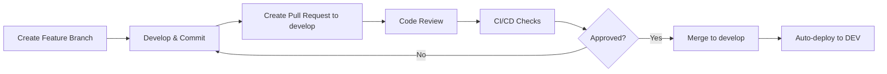
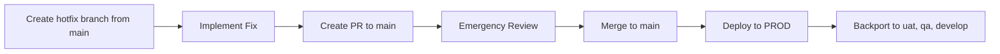

# Git Policy & Branching Strategy Recommendations

## Executive Summary

This document outlines the recommended Git policy for managing code across four environments (Development, QA, UAT, and Production) with emphasis on traceability, integration workflows, and operational excellence.

## 1. Environment Strategy

### 1.1 Environment Definitions

| Environment | Purpose | Branch | Deployment Trigger |
|-------------|---------|--------|-------------------|
| **Development (DEV)** | Active development and feature integration | `develop` | Automatic on merge |
| **Quality Assurance (QA)** | Testing and quality validation | `qa` | Manual promotion from develop |
| **User Acceptance Testing (UAT)** | Business validation and pre-production testing | `uat` | Manual promotion from qa |
| **Production (PROD)** | Live production environment | `main` / `master` | Manual promotion from uat with approval |

### 1.2 Environment Progression Flow

```
Feature → develop (DEV) → qa (QA) → uat (UAT) → main (PROD)
```

## 2. Branching Strategy

### 2.1 Core Branch Structure

We recommend a **modified GitFlow** approach optimized for multiple environments:

#### Protected Branches
- `main` - Production environment (requires 2+ approvals)
- `uat` - UAT environment (requires 1+ approval)
- `qa` - QA environment (requires 1+ approval)
- `develop` - Development environment (requires 1+ approval)

#### Supporting Branches
- `feature/*` - New features and enhancements
- `bugfix/*` - Non-critical bug fixes
- `hotfix/*` - Critical production fixes
- `release/*` - Release preparation branches

### 2.2 Branch Naming Conventions

All branches must follow this naming pattern for traceability:

```
<type>/<ticket-id>-<short-description>

Examples:
feature/JIRA-1234-user-authentication
bugfix/JIRA-5678-login-timeout
hotfix/JIRA-9999-critical-payment-bug
release/v2.3.0
```

**Mandatory Components:**
- `<type>`: feature, bugfix, hotfix, release
- `<ticket-id>`: Issue tracking system reference (JIRA, Azure DevOps, etc.)
- `<short-description>`: Kebab-case description (lowercase with hyphens)

## 3. Commit Message Standards

### 3.1 Commit Message Format

Follow the **Conventional Commits** specification:

```
<type>(<scope>): <subject>

[optional body]

[optional footer]
```

**Example:**
```
feat(auth): implement OAuth2 integration

- Add OAuth2 provider configuration
- Implement token refresh mechanism
- Add integration tests

Refs: JIRA-1234
```

### 3.2 Commit Types

| Type | Description | Usage |
|------|-------------|-------|
| `feat` | New feature | New functionality |
| `fix` | Bug fix | Fix defects |
| `docs` | Documentation | Documentation only changes |
| `style` | Code style | Formatting, missing semicolons, etc. |
| `refactor` | Code refactoring | Neither fixes bug nor adds feature |
| `perf` | Performance improvement | Code changes that improve performance |
| `test` | Adding tests | Adding missing tests |
| `chore` | Maintenance | Build process, auxiliary tools |
| `ci` | CI/CD changes | Changes to CI configuration files |
| `revert` | Revert previous commit | Revert to a previous commit |

### 3.3 Commit Traceability Requirements

**Every commit MUST include:**
1. Reference to ticket/issue ID in commit message
2. Meaningful description of changes
3. Author attribution (via Git config)
4. GPG signature (for production releases - optional but recommended)

## 4. Workflow & Integration Process

### 4.1 Feature Development Workflow



**Steps:**
1. Create feature branch from `develop`
2. Implement changes with proper commits
3. Push branch and create Pull Request (PR)
4. Pass automated checks (tests, linting, security scans)
5. Obtain required code reviews
6. Merge to `develop` (squash or merge commit based on policy)
7. Automatic deployment to DEV environment

### 4.2 Environment Promotion Workflow

#### DEV → QA Promotion
```bash
# Create PR from develop to qa
git checkout qa
git pull origin qa
# Via PR: merge develop into qa
# Manual trigger: Deploy to QA environment
```

**Requirements:**
- All tests passing in DEV
- Code review completed
- QA team notified via PR
- Release notes updated

#### QA → UAT Promotion
```bash
# Create PR from qa to uat
git checkout uat
git pull origin uat
# Via PR: merge qa into uat
# Manual trigger: Deploy to UAT environment
```

**Requirements:**
- QA testing completed and signed off
- Test results documented
- UAT team notified
- Business stakeholders informed

#### UAT → PROD Promotion
```bash
# Create PR from uat to main
git checkout main
git pull origin main
# Via PR: merge uat into main
# Manual trigger with approval: Deploy to PROD
```

**Requirements:**
- UAT testing completed and signed off
- Business acceptance obtained
- Change advisory board (CAB) approval
- Deployment plan documented
- Rollback plan prepared
- Minimum 2 approvals from senior engineers/leads

### 4.3 Hotfix Workflow

Critical production issues bypass normal flow:



**Steps:**
1. Create `hotfix/*` branch from `main`
2. Implement fix with tests
3. Create PR to `main` with "HOTFIX" label
4. Expedited review (minimum 1 senior engineer)
5. Deploy to production
6. Backport changes to `uat`, `qa`, and `develop` immediately

## 5. Pull Request (PR) / Merge Request (MR) Guidelines

### 5.1 PR Requirements

Every PR must include:

**Title Format:**
```
[TICKET-ID] Brief description of changes
Example: [JIRA-1234] Add user authentication module
```

**Description Template:**
```markdown
## Description
Brief description of what this PR does

## Ticket Reference
- JIRA: [JIRA-1234](link)

## Type of Change
- [ ] Feature
- [ ] Bug fix
- [ ] Hotfix
- [ ] Documentation
- [ ] Refactoring

## Changes Made
- List of changes
- Another change

## Testing
- [ ] Unit tests added/updated
- [ ] Integration tests added/updated
- [ ] Manual testing completed

## Deployment Notes
Any special deployment considerations

## Rollback Plan
How to rollback if issues arise
```

### 5.2 Code Review Requirements

| Target Branch | Required Approvals | Reviewers |
|---------------|-------------------|-----------|
| `develop` | 1 | Any team member |
| `qa` | 1 | QA lead or senior engineer |
| `uat` | 1 | Tech lead or architect |
| `main` | 2 | Senior engineers/architects/leads |

### 5.3 Automated PR Checks

All PRs must pass:
- ✅ Unit tests (100% must pass)
- ✅ Integration tests
- ✅ Code coverage threshold (minimum 80%)
- ✅ Linting and code quality checks
- ✅ Security vulnerability scanning (SAST)
- ✅ Dependency vulnerability scanning (SCA)
- ✅ Container image scanning (if applicable)
- ✅ Infrastructure as Code validation (if applicable)

## 6. Traceability & Audit Requirements

### 6.1 Traceability Matrix

Every code change must be traceable through:

```
Issue/Ticket → Branch → Commits → PR → Environment Deployment → Production Release
```

**Implementation:**
- Branch names include ticket IDs
- Commits reference ticket IDs
- PRs link to tickets
- Deployment logs capture branch/commit information
- Release notes generated from PR history

### 6.2 Required Metadata

Each deployment must capture:
- **Commit SHA**: Exact code version deployed
- **Author**: Who made the changes
- **Reviewer(s)**: Who approved the changes
- **Ticket ID**: Business justification
- **Timestamp**: When deployed
- **Environment**: Where deployed
- **Deployer**: Who triggered deployment
- **Build ID**: CI/CD build reference

### 6.3 Audit Log Integration

Integrate Git events with audit logging systems:
- Repository access logs
- Branch protection violations
- Force push attempts
- PR approval bypasses
- Merge events with approver details
- Tag creation (releases)

## 7. Release Management

### 7.1 Versioning Strategy

Follow **Semantic Versioning** (SemVer): `MAJOR.MINOR.PATCH`

```
Example: v2.3.1
- MAJOR: Breaking changes
- MINOR: New features (backward compatible)
- PATCH: Bug fixes
```

### 7.2 Release Process

1. **Create Release Branch**
   ```bash
   git checkout -b release/v2.3.0 uat
   ```

2. **Update Version Files**
   - package.json, pom.xml, etc.
   - CHANGELOG.md
   - Documentation

3. **Create Release PR to main**
   - Include release notes
   - List all tickets included
   - Document breaking changes

4. **Tag Release After Merge**
   ```bash
   git checkout main
   git pull origin main
   git tag -a v2.3.0 -m "Release version 2.3.0"
   git push origin v2.3.0
   ```

5. **Backport Release Branch**
   ```bash
   # Merge back to develop to keep in sync
   git checkout develop
   git merge main
   git push origin develop
   ```

### 7.3 Release Notes Template

```markdown
# Release v2.3.0 - YYYY-MM-DD

## Features
- [JIRA-1234] New user authentication system
- [JIRA-1235] Dashboard performance improvements

## Bug Fixes
- [JIRA-5678] Fixed login timeout issue
- [JIRA-5679] Resolved data export corruption

## Breaking Changes
- API endpoint `/api/v1/users` deprecated, use `/api/v2/users`

## Upgrade Instructions
1. Backup database
2. Run migration scripts
3. Update configuration
4. Deploy new version

## Rollback Procedure
1. Redeploy previous version tag v2.2.5
2. Restore database backup if necessary
```

## 8. CI/CD Integration Guidelines

### 8.1 Pipeline Stages by Environment

**DEV Environment (develop branch)**
```yaml
stages:
  - lint
  - unit-test
  - build
  - security-scan
  - deploy-dev
  - smoke-test
```

**QA Environment (qa branch)**
```yaml
stages:
  - integration-test
  - performance-test
  - build
  - deploy-qa
  - automated-tests
  - test-report
```

**UAT Environment (uat branch)**
```yaml
stages:
  - build
  - deploy-uat
  - smoke-test
  - notification
```

**PROD Environment (main branch)**
```yaml
stages:
  - build
  - security-final-scan
  - manual-approval
  - deploy-prod
  - health-check
  - rollback-on-failure
```

### 8.2 Deployment Automation

- **DEV**: Automatic on merge to `develop`
- **QA**: Manual trigger after merge to `qa`
- **UAT**: Manual trigger with notification after merge to `uat`
- **PROD**: Manual trigger with multi-level approval after merge to `main`

### 8.3 Deployment Gates

| Environment | Required Gates |
|-------------|----------------|
| DEV | Tests passing |
| QA | Tests + Code review |
| UAT | QA signoff + Business approval |
| PROD | UAT signoff + CAB approval + 2+ senior approvals |

## 9. Security & Compliance

### 9.1 Branch Protection Rules

**For `main` (Production):**
- ✅ Require pull request reviews (minimum 2)
- ✅ Require status checks to pass
- ✅ Require branches to be up to date before merging
- ✅ Require signed commits (recommended)
- ✅ Include administrators in restrictions
- ✅ Restrict who can push to matching branches
- ✅ Require linear history (no merge commits, use squash or rebase)
- ✅ Do not allow force pushes
- ✅ Do not allow deletions

**For `uat`, `qa`, `develop`:**
- ✅ Require pull request reviews (minimum 1)
- ✅ Require status checks to pass
- ✅ Do not allow force pushes
- ✅ Do not allow deletions

### 9.2 Access Control

| Role | Permissions |
|------|-------------|
| Developers | Read, create branches, create PRs |
| Senior Developers | Above + approve PRs to develop/qa |
| Tech Leads | Above + approve PRs to uat |
| Architects/Principal Engineers | Above + approve PRs to main |
| DevOps/SRE | Above + manage repository settings |

### 9.3 Secret Management

**Never commit:**
- API keys
- Passwords
- Certificates
- Private keys
- Environment-specific configurations

**Use instead:**
- Environment variables
- Secret management services (HashiCorp Vault, AWS Secrets Manager, Azure Key Vault)
- Encrypted configuration files
- CI/CD secret stores

### 9.4 Security Scanning

Implement automated security scanning:
- **SAST**: Static Application Security Testing (SonarQube, Checkmarx)
- **SCA**: Software Composition Analysis (Snyk, Dependabot)
- **Container Scanning**: Image vulnerability scanning (Trivy, Clair)
- **IaC Scanning**: Infrastructure as Code security (Checkov, tfsec)

## 10. Monitoring & Observability

### 10.1 Git Metrics to Track

- Commit frequency
- PR merge time
- Code review time
- Deployment frequency per environment
- Failed deployments
- Rollback frequency
- Time between environments (dev→qa→uat→prod)

### 10.2 Integration with Monitoring Tools

Link deployments to observability:
- Tag releases in APM tools (New Relic, Datadog, Dynatrace)
- Correlate deployment events with error rates
- Track performance impact of releases
- Monitor rollback triggers

## 11. Best Practices & Guidelines

### 11.1 Do's ✅

- **DO** keep commits small and focused
- **DO** write descriptive commit messages
- **DO** reference ticket IDs in all commits and branches
- **DO** rebase your feature branch before creating PR
- **DO** run tests locally before pushing
- **DO** review your own PR before requesting reviews
- **DO** delete branches after merging
- **DO** use PR templates
- **DO** document breaking changes
- **DO** maintain CHANGELOG
- **DO** tag releases properly

### 11.2 Don'ts ❌

- **DON'T** commit directly to protected branches
- **DON'T** force push to shared branches
- **DON'T** commit secrets or credentials
- **DON'T** commit large binary files (use Git LFS)
- **DON'T** use ambiguous commit messages ("fix", "update", "wip")
- **DON'T** merge without approval
- **DON'T** bypass CI/CD checks
- **DON'T** deploy to production without proper testing
- **DON'T** ignore merge conflicts
- **DON'T** mix multiple features in one PR

### 11.3 Merge Strategies

**Recommended merge strategies by branch:**

| Target Branch | Strategy | Reason |
|---------------|----------|---------|
| `develop` | Squash or Merge Commit | Keeps history clean while preserving context |
| `qa` | Merge Commit | Preserves full history for testing traceability |
| `uat` | Merge Commit | Maintains complete audit trail |
| `main` | Merge Commit | Full traceability required for production |

## 12. Emergency Procedures

### 12.1 Rollback Procedure

**Immediate Rollback:**
```bash
# 1. Identify last good version
git tag --list | grep v

# 2. Create rollback branch
git checkout -b rollback/v2.2.5 v2.2.5

# 3. Deploy previous version
# Trigger deployment pipeline with tag v2.2.5

# 4. Document incident
# Create post-mortem ticket
```

### 12.2 Incident Response

1. **Identify Issue**: Monitor alerts, user reports
2. **Assess Impact**: Determine severity and affected systems
3. **Decide Action**: Rollback vs hotfix
4. **Execute**: Follow hotfix or rollback procedure
5. **Communicate**: Notify stakeholders
6. **Post-Mortem**: Document lessons learned

### 12.3 Force Push Recovery

If someone force-pushes to protected branch:
```bash
# 1. Check reflog on server
git reflog show origin/<branch>

# 2. Identify commit before force push
git reset --hard <commit-sha>

# 3. Force push back (with authorization)
git push origin <branch> --force

# 4. Audit and prevent future occurrences
```

## 13. Tooling Recommendations

### 13.1 Git Hosting Platforms

- **GitHub Enterprise**: Best for open-source style workflows
- **GitLab Self-Managed**: Excellent built-in CI/CD
- **Azure DevOps**: Great for Microsoft ecosystem
- **Bitbucket**: Good Atlassian integration

### 13.2 Essential Integrations

- **Issue Tracking**: JIRA, Azure Boards, GitHub Issues
- **CI/CD**: Jenkins, GitLab CI, GitHub Actions, Azure Pipelines
- **Code Quality**: SonarQube, CodeClimate
- **Security**: Snyk, Dependabot, GitHub Advanced Security
- **Documentation**: Confluence, GitHub Wiki
- **Communication**: Slack, Microsoft Teams
- **Monitoring**: Datadog, New Relic, Prometheus/Grafana

### 13.3 Git Hooks

Implement pre-commit and pre-push hooks:

**Pre-commit:**
- Lint code
- Format code
- Check for secrets
- Run fast unit tests

**Pre-push:**
- Run full test suite
- Verify commit messages
- Check branch naming

### 13.4 GitOps Tools (Optional)

For infrastructure and Kubernetes deployments:
- **ArgoCD**: Kubernetes GitOps continuous delivery
- **Flux**: GitOps for Kubernetes
- **Terraform Cloud**: Infrastructure as Code GitOps

## 14. Training & Documentation

### 14.1 Onboarding Checklist

New team members should:
- [ ] Review this Git policy document
- [ ] Complete Git training (basic and advanced)
- [ ] Understand branching strategy
- [ ] Practice creating feature branches and PRs
- [ ] Shadow a code review
- [ ] Understand deployment process for each environment
- [ ] Know escalation procedures for issues

### 14.2 Documentation Requirements

Maintain these documents:
- Git policy (this document)
- Branching strategy diagram
- Deployment runbooks per environment
- Rollback procedures
- Incident response playbook
- Architecture decision records (ADRs)
- CHANGELOG
- README with setup instructions

## 15. Continuous Improvement

### 15.1 Review Cadence

Review and update this policy:
- **Monthly**: Metrics review
- **Quarterly**: Process improvements
- **Annually**: Complete policy review
- **Ad-hoc**: After major incidents

### 15.2 Feedback Mechanism

Collect feedback through:
- Retrospectives
- Developer surveys
- Incident post-mortems
- Metrics analysis
- Stakeholder reviews

### 15.3 Success Metrics

Track these KPIs:
- Deployment frequency
- Lead time for changes
- Mean time to recovery (MTTR)
- Change failure rate
- Code review time
- Time in each environment
- Number of rollbacks
- Security vulnerabilities detected/fixed

## 16. Conclusion

This Git policy provides a framework for managing code across multiple environments with strong traceability, security, and operational excellence. Success depends on:

1. **Consistent adherence** to branching strategy
2. **Automated enforcement** through CI/CD pipelines
3. **Clear communication** across teams
4. **Regular review** and improvement
5. **Proper training** and documentation

By following these guidelines, the organization will achieve:
- ✅ Complete traceability from issue to production
- ✅ Reduced deployment risks
- ✅ Faster incident response
- ✅ Improved code quality
- ✅ Better collaboration across teams
- ✅ Compliance with audit requirements

---

**Document Version**: 1.0  
**Last Updated**: 2025-10-17  
**Next Review**: 2026-01-17  
**Owner**: DevOps/Platform Engineering Team  
**Approved By**: CTO/VP Engineering
