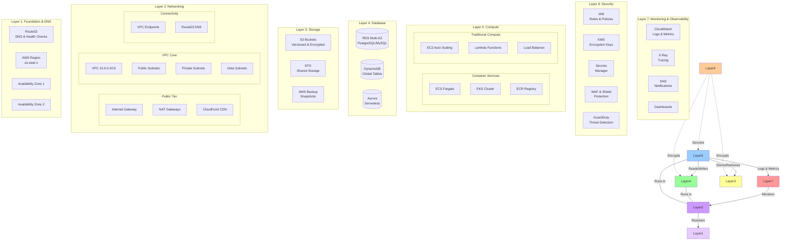

# Simplified AWS Architecture - Visual Layer Diagram

## Layer-Based Architecture Visualization



---

## Quick Reference: Components by Layer

### 🔴 Layer 7: Monitoring & Observability
**Purpose:** Observe, alert, and improve system health

| Component | Function | Key Features |
|-----------|----------|-------------|
| CloudWatch Logs | Centralized logging | Log Groups, Insights, retention policies |
| CloudWatch Metrics | Performance monitoring | Standard & custom metrics, dashboards |
| CloudWatch Alarms | Automated alerting | Multi-metric alarms, composite alarms |
| X-Ray | Distributed tracing | Service map, trace analysis, annotations |
| SNS Topics | Notifications | Email, SMS, Lambda triggers |
| EventBridge | Event routing | Scheduled events, AWS service events |

**Integration Points:**
- All layers send logs and metrics here
- Alarms trigger automated remediation
- Dashboards visualize cross-layer health

---

### 🟠 Layer 6: Security
**Purpose:** Protect resources, data, and access

| Component | Function | Key Features |
|-----------|----------|-------------|
| IAM | Identity & access | Roles, policies, least privilege |
| KMS | Encryption keys | CMKs, automatic rotation, audit |
| Secrets Manager | Credential storage | Automatic rotation, version control |
| AWS WAF | Web protection | SQL injection, XSS prevention |
| Shield | DDoS protection | Standard (free), Advanced (paid) |
| GuardDuty | Threat detection | ML-based anomaly detection |
| Security Hub | Compliance dashboard | CIS benchmarks, PCI DSS |
| CloudTrail | Audit logging | API calls, all regions, immutable |
| Config | Resource compliance | Config rules, drift detection |

**Security Principles:**
- ✅ Encryption at rest (KMS)
- ✅ Encryption in transit (TLS 1.3)
- ✅ Least privilege access (IAM)
- ✅ Defense in depth (multiple layers)
- ✅ Continuous monitoring (GuardDuty, Config)

---

### 🔵 Layer 5: Compute
**Purpose:** Run applications and process workloads

| Component | Function | Key Features |
|-----------|----------|-------------|
| ECS Fargate | Serverless containers | No server management, auto-scaling |
| EKS | Kubernetes | Managed control plane, node auto-scaling |
| ECR | Container registry | Image scanning, encryption, lifecycle |
| EC2 Auto Scaling | Virtual machines | Multiple AZs, predictive scaling |
| Lambda | Serverless functions | Event-driven, pay-per-invocation |
| ALB | Load balancing | Path routing, SSL termination, sticky sessions |

**Compute Strategy:**
- **Containerized Apps** → ECS Fargate (stateless) or EKS (complex orchestration)
- **Traditional Apps** → EC2 with Auto Scaling Groups
- **Event-Driven** → Lambda functions
- **APIs** → Lambda + API Gateway or ECS + ALB

---

### 🟢 Layer 4: Database
**Purpose:** Store and manage structured data

| Component | Function | Key Features |
|-----------|----------|-------------|
| RDS Multi-AZ | Relational DB | PostgreSQL, MySQL, automatic failover |
| RDS Read Replicas | Scale reads | Up to 5 replicas, cross-region |
| DynamoDB | NoSQL DB | Serverless, single-digit ms latency |
| DynamoDB DAX | Cache | Microsecond latency, in-memory |
| Aurora | Advanced RDS | Auto-scaling, global database |
| RDS Proxy | Connection pooling | Reduce DB connections, failover |

**Database Selection:**
- **Relational + ACID** → RDS (PostgreSQL/MySQL)
- **Key-Value + Scale** → DynamoDB
- **High Performance** → Aurora, DynamoDB + DAX
- **Analytics** → RDS with read replicas + Athena

---

### 🟡 Layer 3: Storage
**Purpose:** Persistent object and file storage

| Component | Function | Key Features |
|-----------|----------|-------------|
| S3 Standard | Hot storage | Frequent access, 11 9s durability |
| S3 IA | Infrequent access | 30-day lifecycle, lower cost |
| S3 Glacier | Archive | Long-term retention, retrieval times |
| EFS | Shared file system | NFS protocol, multi-AZ, auto-scaling |
| EBS | Block storage | Attached to EC2, gp3/io2 volumes |
| AWS Backup | Backup service | Centralized, automated, cross-region |

**Storage Tiers:**
```
Hot Data (< 30 days)     → S3 Standard
Warm Data (30-90 days)   → S3 Standard-IA  
Cold Data (90-365 days)  → S3 Glacier
Archive (> 365 days)     → S3 Glacier Deep Archive
```

---

### 🟣 Layer 2: Networking
**Purpose:** Connect resources securely and efficiently

| Component | Function | Key Features |
|-----------|----------|-------------|
| VPC | Virtual network | Isolated, CIDR 10.0.0.0/16 |
| Internet Gateway | Internet access | Attached to VPC, for public subnets |
| NAT Gateway | Outbound from private | High availability, per-AZ |
| Public Subnets | Internet-facing | ALB, NAT Gateway, Bastion |
| Private Subnets | Internal app tier | ECS, EC2, Lambda |
| Data Subnets | Database tier | RDS, EFS |
| VPC Endpoints | AWS service access | S3, DynamoDB, ECR (no internet) |
| Security Groups | Instance firewall | Stateful, allow rules only |
| NACLs | Subnet firewall | Stateless, allow & deny rules |
| Route Tables | Traffic routing | Public, private (per AZ) |
| CloudFront | CDN | Global edge locations, DDoS protection |
| Route53 | DNS | Health checks, failover routing |

**Subnet Strategy:**
```
Public Subnets (IGW access)
├── 10.0.0.0/24 (AZ1) - ALB, NAT GW
└── 10.0.1.0/24 (AZ2) - ALB, NAT GW

Private App Subnets (NAT GW access)
├── 10.0.4.0/24 (AZ1) - ECS, EC2
└── 10.0.5.0/24 (AZ2) - ECS, EC2

Private Data Subnets (No internet)
├── 10.0.6.0/24 (AZ1) - RDS, EFS
└── 10.0.7.0/24 (AZ2) - RDS, EFS
```

---

### 🟪 Layer 1: Foundation
**Purpose:** Regional infrastructure and DNS

| Component | Function | Key Features |
|-----------|----------|-------------|
| AWS Region | Geographic location | us-east-1 (N. Virginia) |
| Availability Zones | Isolated DCs | Minimum 2 AZs for HA |
| Route53 | Global DNS | Latency-based, geo-routing, health checks |
| AWS Organizations | Account management | Multi-account strategy, SCPs |
| Control Tower | Governance | Landing zone, guardrails |

---

## Traffic Flow Summary

### 🌐 Inbound Traffic (User → Application)
```
User Request
    ↓
CloudFront (Edge) → Caching, DDoS protection
    ↓
Route53 (DNS) → Health checks, routing
    ↓
ALB (Public Subnet) → SSL termination, path routing
    ↓
ECS/EC2 (Private Subnet) → Application processing
    ↓
RDS/DynamoDB (Data Subnet) → Data persistence
    ↓
Response (reverse path)
```

### 📤 Outbound Traffic (Application → Internet)
```
ECS/EC2 (Private Subnet)
    ↓
NAT Gateway (Public Subnet)
    ↓
Internet Gateway
    ↓
External Service/API
```

### 🔐 AWS Service Access (Application → AWS Services)
```
ECS/EC2 (Private Subnet)
    ↓
VPC Endpoint (Private)
    ↓
S3 / DynamoDB / ECR (No internet traversal)
```

---

## High Availability Features

| Component | HA Strategy | Failover Time |
|-----------|-------------|---------------|
| ALB | Multi-AZ by default | Immediate |
| ECS Fargate | Tasks across AZs | < 1 minute |
| RDS | Multi-AZ with standby | 60-120 seconds |
| NAT Gateway | One per AZ | Immediate |
| S3 | Multi-AZ replication | Transparent |
| DynamoDB | Multi-AZ replication | Transparent |
| EFS | Multi-AZ by design | Transparent |

---

## Security Controls by Layer

```
Layer 7: Monitoring
├── CloudWatch Logs encryption (KMS)
├── SNS topic encryption
└── Access via IAM roles

Layer 6: Security
├── All encryption keys in KMS
├── Secrets rotation every 30 days
└── GuardDuty continuously monitoring

Layer 5: Compute
├── Task/Instance IAM roles (no credentials)
├── Security groups (least privilege)
├── No SSH keys (Session Manager only)
└── Container image scanning

Layer 4: Database
├── Encryption at rest (KMS)
├── SSL/TLS required for connections
├── Private subnets only
├── Security groups allow app tier only
└── Automated backups encrypted

Layer 3: Storage
├── S3 bucket encryption (KMS)
├── EFS encryption at rest and in transit
├── Versioning enabled
├── Public access blocked
└── Access logging enabled

Layer 2: Networking
├── Private subnets for sensitive workloads
├── Security groups (stateful firewall)
├── NACLs (stateless firewall)
├── VPC Flow Logs for audit
├── WAF for application protection
└── No direct internet access to data tier

Layer 1: Foundation
├── Multi-AZ deployment
├── Route53 DNSSEC
└── AWS Shield Standard (automatic)
```

---

## Cost Optimization by Layer

| Layer | Optimization Strategy | Est. Monthly Savings |
|-------|----------------------|---------------------|
| Compute | Reserved Instances (1yr) | 30-40% |
| Compute | Fargate Spot | 50-70% |
| Compute | Lambda (pay per use) | 80% vs always-on |
| Database | RDS Reserved (3yr) | 60% |
| Database | Aurora Serverless | 90% for variable loads |
| Storage | S3 Intelligent Tiering | 30-70% |
| Storage | EFS IA (auto) | 92% for infrequent |
| Networking | VPC Endpoints | $0.05/GB saved |
| Networking | CloudFront | Reduced origin costs |

**Total Optimization Potential:** 40-60% reduction vs on-demand pricing

---

## Quick Deployment Checklist

### Pre-Deployment
- [ ] AWS account created
- [ ] IAM user with admin access
- [ ] Terraform installed (v1.5+)
- [ ] AWS CLI configured
- [ ] S3 bucket for Terraform state
- [ ] DynamoDB table for state locking

### Layer Deployment Order
1. [ ] Layer 1: Foundation (AWS account, regions)
2. [ ] Layer 2: Networking (VPC, subnets, gateways)
3. [ ] Layer 6: Security (IAM, KMS, Secrets Manager)
4. [ ] Layer 3: Storage (S3, EFS)
5. [ ] Layer 4: Database (RDS, DynamoDB)
6. [ ] Layer 5: Compute (ECR, ECS, EC2, ALB)
7. [ ] Layer 7: Monitoring (CloudWatch, SNS)

### Post-Deployment
- [ ] Verify health checks
- [ ] Test failover scenarios
- [ ] Configure backup retention
- [ ] Set up alerting
- [ ] Document runbooks
- [ ] Schedule DR drills

---

**Document Version:** 1.0  
**Purpose:** Quick reference and overview  
**For detailed information:** See ARCHITECTURE_DIAGRAM.md
